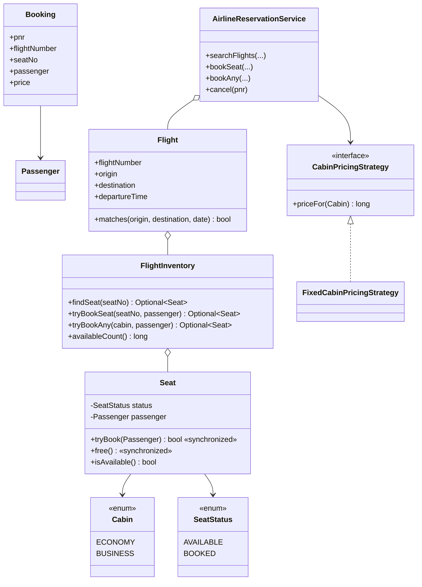
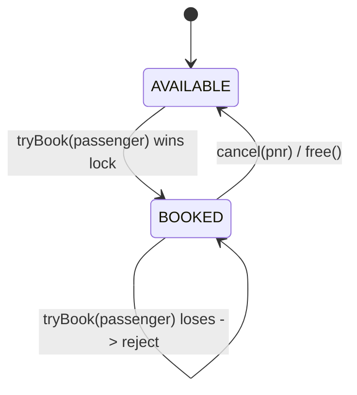
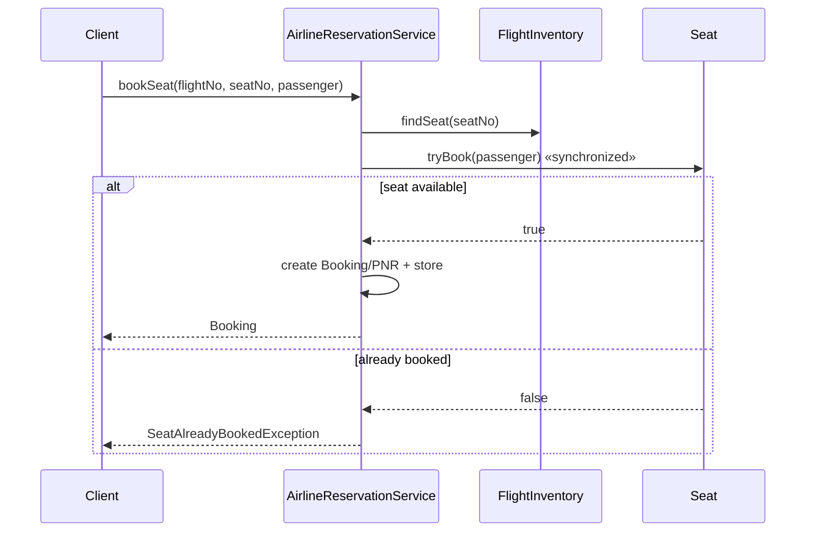

# Airline Reservation — LLD Machine Coding (Java)

An end-to-end MVP of an airline reservation system, built for an SDE2 machine-coding round. It
focuses on flight search, seat inventory, PNR booking/cancellation, and **thread-safe** booking with
no double-booked seat.

> A parallel Python implementation lives in `../python` with its own README. The class structure is
> intentionally 1:1 between the two languages.

---

## 1. Why this MVP?

A machine-coding interviewer looks for clean OOP, correct invariants, testability, and a focused
scope. This MVP is the smallest airline system that still demonstrates the important design problem:
**seat inventory locking**.

**In scope**
- Flights with `flightNumber`, route, departure time, and a fixed seat map
- `searchFlights(origin, destination, optionalDate, onlyWithSeats)`
- `bookSeat(flightNo, seatNo, passenger)` for a specific seat
- `bookAny(flightNo, cabin, passenger)` for first available cabin seat
- `cancel(pnr)` frees the seat
- Fixed cabin pricing via `CabinPricingStrategy`
- Thread-safe concurrent booking

**Deliberately out of scope**: payments, full fare buckets, multi-leg itineraries, waitlists,
loyalty, refunds policy, persistence, REST/UI. These are extension points, not required for proving
the core invariant.

---

## 2. UML

### Class diagram


### Seat state diagram


### Booking sequence


---

## 3. Design decisions

| Decision | Reasoning |
| --- | --- |
| **Flight owns FlightInventory** | Keeps route metadata separate from mutable seat state. |
| **Seat is the lock boundary** | Highest concurrency: different seats can book in parallel, same seat is serialized. |
| **Two-state `SeatStatus`** | MVP needs only `AVAILABLE` and `BOOKED`; `RESERVED` can be added later. |
| **PNR in `ConcurrentHashMap`** | Thread-safe lookup/insert; atomic `remove` makes cancellation safe. |
| **`bookAny` scans then `tryBook`s** | The scan is not trusted; only the atomic seat claim proves ownership. |
| **Pricing strategy** | Fare policy changes without touching booking/cancellation logic. |

### Concurrency model (the key part)
`Seat.tryBook` is `synchronized`, so checking `AVAILABLE` and marking `BOOKED` is one atomic step.
When 50 threads race for `12A`, exactly one creates a PNR; the rest get
`SeatAlreadyBookedException`. Cancellation uses atomic map `remove`, so a PNR frees its seat at
most once.

---

## 4. Code flow

```
Main → AirlineReservationService.searchFlights
Main → AirlineReservationService.bookSeat
        → FlightInventory.findSeat → Seat.tryBook (atomic)
        → new Booking/PNR → bookings ConcurrentHashMap
AirlineReservationService.bookAny
        → FlightInventory.tryBookAny → Seat.tryBook (atomic)
AirlineReservationService.cancel
        → bookings.remove(pnr) (atomic) → Seat.free
```

Package layout:
```
com.example.airline
├── model/      Cabin, SeatStatus, Passenger, Seat, FlightInventory, Flight, Booking
├── strategy/   CabinPricingStrategy + FixedCabinPricingStrategy
├── service/    AirlineReservationService
├── exception/  Flight/seat/booking domain exceptions
└── Main.java   runnable demo
```

---

## 5. How to run

Prerequisites: JDK 17+ and Maven.

```powershell
cd java

# run the test suite (5 tests incl. the concurrency race test)
mvn test

# run the demo
mvn -q compile exec:java "-Dexec.mainClass=com.example.airline.Main"
```

Expected demo output (PNR values vary):
```
Search BLR -> DEL:
AI101 BLR->DEL seats=3
Booked PNR-........ for Alice on 1A price=12000
Second booking rejected: Seat 1A is already booked
Cancelled PNR-........; seat 1A available=true
Rebooked PNR-........ for Bob on 1A
```

---

## 6. Tests

`AirlineReservationTest` covers:
- route/date search and `onlyWithSeats` filtering
- specific seat booking creates a PNR and marks the seat BOOKED
- duplicate specific-seat booking is rejected
- `bookAny` picks the requested cabin and rejects when that cabin is full
- cancel frees the seat and a consumed PNR cannot be cancelled twice
- **concurrency**: 50 threads race for the same seat → exactly 1 success, 0 double-booking

---

## 7. Extending
- **Payments**: collect payment after a PNR is created, or hold then confirm.
- **Fares/pricing tiers**: replace `FixedCabinPricingStrategy` with dynamic fare buckets.
- **Multi-leg itineraries**: introduce `Itinerary` and atomically reserve seats across flights.
- **Waitlists/holds**: add `RESERVED` state with expiry.
- **Persistence**: move flights/bookings behind repositories.
