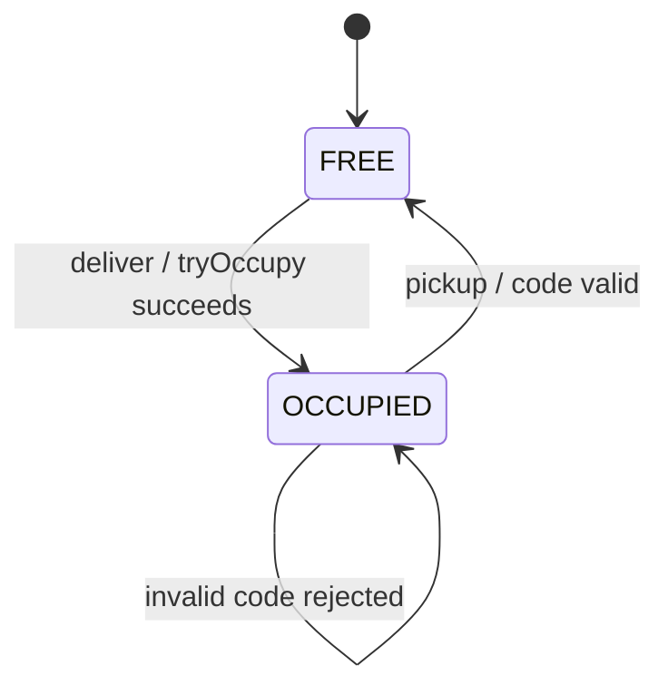

# Amazon Locker — LLD Machine Coding (Java)

An end-to-end MVP of an Amazon Locker location, built for an SDE2 machine-coding round. It
demonstrates OOP modelling, the **Strategy** and **Factory** patterns, a tiny **State** model, and
**thread-safe** concurrent delivery with no double-allocation.

> A parallel Python implementation lives in `../python` with its own README. Both produce identical
> demo output.

---

## 1. Why this MVP?

A machine-coding interviewer looks for: clean OOP, patterns applied for real reasons, correct
concurrency, and working tests — delivered in ~45 minutes. So the MVP is the **smallest locker
system that still exercises all of those**:

**In scope**
- One locker location, 3 locker/package sizes (SMALL/MEDIUM/LARGE) with fit rules
- `deliver` → find smallest compatible free locker → mark it `OCCUPIED` → issue pickup code
- `pickup` → validate one-time code → open/free locker → return package
- Thread-safe concurrent delivery (the part interviewers probe hardest)
- Pluggable **LockerAssignmentStrategy**
- **Factory** for package/locker creation
- **State** via `LockerState.FREE` / `OCCUPIED`

**Deliberately out of scope** (extension points, not core learning value): payment, package expiry
or return-to-sender, notifications, multi-location routing, persistence/DB, REST/UI layer. Each is
noted below under *Extending*.

---

## 2. UML

### Class diagram

```mermaid
classDiagram
    class DeliveryPackage {
      +String id
      +PackageSize size
    }
    class PackageSize {
      <<enum>>
      SMALL
      MEDIUM
      LARGE
    }
    class LockerSize {
      <<enum>>
      SMALL
      MEDIUM
      LARGE
    }
    class LockerState {
      <<enum>>
      FREE
      OCCUPIED
    }
    class Locker {
      -LockerState state
      -DeliveryPackage currentPackage
      +canFit(DeliveryPackage) bool
      +tryOccupy(DeliveryPackage) bool  «synchronized»
      +free() DeliveryPackage  «synchronized»
    }
    class LockerLocation {
      +List~Locker~ lockers
      +of(id, s, m, l) LockerLocation
    }
    class AmazonLockerService {
      +deliver(DeliveryPackage) String
      +pickup(code) DeliveryPackage
      +availableLockers() long
    }
    class LockerAssignmentStrategy {
      <<interface>>
      +assign(location, package) Optional~Locker~
    }
    class SmallestFitAssignmentStrategy
    class LockerFactory {
      <<factory>>
      +createPackage(id, size) DeliveryPackage
      +createLocker(id, size) Locker
    }

    LockerAssignmentStrategy <|.. SmallestFitAssignmentStrategy
    AmazonLockerService o-- LockerLocation
    AmazonLockerService --> LockerAssignmentStrategy
    LockerLocation o-- Locker
    Locker --> LockerState
    Locker --> LockerSize
    DeliveryPackage --> PackageSize
    LockerFactory ..> DeliveryPackage
    LockerFactory ..> Locker
```


### Locker state diagram


---

## 3. Design decisions

| Decision | Reasoning |
| --- | --- |
| **`PackageSize` and `LockerSize` ordinal comparison** | `locker >= package` is one line and models "bigger locker fits smaller package". |
| **Strategy for assignment** | Placement policy changes without touching the service (Dependency Inversion). |
| **Smallest-fit strategy** | Keeps larger lockers free for larger packages, improving future allocation success. |
| **Factory for packages/lockers** | Callers depend on simple enum values, not constructors. |
| **Explicit `LockerState`** | Makes FREE/OCCUPIED transitions visible for interviews and diagrams. |
| **Concurrency at the locker, not the service** | A service-wide lock would serialize all deliveries. Per-locker atomic `tryOccupy` allows parallelism while preventing double-allocation. |
| **`ConcurrentHashMap` for codes; atomic `remove` on pickup** | Guarantees a pickup code is used exactly once (no double-open / double-free). |

### Concurrency model (the key part)
`Locker.tryOccupy` is `synchronized`, so the check *“free and fits?”* and the state change are a
single atomic step. The assignment strategy sorts by size and calls `tryOccupy`; when 50 threads
race for 5 lockers, exactly 5 win and no locker id is claimed twice. Pickup uses atomic
`ConcurrentHashMap.remove`, so invalid or already-used codes fail deterministically.

---

## 4. Code flow

```
Main → LockerFactory.createPackage → AmazonLockerService.deliver
        → LockerAssignmentStrategy.assign → Locker.tryOccupy (atomic)
        → generate pickup code → store in ConcurrentHashMap
AmazonLockerService.pickup → remove code (atomic) → locker.free → DeliveryPackage
```

Package layout:
```
com.example.locker
├── model/      PackageSize, LockerSize, LockerState, DeliveryPackage, Locker
├── strategy/   LockerAssignmentStrategy + SmallestFit
├── factory/    LockerFactory
├── service/    LockerLocation, AmazonLockerService
├── exception/  NoAvailableLockerException, InvalidPickupCodeException
└── Main.java   runnable demo
```

---

## 5. How to run

Prerequisites: JDK 17+ and Maven.

```powershell
cd java

# run the test suite (7 tests incl. the concurrency race test)
mvn test

# run the demo
mvn -q compile exec:java "-Dexec.mainClass=com.example.locker.Main"
```

Expected demo output:
```
Free lockers at open: 5
Delivered small package to LOC1-L0
Delivered medium package to LOC1-L2
Delivered large package to LOC1-L4
Free lockers now: 2
Picked up package PKG-M
Free lockers after pickup: 3
```

---

## 6. Tests

`AmazonLockerTest` covers:
- smallest-fit allocation (SMALL first, then MEDIUM when SMALL is full)
- fit rule (LARGE package cannot fit SMALL locker)
- deliver → pickup returns the same package and frees the locker
- invalid and already-used pickup codes → `InvalidPickupCodeException`
- full location → `NoAvailableLockerException`
- **concurrency**: 50 threads race for 5 lockers → exactly 5 succeed, 0 duplicate locker ids

---

## 7. Extending (what a follow-up would add)
- **Payments**: a `PaymentProcessor` invoked before/after pickup.
- **Expiry / return-to-sender**: timestamp packages and run a sweeper job.
- **Notifications**: SMS/email adapter after successful delivery.
- **Multi-location routing**: choose a location before invoking locker assignment.
- **Persistence**: replace in-memory maps with a repository interface.
