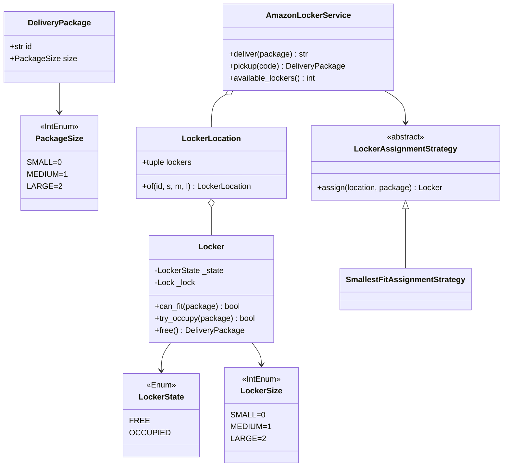
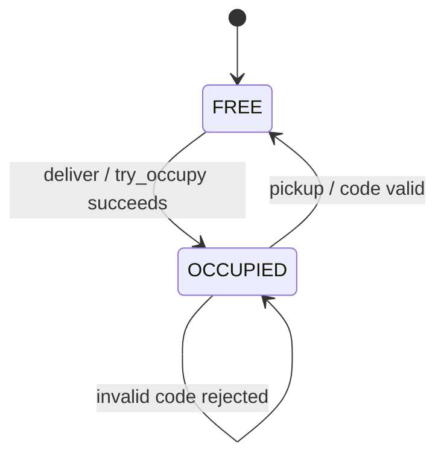

# Amazon Locker — LLD Machine Coding (Python)

An end-to-end MVP of an Amazon Locker location, built for an SDE2 machine-coding round. It
demonstrates OOP modelling, the **Strategy** and **Factory** patterns, a tiny **State** model, and
**thread-safe** concurrent delivery with no double-allocation.

> A parallel Java implementation lives in `../java` with its own README. Both produce identical
> demo output. The class structure is intentionally 1:1 between the two languages.

---

## 1. Why this MVP?

A machine-coding interviewer looks for clean OOP, patterns applied for real reasons, correct
concurrency, and working tests — in ~45 minutes. The MVP is the **smallest locker system that still
exercises all of those**:

**In scope**
- One locker location, 3 locker/package sizes (SMALL/MEDIUM/LARGE) with fit rules
- `deliver` → find smallest compatible free locker → mark it `OCCUPIED` → issue pickup code
- `pickup` → validate one-time code → open/free locker → return package
- Thread-safe concurrent delivery
- Pluggable **LockerAssignmentStrategy**
- **Factory** for package/locker creation
- **State** via `LockerState.FREE` / `OCCUPIED`

**Deliberately out of scope** (extension points): payment, package expiry/return-to-sender,
notifications, multi-location routing, persistence/DB, REST/UI layer. See *Extending* below.

---

## 2. UML

### Class diagram


### Locker state diagram


---

## 3. Design decisions

| Decision | Reasoning |
| --- | --- |
| **`PackageSize(IntEnum)` and `LockerSize(IntEnum)`** | `locker >= package` is one line and models "bigger locker fits smaller package". |
| **Strategy for assignment (ABC)** | Placement policy changes without touching the service (Dependency Inversion). |
| **Smallest-fit strategy** | Keeps larger lockers free for larger packages, improving future allocation success. |
| **Factory functions** | Callers depend on simple enum values, not constructors. |
| **Explicit `LockerState`** | Makes FREE/OCCUPIED transitions visible for interviews and diagrams. |
| **Concurrency at the locker, not the service** | Per-locker `threading.Lock` allows parallelism while preventing double-allocation. |
| **Dict + lock, atomic `pop` on pickup** | Guarantees a pickup code is used exactly once (no double-open / double-free). |

### Concurrency model (the key part)
`Locker.try_occupy` holds a `threading.Lock`, so the check *“free and fits?”* and the state change
are one atomic step. The assignment strategy sorts by size and calls `try_occupy`; when 50 threads
race for 5 lockers, exactly 5 win and no locker id is claimed twice. Pickup pops from the dict under
the same code lock, so invalid or already-used codes fail deterministically.

---

## 4. Code flow

```
main → create_package → AmazonLockerService.deliver
        → LockerAssignmentStrategy.assign → Locker.try_occupy (atomic)
        → generate pickup code → store in dict under lock
AmazonLockerService.pickup → pop code (under lock) → locker.free → DeliveryPackage
```

Module layout:
```
locker/
├── models.py       PackageSize, LockerSize, LockerState, DeliveryPackage, Locker
├── strategies.py   LockerAssignmentStrategy + SmallestFit
├── factory.py      create_package, create_locker
├── service.py      LockerLocation, AmazonLockerService
├── exceptions.py   NoAvailableLockerError, InvalidPickupCodeError
└── main.py         runnable demo
tests/
└── test_locker.py
```

---

## 5. How to run

Prerequisites: Python 3.10+.

```powershell
cd python

# install the test runner (only dependency)
python -m pip install pytest

# run the suite (7 tests incl. the concurrency race test)
python -m pytest -q

# run the demo
python -m locker.main
```

Expected demo output:
```
Free lockers at open: 5
Delivered small package to LOC1-L0
Delivered medium package to LOC1-L2
Delivered large package to LOC1-L4
Free lockers now: 2
Picked up package PKG-M
Free lockers after pickup: 3
```

---

## 6. Tests

`tests/test_locker.py` covers:
- smallest-fit allocation (SMALL first, then MEDIUM when SMALL is full)
- fit rule (LARGE package cannot fit SMALL locker)
- deliver → pickup returns the same package and frees the locker
- invalid and already-used pickup codes → `InvalidPickupCodeError`
- full location → `NoAvailableLockerError`
- **concurrency**: 50 threads race for 5 lockers → exactly 5 succeed, 0 duplicate locker ids

---

## 7. Extending (what a follow-up would add)
- **Payments**: a `PaymentProcessor` invoked before/after pickup.
- **Expiry / return-to-sender**: timestamp packages and run a sweeper job.
- **Notifications**: SMS/email adapter after successful delivery.
- **Multi-location routing**: choose a location before invoking locker assignment.
- **Persistence**: replace the in-memory dict with a repository abstraction.
