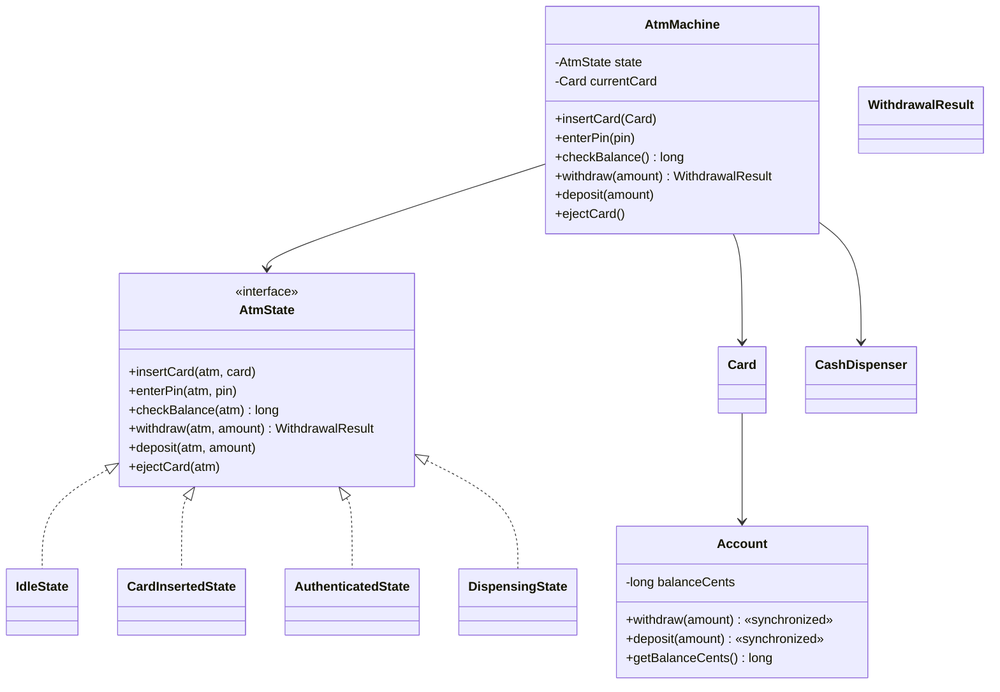
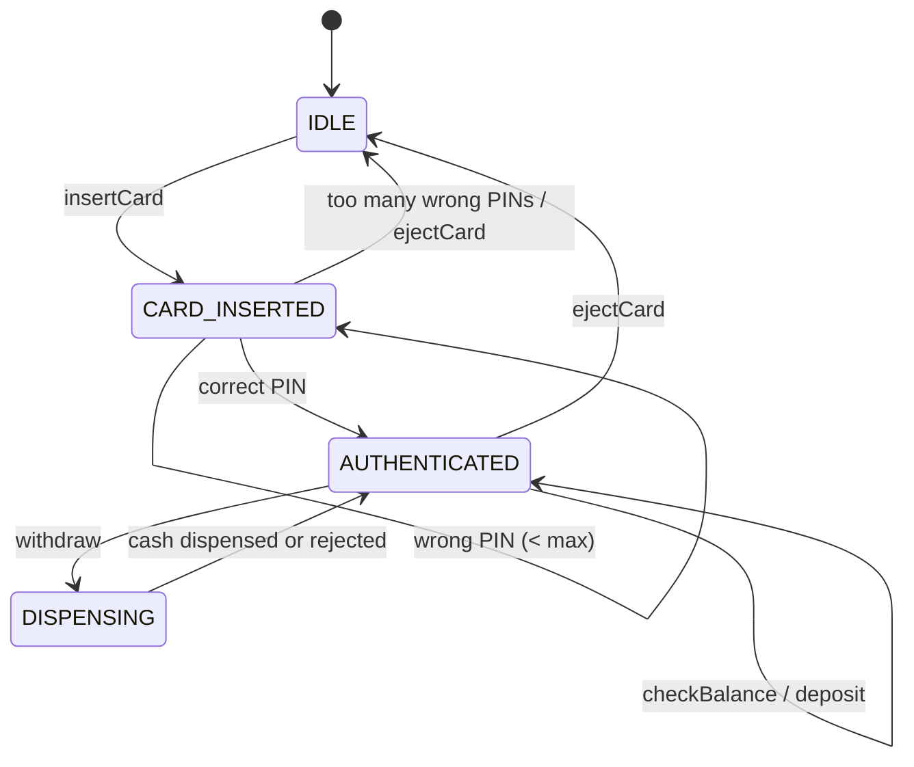

# ATM Machine — LLD Machine Coding (Java)

An end-to-end MVP of an ATM, built for an SDE2 machine-coding round. It demonstrates OOP modelling,
the **State** pattern as the centerpiece, greedy cash dispensing, and **thread-safe** account balance
updates so concurrent withdrawals cannot overdraw.

> A parallel Python implementation lives in `../python` with its own README. Both produce identical
> demo output and keep the class/module structure intentionally 1:1.

---

## 1. Why this MVP?

**In scope**
- `insertCard` → `enterPin` → `checkBalance` / `withdraw` / `deposit` → `ejectCard`
- **State pattern** states: `IDLE`, `CARD_INSERTED`, `AUTHENTICATED`, short-lived `DISPENSING`
- PIN retry limit; too many failures eject the card and return to `IDLE`
- Account balance stored as integer cents/paise, never `double`
- CashDispenser with ₹2000/₹500/₹200/₹100 denominations and greedy exact-breakdown logic
- Thread-safe `Account.withdraw` / `deposit`

**Deliberately out of scope**: real card/bank network, PIN encryption, receipts, transfers,
mini-statement, multi-currency, persistence/DB, REST/UI layer.

---

## 2. UML

### Class diagram


### State transition diagram


---

## 3. Design decisions

| Decision | Reasoning |
| --- | --- |
| **State pattern for ATM flow** | Valid operations differ by session stage; each state owns allowed actions and transitions. |
| **Interface defaults reject invalid operations** | State guards are centralized and clear: withdraw before auth fails with `InvalidOperationException`. |
| **Integer cents/paise** | Money must not use binary floating point; `long` is enough for this MVP. |
| **Greedy cash dispenser** | Works for canonical ₹2000/₹500/₹200/₹100 notes and is easy to explain. |
| **Plan before debit** | Non-dispensable amounts fail before account balance changes. |
| **`Account` synchronized methods** | Check-and-decrement is atomic, so concurrent withdrawals never overdraw. |
| **Physical ATM method synchronization** | One kiosk cannot interleave two users; shared-account concurrency is protected at `Account`. |

### Concurrency model
`Account.withdraw` is `synchronized`, so *“is balance enough?”* and *“decrement balance”* happen as
one atomic critical section. The concurrency test launches 50 independent ATM sessions sharing one
account with only enough balance for 5 withdrawals; exactly 5 succeed.

---

## 4. Code flow

```
Main → AtmMachine.insertCard → IdleState → CARD_INSERTED
Main → enterPin → CardInsertedState → AUTHENTICATED
Main → withdraw → AuthenticatedState → DISPENSING
        → CashDispenser.planBreakdown → Account.withdraw (atomic)
        → CashDispenser.dispense → WithdrawalResult → AUTHENTICATED
Main → ejectCard → IDLE
```

Package layout:
```
com.example.atm
├── model/      Account, Card, AtmStatus, WithdrawalResult
├── state/      AtmState + Idle/CardInserted/Authenticated/Dispensing states
├── service/    AtmMachine, CashDispenser
├── exception/  domain exceptions
└── Main.java   runnable demo
```

---

## 5. How to run

```powershell
cd java
mvn test
mvn -q compile exec:java "-Dexec.mainClass=com.example.atm.Main"
```

Expected demo output:
```
ATM state at open: IDLE
After card insert: CARD_INSERTED
After PIN: AUTHENTICATED
Balance before withdrawal: INR 10,000.00
Dispensed: INR 3,000.00 as {200000=1, 50000=2}
Balance after withdrawal: INR 7,000.00
After eject: IDLE
```

---

## 6. Tests

`AtmMachineTest` covers card/PIN flow, PIN retry eject, successful withdrawal with denomination
breakdown and inventory decrement, insufficient funds, non-dispensable amount, state guards, deposit,
and **concurrent withdrawals with no overdraft**.

---

## 7. Extending
- **Bank network**: replace direct `Card → Account` with an authorization gateway.
- **PIN security**: hash/PIN-block verification instead of a demo string.
- **Receipts and audit log**: add transaction records around `WithdrawalResult`.
- **Transfers / mini-statement**: new authenticated operations, no state-machine rewrite needed.
- **Multi-currency**: make denomination set and money formatter currency-aware.
