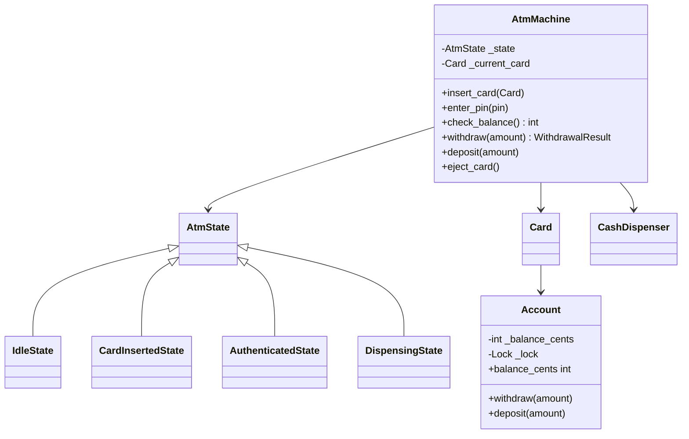
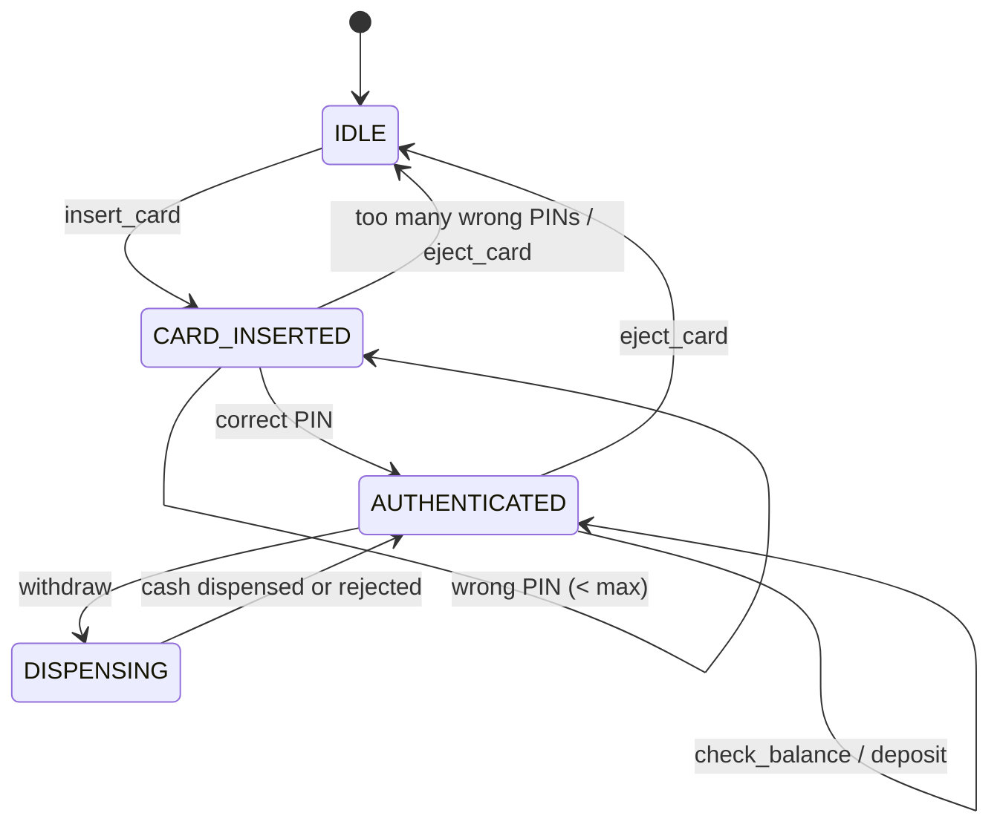

# ATM Machine — LLD Machine Coding (Python)

An end-to-end MVP of an ATM, built for an SDE2 machine-coding round. It demonstrates OOP modelling,
the **State** pattern as the centerpiece, greedy cash dispensing, and **thread-safe** account balance
updates so concurrent withdrawals cannot overdraw.

> A parallel Java implementation lives in `../java` with its own README. Both produce identical
> demo output and keep the class/module structure intentionally 1:1.

---

## 1. Why this MVP?

**In scope**
- `insert_card` → `enter_pin` → `check_balance` / `withdraw` / `deposit` → `eject_card`
- **State pattern** states: `IDLE`, `CARD_INSERTED`, `AUTHENTICATED`, short-lived `DISPENSING`
- PIN retry limit; too many failures eject the card and return to `IDLE`
- Account balance stored as integer cents/paise, never `float`
- CashDispenser with ₹2000/₹500/₹200/₹100 denominations and greedy exact-breakdown logic
- Thread-safe `Account.withdraw` / `deposit`

**Deliberately out of scope**: real card/bank network, PIN encryption, receipts, transfers,
mini-statement, multi-currency, persistence/DB, REST/UI layer.

---

## 2. UML

### Class diagram


### State transition diagram


---

## 3. Design decisions

| Decision | Reasoning |
| --- | --- |
| **State pattern for ATM flow** | Valid operations differ by session stage; each state owns allowed actions and transitions. |
| **Base state rejects invalid operations** | State guards are centralized and clear: withdraw before auth fails with `InvalidOperationError`. |
| **Integer cents/paise** | Money must not use binary floating point; Python `int` is precise. |
| **Greedy cash dispenser** | Works for canonical ₹2000/₹500/₹200/₹100 notes and is easy to explain. |
| **Plan before debit** | Non-dispensable amounts fail before account balance changes. |
| **`Account` lock** | Check-and-decrement is atomic, so concurrent withdrawals never overdraw. |
| **Physical ATM `RLock`** | One kiosk cannot interleave two users; shared-account concurrency is protected at `Account`. |

---

## 4. Code flow

```
main → AtmMachine.insert_card → IdleState → CARD_INSERTED
main → enter_pin → CardInsertedState → AUTHENTICATED
main → withdraw → AuthenticatedState → DISPENSING
        → CashDispenser.plan_breakdown → Account.withdraw (atomic)
        → CashDispenser.dispense → WithdrawalResult → AUTHENTICATED
main → eject_card → IDLE
```

Module layout:
```
atm/
├── models.py      Account, Card, AtmStatus, WithdrawalResult
├── states.py      AtmState + Idle/CardInserted/Authenticated/Dispensing states
├── atm.py         AtmMachine, CashDispenser
├── exceptions.py  domain exceptions
└── main.py        runnable demo
tests/
└── test_atm.py
```

---

## 5. How to run

```powershell
cd python
python -m pytest -q
python -m atm.main
```

Expected demo output:
```
ATM state at open: IDLE
After card insert: CARD_INSERTED
After PIN: AUTHENTICATED
Balance before withdrawal: INR 10,000.00
Dispensed: INR 3,000.00 as {200000: 1, 50000: 2}
Balance after withdrawal: INR 7,000.00
After eject: IDLE
```

---

## 6. Tests

`tests/test_atm.py` covers card/PIN flow, PIN retry eject, successful withdrawal with denomination
breakdown and inventory decrement, insufficient funds, non-dispensable amount, state guards, deposit,
and **concurrent withdrawals with no overdraft**.

---

## 7. Extending
- **Bank network**: replace direct `Card → Account` with an authorization gateway.
- **PIN security**: hash/PIN-block verification instead of a demo string.
- **Receipts and audit log**: add transaction records around `WithdrawalResult`.
- **Transfers / mini-statement**: new authenticated operations, no state-machine rewrite needed.
- **Multi-currency**: make denomination set and money formatter currency-aware.
