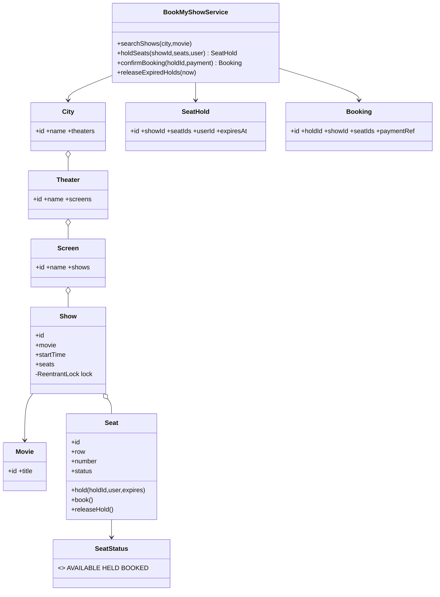
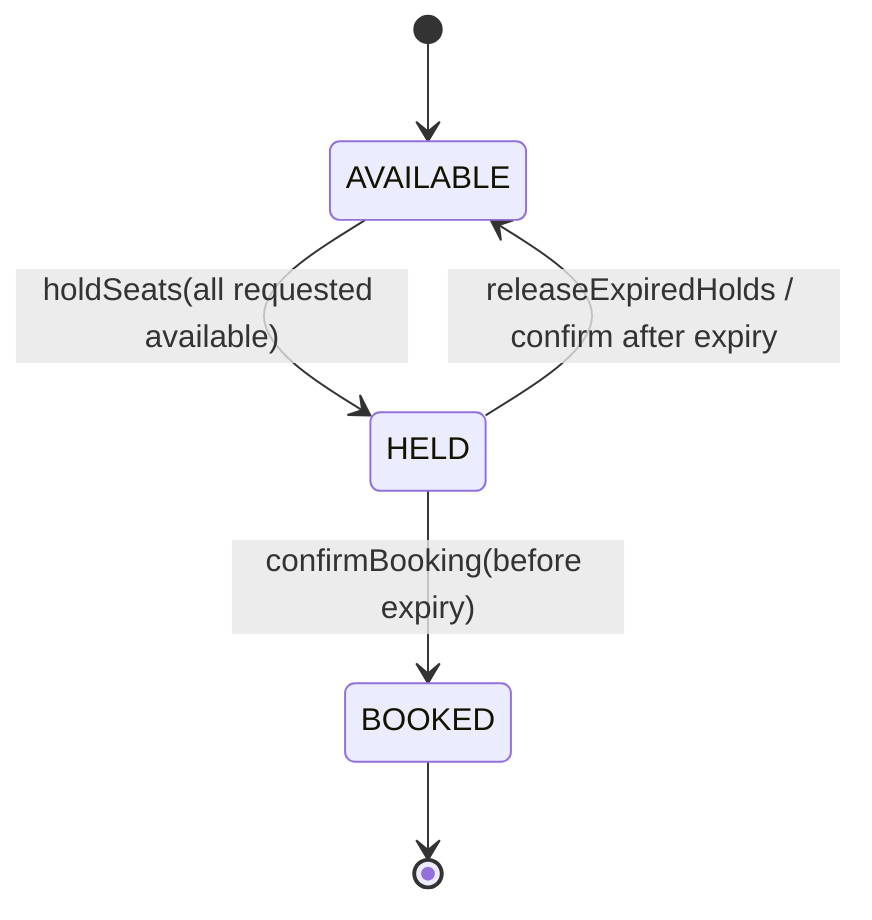
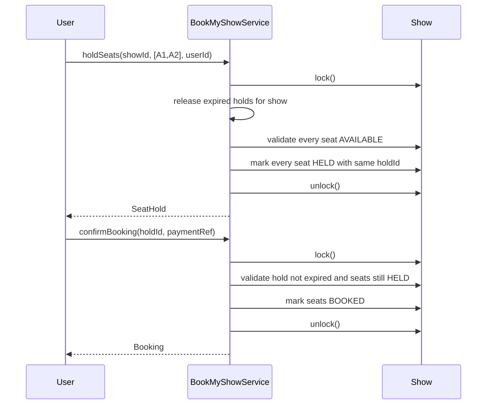

# BookMyShow — LLD Machine Coding (Java)

An end-to-end MVP for an SDE2 machine-coding round. It covers movie discovery and the hardest part
of BookMyShow: **thread-safe seat holding with expiry and booking confirmation**.

> A parallel Python implementation lives in `../python` with its own README. The class structure is
> intentionally 1:1 between the two languages.

---

## 1. Why this MVP?

Interviewers probe the invariant: **no seat is ever double-booked**, even when many users race for
the last seat. Therefore this MVP keeps discovery simple and spends complexity on seat locking.

**In scope**
- City → Theater → Screen → Show hierarchy
- Search shows by movie + city
- `holdSeats(showId, seatIds, userId)` all-or-nothing seat hold
- `confirmBooking(holdId, paymentRef)` converts HELD seats to BOOKED
- Hold expiry via injected `Clock`
- Thread-safe concurrent holds/confirms

**Deliberately out of scope**: payment gateway integration, seat pricing tiers, user auth,
cancellations/refunds, notifications, REST/UI, persistence.

---

## 2. UML

### Class diagram


### Seat state diagram


### Booking sequence


---

## 3. Design decisions

| Decision | Reasoning |
| --- | --- |
| **Show is the aggregate root for seat state** | Seats are meaningful only within a show; all races happen on a show's seat map. |
| **Per-show `ReentrantLock`** | A multi-seat hold needs one atomic check-and-mutate section. Locking per show avoids a global bottleneck while preventing double-booking. |
| **All-or-nothing validation before mutation** | If any requested seat is HELD/BOOKED/unknown, no requested seat is changed. |
| **`ConcurrentHashMap` for holds/bookings** | Independent lookup is safe; seat mutation still happens under the show lock. |
| **Injected `Clock`** | Expiry tests use a mutable clock; no sleeps or flaky timing. |
| **`releaseExpiredHolds(now)` and check-on-access cleanup** | Expiry can be pulled by a scheduler later, while reads/holds/confirms remain correct today. |

### Concurrency model (the key part)
`holdSeats` locks the `Show`, releases expired holds, verifies **all** requested seats are
AVAILABLE, then marks **all** seats HELD before unlocking. Thus a competing thread can only run
before the hold (and win) or after it (and fail); it can never interleave halfway through. The race
test starts 50 threads together for seat A1 and asserts exactly one successful hold.

---

## 4. Code flow

```
Main → BookMyShowService.searchShows
Main → holdSeats → Show.lock → releaseExpired → validate all seats → mark HELD → SeatHold
Main → confirmBooking → Show.lock → validate expiry/ownership → mark BOOKED → Booking
```

Package layout:
```
com.example.bookmyshow
├── model/      City, Theater, Screen, Show, Seat, Movie, SeatHold, Booking
├── service/    BookMyShowService
├── exception/  SeatUnavailableException, HoldExpiredException, NotFoundException
└── Main.java   runnable demo
```

---

## 5. How to run

```powershell
cd java
mvn test
mvn -q compile exec:java "-Dexec.mainClass=com.example.bookmyshow.Main"
```

Expected demo output:
```
Shows found for Interstellar in Bengaluru: 1
Held seats [A1, A2] until <timestamp>
Booking confirmed: <booking-id> seats=[A1, A2]
```

---

## 6. Tests

`BookMyShowTest` covers:
- search returns the right shows for movie + city
- hold then confirm → seats BOOKED; later hold fails
- all-or-nothing: `[available, alreadyHeld]` fails and leaves the available seat AVAILABLE
- hold expiry: mutable clock advances; confirm fails and seats release
- explicit `releaseExpiredHolds(now)`
- **concurrency race**: 50 threads race for the same seat → exactly one succeeds
- concurrent holds for distinct seats all succeed without overlap

---

## 7. Extending
- **Payments**: introduce `PaymentProcessor` before final booking response.
- **Pricing tiers**: add seat type and a pricing strategy.
- **Cancellations/refunds**: add BOOKED → AVAILABLE transition with policy checks.
- **Auth/user accounts**: validate `userId` via user service.
- **Persistence**: replace maps with repository interfaces and DB transactions/row locks.
