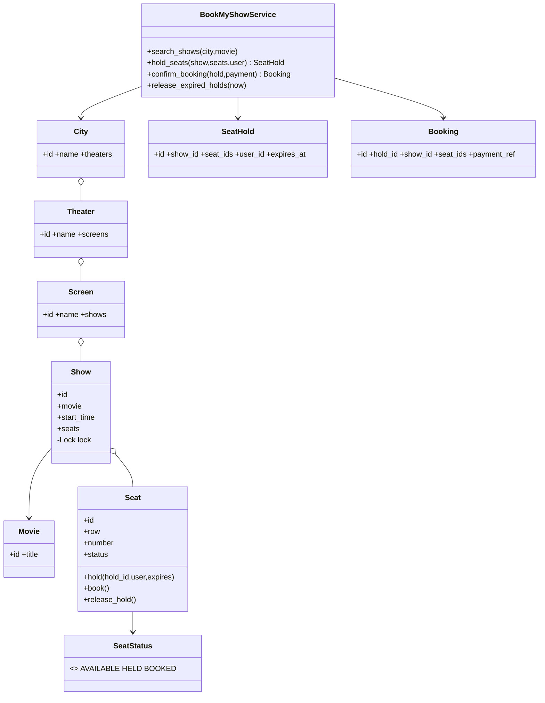
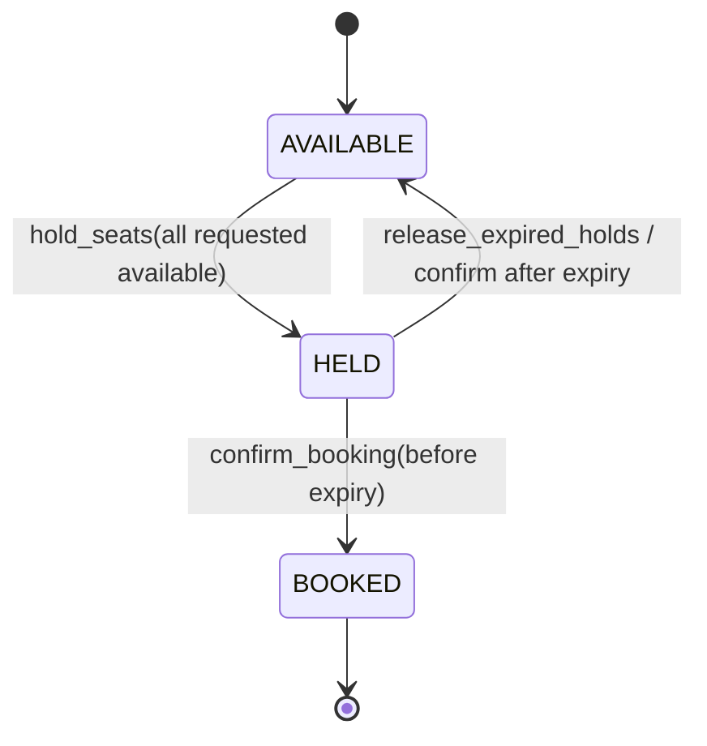
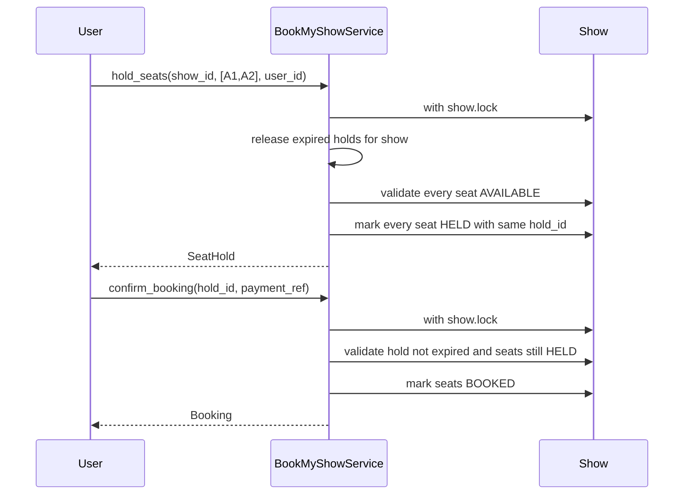

# BookMyShow — LLD Machine Coding (Python)

An end-to-end MVP for an SDE2 machine-coding round. It covers movie discovery and the hardest part
of BookMyShow: **thread-safe seat holding with expiry and booking confirmation**.

> A parallel Java implementation lives in `../java` with its own README. The class structure is
> intentionally 1:1 between the two languages.

---

## 1. Why this MVP?

The central invariant is: **no seat is ever double-booked**, even under concurrent requests. This
MVP therefore keeps catalog/search simple and focuses on hold/confirm correctness.

**In scope**
- City → Theater → Screen → Show hierarchy
- Search shows by movie + city
- `hold_seats(show_id, seat_ids, user_id)` all-or-nothing seat hold
- `confirm_booking(hold_id, payment_ref)` converts HELD seats to BOOKED
- Hold expiry via injected clock callable
- Thread-safe concurrent holds/confirms

**Deliberately out of scope**: payment gateway integration, seat pricing tiers, user auth,
cancellations/refunds, notifications, REST/UI, persistence.

---

## 2. UML

### Class diagram


### Seat state diagram


### Booking sequence


---

## 3. Design decisions

| Decision | Reasoning |
| --- | --- |
| **Show is the aggregate root for seat state** | Seats are scoped to one show; all contention happens on that show. |
| **Per-show `threading.Lock`** | Multi-seat hold needs one atomic check-and-mutate section. Different shows can still proceed independently. |
| **All-or-nothing validation before mutation** | If any requested seat is HELD/BOOKED/unknown, no requested seat changes. |
| **Dicts + small locks for holds/bookings** | Simple in-memory repositories for machine coding; show lock protects seat transitions, dict locks protect repository access. |
| **Injected clock callable** | Expiry tests use a mutable clock; no sleeps or flaky timing. |
| **`release_expired_holds(now)` and check-on-access cleanup** | Works now without a scheduler; a scheduler can call the same method later. |

### Concurrency model (the key part)
`hold_seats` takes `show.lock`, releases expired holds, verifies **all** requested seats are
AVAILABLE, then marks **all** seats HELD before releasing the lock. A competing thread can only run
before this critical section or after it; it cannot observe a half-held group. Even with CPython's
GIL, the explicit lock is required because check-then-set logic is not atomic. The race test starts
50 threads together for A1 and asserts exactly one winner.

---

## 4. Code flow

```
main → BookMyShowService.search_shows
main → hold_seats → Show.lock → release_expired → validate all seats → mark HELD → SeatHold
main → confirm_booking → Show.lock → validate expiry/ownership → mark BOOKED → Booking
```

Module layout:
```
bookmyshow/
├── models.py       City, Theater, Screen, Show, Seat, Movie, SeatHold, Booking
├── service.py      BookMyShowService
├── exceptions.py   SeatUnavailableError, HoldExpiredError, NotFoundError
└── main.py         runnable demo
tests/
└── test_bookmyshow.py
```

---

## 5. How to run

```powershell
cd python
python -m pytest -q
python -m bookmyshow.main
```

Expected demo output:
```
Shows found for Interstellar in Bengaluru: 1
Held seats ['A1', 'A2'] until <timestamp>
Booking confirmed: <booking-id> seats=['A1', 'A2']
```

---

## 6. Tests

`tests/test_bookmyshow.py` covers:
- search returns the right shows for movie + city
- hold then confirm → seats BOOKED; later hold fails
- all-or-nothing: `[available, alreadyHeld]` fails and leaves the available seat AVAILABLE
- hold expiry: mutable clock advances; confirm fails and seats release
- explicit `release_expired_holds(now)`
- **concurrency race**: 50 threads race for the same seat → exactly one succeeds
- concurrent holds for distinct seats all succeed without overlap

---

## 7. Extending
- **Payments**: introduce `PaymentProcessor` before final booking response.
- **Pricing tiers**: add seat type and a pricing strategy.
- **Cancellations/refunds**: add BOOKED → AVAILABLE transition with policy checks.
- **Auth/user accounts**: validate `user_id` via user service.
- **Persistence**: replace dicts with repositories and DB transactions/row locks.
