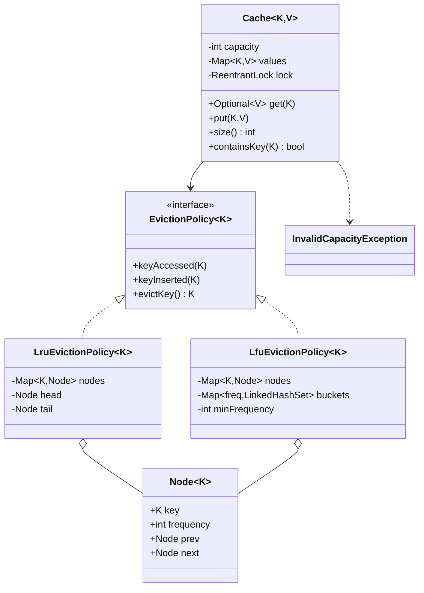
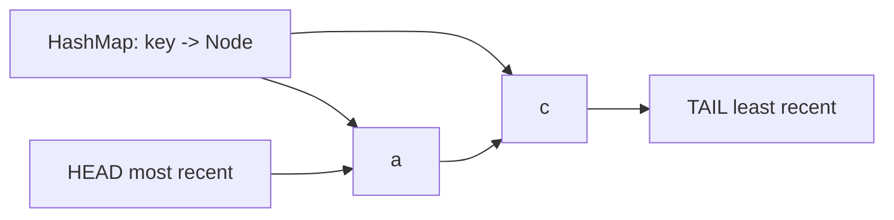
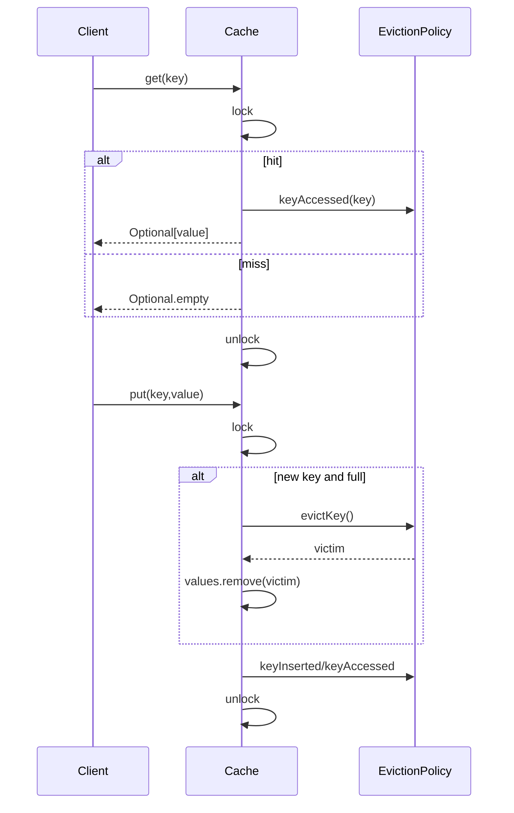

# Cache — LLD Machine Coding (Java)

A focused MVP of a generic, thread-safe in-memory cache with **pluggable eviction**. It is designed for an SDE2 machine-coding round: small surface area, clear Strategy pattern, good data structures, and tests that prove both eviction order and concurrency invariants.

> A parallel Python implementation lives in `../python` with its own README. The class structure and tests are intentionally 1:1 between the two languages.

---

## 1. Why this MVP?

A cache can balloon into a distributed storage system quickly. This MVP keeps only the parts that demonstrate core LLD skills.

**In scope**
- Generic `Cache<K,V>` with fixed positive capacity.
- `get`, `put`, `size`, and `containsKey`.
- Pluggable `EvictionPolicy<K>` Strategy.
- LRU and LFU policies with efficient bookkeeping.
- Thread-safe `get`/`put` using `ReentrantLock`.

**Deliberately out of scope** (extension points): TTL/expiry, write-through/write-back, size-weighted entries, persistence, distributed cache/sharding/replication.

---

## 2. UML

### Class diagram


### LRU DLL structure


### get/put sequence


---

## 3. Design decisions

| Decision | Reasoning |
| --- | --- |
| **Strategy for eviction** | `Cache` delegates ordering/frequency state to `EvictionPolicy`; FIFO can be added without editing cache logic. |
| **HashMap for values** | O(1) lookup/update for the main key-value store. |
| **LRU = HashMap + DLL** | Map finds a node in O(1); DLL moves a node to head and removes tail in O(1). |
| **LFU = node map + frequency buckets** | Map finds the key frequency; buckets group same-frequency keys and preserve LRU tie-break; `minFrequency` avoids scanning. |
| **`Optional<V>` for misses** | Java callers can distinguish miss from a present key's value flow without exceptions. |
| **Single `ReentrantLock` in Cache** | Simpler, correct MVP concurrency: map and policy mutate atomically together, so size never exceeds capacity. |

---

## 4. Code flow

```
Main/tests → new Cache(capacity, policy)
get → lock → values lookup → policy.keyAccessed on hit → unlock
put existing → lock → values update → policy.keyAccessed → unlock
put new full → lock → policy.evictKey → values.remove(victim) → insert → policy.keyInserted → unlock
```

Package layout:
```
com.example.cache
├── Cache.java
├── eviction/   EvictionPolicy, LruEvictionPolicy, LfuEvictionPolicy
├── exception/  InvalidCapacityException
└── Main.java   runnable demo
```

---

## 5. How to run

Prerequisites: JDK 17+ and Maven.

```powershell
cd java

# run the test suite (7 tests incl. two concurrency tests)
mvn test

# run the demo
mvn -q compile exec:java "-Dexec.mainClass=com.example.cache.Main"
```

Expected demo output:
```
LRU get a: Alpha
LRU contains a: true
LRU contains b: false
LRU contains c: true
LFU contains a: true
LFU contains b: false
LFU contains c: true
```

---

## 6. Tests

`CacheTest` covers:
- LRU access-order eviction.
- LRU update refreshing recency.
- LFU lowest-frequency eviction.
- LFU LRU tie-break within the lowest-frequency bucket.
- Missing get and capacity invariant.
- **Concurrency**: many threads hammer put/get while `size <= capacity`.
- **Targeted race**: distinct concurrent puts into capacity-1 cache leave `size == 1`.

---

## 7. Extending (what a follow-up would add)
- **TTL/expiry**: add timestamps and lazy/eager cleanup before get/put.
- **FIFO**: implement another `EvictionPolicy` with an insertion-order queue.
- **Write-through/write-back**: add a storage strategy behind `put`/eviction.
- **Size-weighted entries**: track total weight instead of item count.
- **Distributed cache**: partitioning, replication, consistency, and network failure handling.
