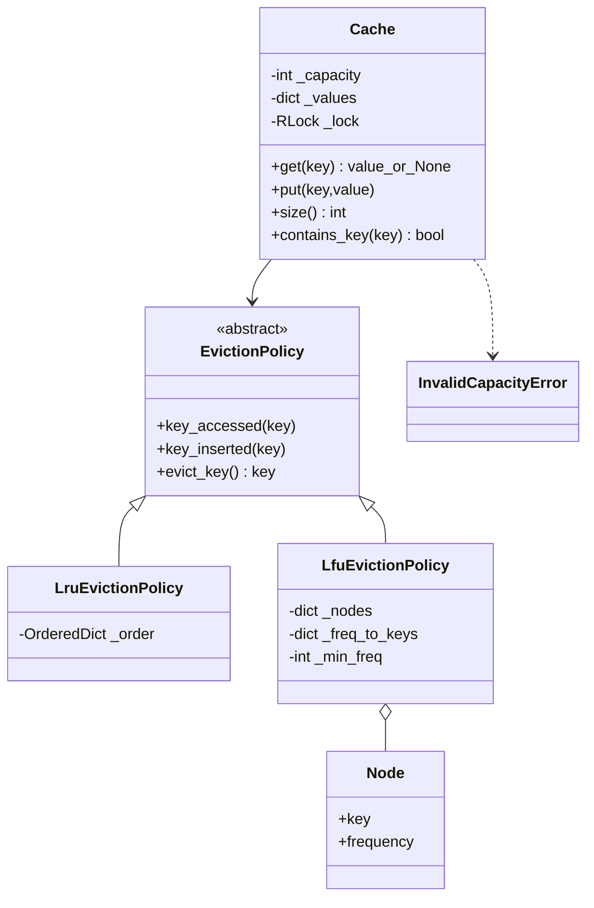
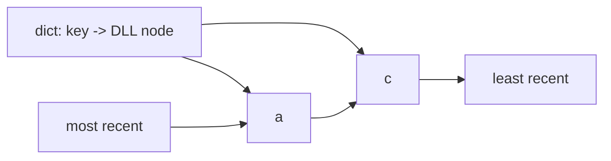
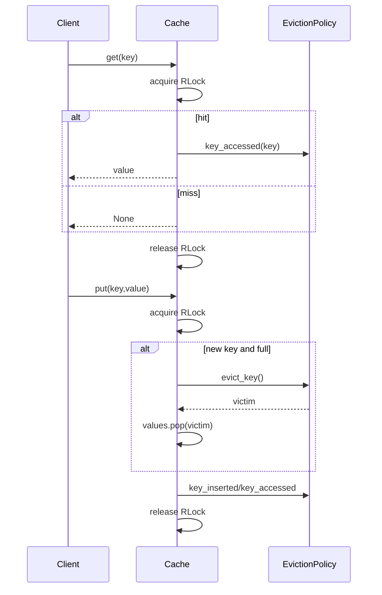

# Cache — LLD Machine Coding (Python)

A focused MVP of a generic, thread-safe in-memory cache with **pluggable eviction**. It mirrors the Java version 1:1 while using idiomatic Python types.

> A parallel Java implementation lives in `../java` with its own README. Both produce equivalent demo output and cover the same behavior.

---

## 1. Why this MVP?

A cache interview problem is best solved by showing clean abstractions and the right O(1) data structures, not by building Redis. This MVP keeps the learning value high and the scope controlled.

**In scope**
- `Cache` for any hashable key and any value.
- `get`, `put`, `size`, and `contains_key`.
- Pluggable `EvictionPolicy` Strategy.
- LRU and LFU policies with efficient bookkeeping.
- Thread-safe `get`/`put` using `threading.RLock`.

**Deliberately out of scope** (extension points): TTL/expiry, write-through/write-back, size-weighted entries, persistence, distributed cache/sharding/replication.

---

## 2. UML

### Class diagram


### LRU DLL structure


### get/put sequence


---

## 3. Design decisions

| Decision | Reasoning |
| --- | --- |
| **Strategy for eviction** | `Cache` delegates ordering/frequency state to `EvictionPolicy`; FIFO can be added without editing cache logic. |
| **dict for values** | O(1) lookup/update for the main key-value store. |
| **LRU = OrderedDict** | `OrderedDict` is Python's HashMap + doubly linked list: O(1) lookup, move-to-end, and pop-front. |
| **LFU = node map + frequency buckets** | `_nodes` finds the frequency; buckets preserve recency within a frequency; `_min_freq` avoids scans. |
| **`None` for misses** | Simple Python API matching common cache semantics. |
| **Single `RLock` in Cache** | Correct MVP concurrency: value dict and policy metadata mutate atomically together, so size never exceeds capacity. |

---

## 4. Code flow

```
main/tests → Cache(capacity, policy)
get → lock → dict lookup → policy.key_accessed on hit → unlock
put existing → lock → dict update → policy.key_accessed → unlock
put new full → lock → policy.evict_key → dict.pop(victim) → insert → policy.key_inserted → unlock
```

Module layout:
```
cache/
├── cache.py       Cache service and locking
├── policies.py    EvictionPolicy, LruEvictionPolicy, LfuEvictionPolicy
├── exceptions.py  InvalidCapacityError
├── __init__.py    public exports
└── main.py        runnable demo
tests/
└── test_cache.py
```

---

## 5. How to run

Prerequisites: Python 3.10+.

```powershell
cd python

# install the test runner if needed
python -m pip install pytest

# run the suite (7 tests incl. two concurrency tests)
python -m pytest -q

# run the demo
python -m cache.main
```

Expected demo output:
```
LRU get a: Alpha
LRU contains a: true
LRU contains b: false
LRU contains c: true
LFU contains a: true
LFU contains b: false
LFU contains c: true
```

---

## 6. Tests

`tests/test_cache.py` covers:
- LRU access-order eviction.
- LRU update refreshing recency.
- LFU lowest-frequency eviction.
- LFU LRU tie-break within the lowest-frequency bucket.
- Missing get and capacity invariant.
- **Concurrency**: many threads hammer put/get while `size <= capacity`.
- **Targeted race**: distinct concurrent puts into capacity-1 cache leave `size == 1`.

---

## 7. Extending (what a follow-up would add)
- **TTL/expiry**: store timestamps and lazily/eagerly remove expired keys.
- **FIFO**: implement another `EvictionPolicy` with insertion-order metadata.
- **Write-through/write-back**: add a storage strategy behind writes and evictions.
- **Size-weighted entries**: track total weight instead of entry count.
- **Distributed cache**: partitioning, replication, consistency, and network failure handling.
