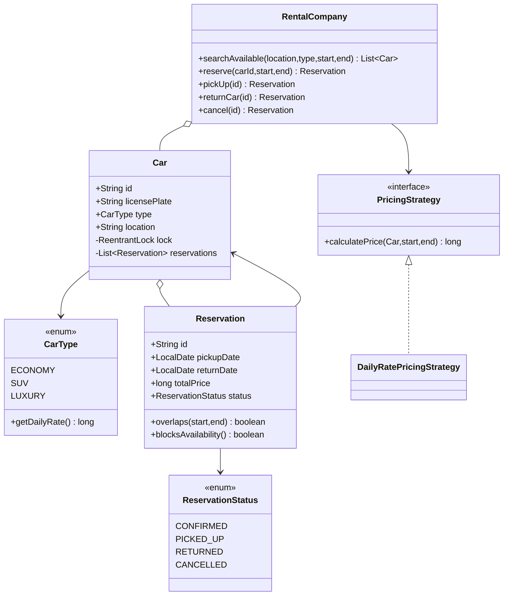
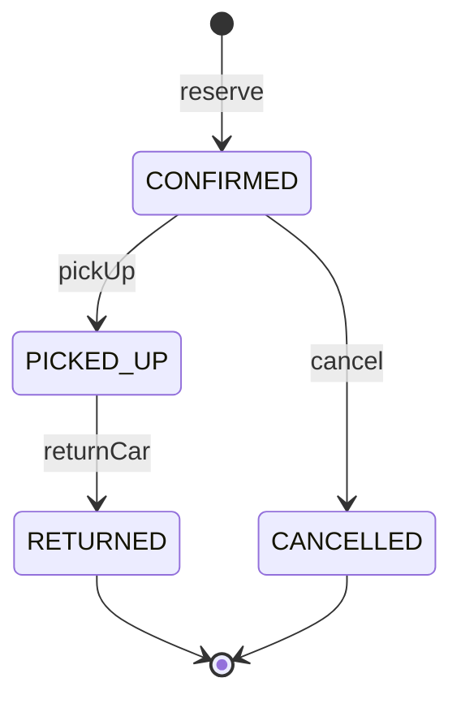
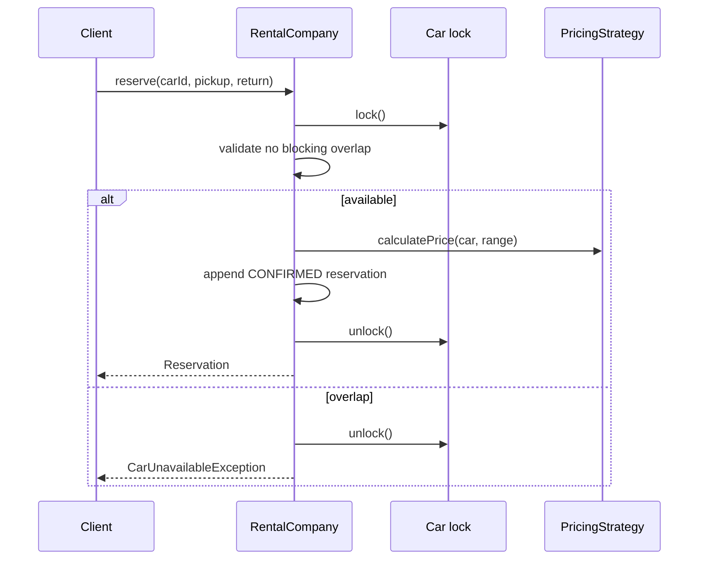

# Car Rental — LLD Machine Coding (Java)

An end-to-end MVP of a car rental system, built for an SDE2 machine-coding round. It demonstrates
OOP modelling, the **Strategy** pattern, a reservation state machine, and **thread-safe** booking
with no overlapping double-booking.

> A parallel Python implementation lives in `../python` with its own README. Both produce identical
> demo output.

---

## 1. Why this MVP?

A machine-coding interviewer looks for clean OOP, a real design pattern, correct concurrency, and
working tests. This MVP is the smallest system that still proves those skills.

**In scope**
- Cars of type `ECONOMY`, `SUV`, `LUXURY`, each at a location/store
- Search available cars by `(location, type, [pickup, return))`
- Reserve a specific car and compute total via `PricingStrategy`
- Pick up, return, and cancel reservations
- Thread-safe no-overlap invariant under concurrent reservations

**Deliberately out of scope**: customers/accounts, payments, insurance add-ons, one-way rentals
across locations, damage/late fees, refunds.

---

## 2. UML

### Class diagram


### Reservation state diagram


### Reserve sequence


---

## 3. Design decisions

| Decision | Reasoning |
| --- | --- |
| **Half-open date range `[pickup, return)`** | The return day is free for the next customer, matching hotel/car-rental style inventory. |
| **Overlap rule: `start1 < end2 && start2 < end1`** | Correctly rejects true overlaps and allows adjacent ranges where `return == next pickup`. |
| **Per-car `ReentrantLock`** | Locks only the car being booked; unrelated cars can be reserved in parallel. |
| **Check + insert under the same lock** | Makes reservation atomic and prevents two concurrent overlapping winners. |
| **`PricingStrategy`** | Daily-rate pricing is MVP; weekend, seasonal, loyalty, coupons can be swapped in. |
| **Reservation state enum** | Lifecycle is explicit and invalid transitions are easy to reject. |

### Concurrency model (the key part)
`RentalCompany.reserve` locks the target `Car`, checks all `CONFIRMED`/`PICKED_UP` reservations for
overlap, calculates the price, and appends the new reservation before unlocking. That critical
section is the atomic "compare-and-insert" operation. In the race test, 50 threads try to reserve the
same car for the same date range; exactly one succeeds.

---

## 4. Code flow

```
Main → RentalCompany.searchAvailable
Main → RentalCompany.reserve
        → car.lock
        → overlap check using [pickup, return)
        → PricingStrategy.calculatePrice
        → append CONFIRMED Reservation
RentalCompany.pickUp → CONFIRMED -> PICKED_UP
RentalCompany.returnCar → PICKED_UP -> RETURNED
RentalCompany.cancel → CONFIRMED -> CANCELLED, range becomes free
```

Package layout:
```
com.example.carrental
├── model/      CarType, ReservationStatus, Car, Reservation
├── strategy/   PricingStrategy + DailyRatePricingStrategy
├── service/    RentalCompany
├── exception/  domain exceptions
└── Main.java   runnable demo
```

---

## 5. How to run

Prerequisites: JDK 17+ and Maven.

```powershell
cd java

# run the test suite (5 tests incl. the concurrency race test)
mvn test

# run the demo
mvn -q compile exec:java "-Dexec.mainClass=com.example.carrental.Main"
```

Expected demo output:
```
Available SUVs in BLR: 1
Reserved C2 for 210
Available SUVs in BLR after reserve: 0
Status after pickup: PICKED_UP
Status after return: RETURNED
```

---

## 6. Tests

`CarRentalTest` covers:
- search returns only cars free for the range and allows adjacent ranges
- reserve computes `days * dailyRate` and rejects unavailable cars
- lifecycle: `CONFIRMED -> PICKED_UP -> RETURNED`
- cancel frees the date range
- pricing strategy is swappable via injection
- **concurrency**: 50 threads race for the same car/range → exactly 1 succeeds

---

## 7. Extending
- **Customers/accounts**: attach a `Customer` to `Reservation`.
- **Payments/refunds**: call a `PaymentProcessor` after reservation/cancel.
- **Insurance/add-ons**: decorate `PricingStrategy`.
- **One-way rentals**: add pickup and drop locations to `Reservation`.
- **Late/damage fees**: compute additional charges on `returnCar`.
- **Persistence**: replace maps/lists with repository interfaces.
