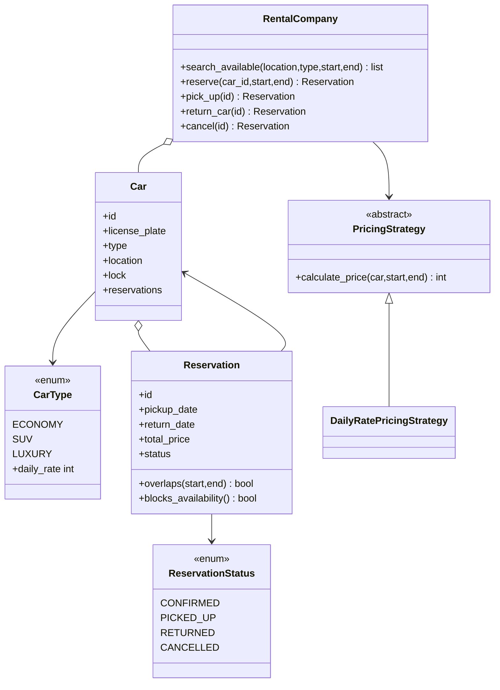
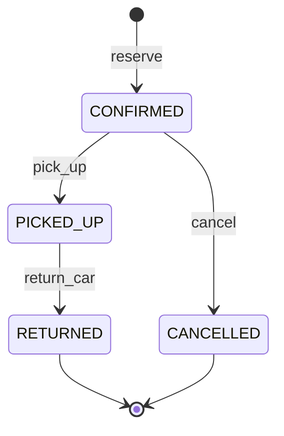
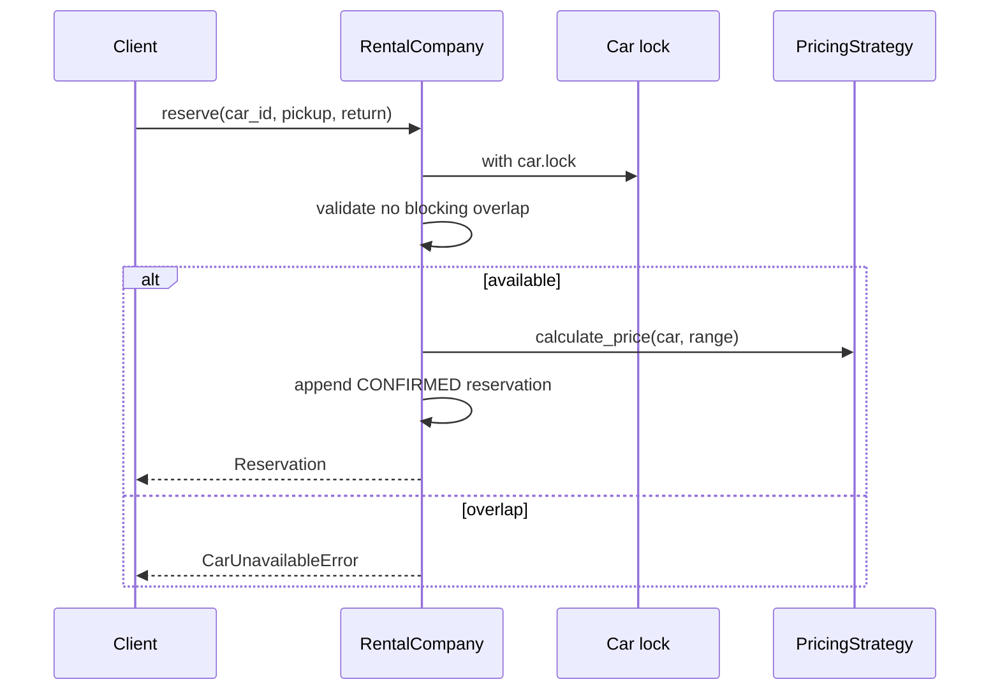

# Car Rental — LLD Machine Coding (Python)

An end-to-end MVP of a car rental system, built for an SDE2 machine-coding round. It mirrors the
Java design one-for-one: OOP models, **Strategy** pricing, reservation lifecycle, and **thread-safe**
no-overlap booking.

> A parallel Java implementation lives in `../java` with its own README. Both produce identical demo
> output.

---

## 1. Why this MVP?

This is the smallest useful rental-company core: enough to show modelling, patterns, concurrency,
and tests without drowning in product features.

**In scope**
- Cars of type `ECONOMY`, `SUV`, `LUXURY`, each at a location/store
- Search available cars by `(location, type, [pickup, return))`
- Reserve a specific car and compute total via a pricing strategy
- Pick up, return, and cancel reservations
- Thread-safe no-overlap invariant under concurrent reservations

**Deliberately out of scope**: customers/accounts, payments, insurance add-ons, one-way rentals
across locations, damage/late fees, refunds.

---

## 2. UML

### Class diagram


### Reservation state diagram


### Reserve sequence


---

## 3. Design decisions

| Decision | Reasoning |
| --- | --- |
| **Half-open date range `[pickup, return)`** | Return day is free for the next booking. |
| **Overlap rule: `start1 < end2 and start2 < end1`** | Rejects true overlaps and allows adjacent ranges. |
| **Per-car `threading.Lock`** | Unrelated cars book in parallel; one car serializes its own reservations. |
| **Check + append under the same lock** | Atomic reservation prevents double-booking under races. |
| **`PricingStrategy` ABC** | Daily-rate pricing now; weekend/seasonal/loyalty later. |
| **Reservation status enum** | Keeps workflow explicit and testable. |

### Concurrency model (the key part)
`RentalCompany.reserve` enters `with car.lock`, checks blocking reservations, calculates price, and
appends the new reservation before releasing the lock. In the race test, 50 threads reserve the same
car for the same range; exactly one succeeds.

---

## 4. Code flow

```
main → RentalCompany.search_available
main → RentalCompany.reserve
        → with car.lock
        → overlap check using [pickup, return)
        → PricingStrategy.calculate_price
        → append CONFIRMED Reservation
RentalCompany.pick_up → CONFIRMED -> PICKED_UP
RentalCompany.return_car → PICKED_UP -> RETURNED
RentalCompany.cancel → CONFIRMED -> CANCELLED, range becomes free
```

Package layout:
```
carrental/
├── models.py      CarType, ReservationStatus, Car, Reservation
├── strategies.py  PricingStrategy + DailyRatePricingStrategy
├── service.py     RentalCompany
├── exceptions.py  domain exceptions
└── main.py        runnable demo
tests/test_carrental.py
```

---

## 5. How to run

```powershell
cd python

# run the test suite (5 tests incl. the concurrency race test)
python -m pytest -q

# run the demo
python -m carrental.main
```

Expected demo output:
```
Available SUVs in BLR: 1
Reserved C2 for 210
Available SUVs in BLR after reserve: 0
Status after pickup: PICKED_UP
Status after return: RETURNED
```

---

## 6. Tests

`tests/test_carrental.py` covers:
- search returns only cars free for the range and allows adjacent ranges
- reserve computes `days * daily_rate` and rejects unavailable cars
- lifecycle: `CONFIRMED -> PICKED_UP -> RETURNED`
- cancel frees the date range
- pricing strategy is swappable via injection
- **concurrency**: 50 threads race for the same car/range → exactly 1 succeeds

---

## 7. Extending
- **Customers/accounts**: attach a customer object to each reservation.
- **Payments/refunds**: call a payment gateway service.
- **Insurance/add-ons**: layer decorators around the pricing strategy.
- **One-way rentals**: store pickup and drop locations separately.
- **Late/damage fees**: compute additional charges on return.
- **Persistence**: replace in-memory dictionaries/lists with repositories.
