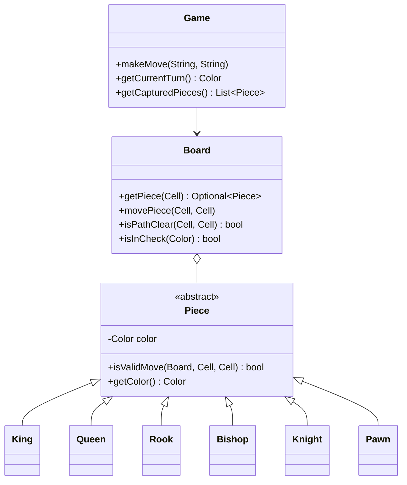
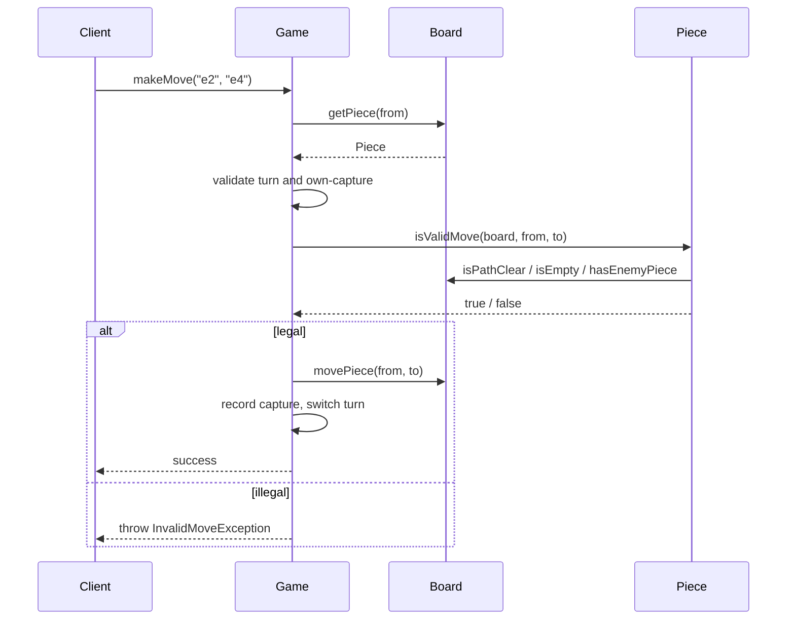

# Chess — LLD Machine Coding (Java)

An interview-sized Chess MVP built around **polymorphic piece movement**. The solution favors clear
OOP over a full chess engine: every piece subclass owns its movement geometry, while `Game` handles
turns, captures, and errors.

> A parallel Python implementation lives in `../python` with the same class/module shape and demo.

---

## 1. Why this MVP?

A machine-coding round rewards correct scope control. Full chess has many special rules, but the
best LLD signal here is the **Piece hierarchy** and clean board/game separation.

**In scope**
- 8x8 board with standard initial setup
- `Color.WHITE` / `Color.BLACK`, alternating turns
- Polymorphic movement validation for King, Queen, Rook, Bishop, Knight, Pawn
- Clear-path validation for sliding pieces
- Captures, own-piece capture rejection, captured-piece tracking
- Simple `isInCheck(color)` for an attacked king

**Deliberately out of scope** (extensions, not core MVP): checkmate/stalemate, castling,
en-passant, promotion, clock/timers, persistence, UI/API. These need more state and edge-case rules;
including them in a time-box would distract from the polymorphism centerpiece.

Because Chess is turn-based, this MVP needs **no concurrency**. A caller submits one move at a time.

---

## 2. UML

### Piece hierarchy


### `makeMove` sequence


---

## 3. Design decisions

| Decision | Reasoning |
| --- | --- |
| **Abstract `Piece` + overrides** | Adds new movement by adding a subclass; avoids a fragile switch in `Game`. |
| **Board vs Game split** | Board answers spatial questions; Game owns workflow rules like turns and captures. |
| **`Cell` value object** | Prevents invalid coordinates and supports algebraic notation (`e2`). |
| **Sliding path helper in `Board`** | Rook/Bishop/Queen reuse the same path-clear logic. |
| **Captured list in `Game`** | Keeps move history side effects visible and easy to test. |
| **Simple check detection** | Useful extension point without attempting checkmate/stalemate. |

---

## 4. Code flow

```
Main → Game.makeMove
       → Board.getPiece(from)
       → validate turn / source / own capture
       → Piece.isValidMove(board, from, to)   (polymorphic dispatch)
       → record captured piece → Board.movePiece → switch turn
```

Package layout:
```
com.example.chess
├── model/       Board, Cell, Color
│   └── pieces/  Piece hierarchy
├── game/        Game, Move
├── exception/   InvalidMoveException
└── Main.java    runnable demo
```

---

## 5. How to run

Prerequisites: JDK 17+ and Maven.

```powershell
cd java
mvn test
mvn -q compile exec:java "-Dexec.mainClass=com.example.chess.Main"
```

Expected demo output:
```
Starting turn: WHITE
White plays e2 -> e4
Black plays e7 -> e5
White plays g1 -> f3
Black plays b8 -> c6
Next turn: WHITE
Captured pieces: 0
```

---

## 6. Tests

`ChessTest` covers:
- each piece has legal and illegal movement cases
- rook/bishop blocked-path rejection
- own capture rejection and enemy capture recording
- turn enforcement
- simple check detection

---

## 7. Extending
- **Checkmate/stalemate**: generate all legal replies and test whether check can be escaped.
- **Castling**: track king/rook move history and attacked transit squares.
- **En-passant**: remember the previous double-step pawn move.
- **Promotion**: replace a pawn reaching the last rank using a selected piece factory.
- **AI**: add legal-move generation + minimax/evaluation without changing `Piece` callers.
