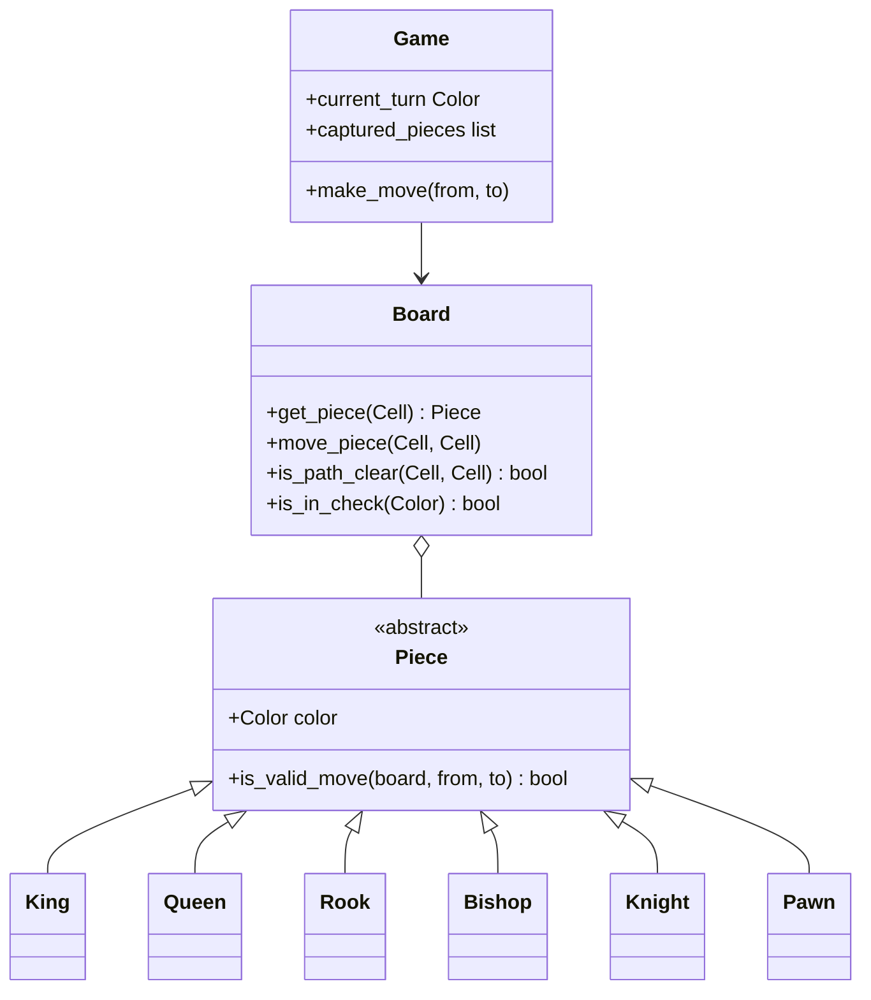
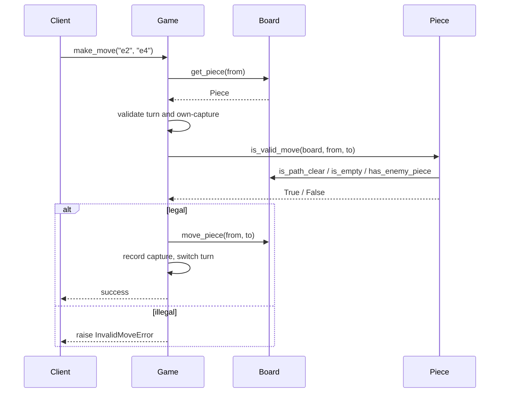

# Chess — LLD Machine Coding (Python)

An interview-sized Chess MVP built around **polymorphic piece movement**. The solution mirrors the
Java version: each piece subclass owns its movement geometry, while `Game` handles turns, captures,
and errors.

> A parallel Java implementation lives in `../java` with the same class/module shape and demo.

---

## 1. Why this MVP?

A machine-coding round rewards correct scope control. Full chess has many special rules, but the
best LLD signal here is the **Piece hierarchy** and clean board/game separation.

**In scope**
- 8x8 board with standard initial setup
- `Color.WHITE` / `Color.BLACK`, alternating turns
- Polymorphic movement validation for King, Queen, Rook, Bishop, Knight, Pawn
- Clear-path validation for sliding pieces
- Captures, own-piece capture rejection, captured-piece tracking
- Simple `is_in_check(color)` for an attacked king

**Deliberately out of scope** (extensions): checkmate/stalemate, castling, en-passant, promotion,
clock/timers, persistence, UI/API. These need more state and edge-case rules; including them in a
time-box would distract from the polymorphism centerpiece.

Because Chess is turn-based, this MVP needs **no concurrency**. A caller submits one move at a time.

---

## 2. UML

### Piece hierarchy


### `make_move` sequence


---

## 3. Design decisions

| Decision | Reasoning |
| --- | --- |
| **Abstract `Piece` + overrides** | Adds new movement by adding a subclass; avoids a fragile switch in `Game`. |
| **Board vs Game split** | Board answers spatial questions; Game owns workflow rules like turns and captures. |
| **`Cell` dataclass** | Prevents invalid coordinates and supports algebraic notation (`e2`). |
| **Sliding path helper in `Board`** | Rook/Bishop/Queen reuse the same path-clear logic. |
| **Captured list in `Game`** | Keeps move side effects visible and easy to test. |
| **Simple check detection** | Useful extension point without attempting checkmate/stalemate. |

---

## 4. Code flow

```
main → Game.make_move
       → Board.get_piece(from)
       → validate turn / source / own capture
       → Piece.is_valid_move(board, from, to)   (polymorphic dispatch)
       → record captured piece → Board.move_piece → switch turn
```

Module layout:
```
chess/
├── models.py      Cell, Color
├── pieces.py      Piece hierarchy
├── board.py       Board and path/check helpers
├── game.py        Game, Move
├── exceptions.py  InvalidMoveError
└── main.py        runnable demo
tests/
└── test_chess.py
```

---

## 5. How to run

Prerequisites: Python 3.10+ and pytest.

```powershell
cd python
python -m pytest -q
python -m chess.main
```

Expected demo output:
```
Starting turn: WHITE
White plays e2 -> e4
Black plays e7 -> e5
White plays g1 -> f3
Black plays b8 -> c6
Next turn: WHITE
Captured pieces: 0
```

---

## 6. Tests

`tests/test_chess.py` covers:
- each piece has legal and illegal movement cases
- rook/bishop blocked-path rejection
- own capture rejection and enemy capture recording
- turn enforcement
- simple check detection

---

## 7. Extending
- **Checkmate/stalemate**: generate all legal replies and test whether check can be escaped.
- **Castling**: track king/rook move history and attacked transit squares.
- **En-passant**: remember the previous double-step pawn move.
- **Promotion**: replace a pawn reaching the last rank using a selected piece factory.
- **AI**: add legal-move generation + minimax/evaluation without changing `Piece` callers.
