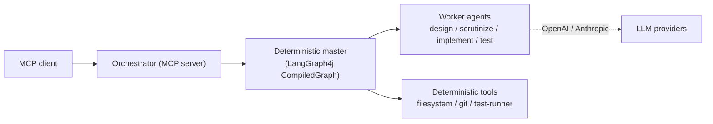

# Coding Orchestrator — Overview

The **Coding Orchestrator** is a deterministic, **master–worker** multi-agent system (built in Java
with **LangGraph4j**) that takes a coding task and drives it through a fixed pipeline:

1. **Design** →
2. **Scrutinize design** (SOLID + design patterns, using a *different* model to reduce bias) →
3. **Implement** →
4. **Scrutinize code** (iterates with the implementer until they reach harmony) →
5. **Write unit tests** and push to GitHub.

A deterministic Java *master* (a compiled state graph) decides routing purely from explicit control
signals in shared state — it never asks an LLM "what next?". Worker **LLM agents** produce artifacts;
deterministic **Java tools** (filesystem, git, test runner) perform all side effects. The whole
orchestrator is exposed over **MCP (Model Context Protocol)**, and each agent is itself an MCP tool.

> **Full deep-dive:** see **`ORCHESTRATOR_FLOW.md`** in this folder for the master control flow, the
> deterministic tools, and the exact LangGraph4j graph syntax, with Mermaid diagrams.

---

## Why this section also teaches AI concepts

Building this orchestrator touches most of modern applied-AI engineering: agents, graphs, tool use,
context protocols, retrieval, and the models underneath. The **`ai-concepts/`** subfolder is a
compact, from-first-principles reference to those topics:

| # | Topic | What it covers |
|---|---|---|
| 01 | Agentic AI | what an "agent" is; the perceive→reason→act loop; autonomy levels |
| 02 | Large Language Models | tokens, transformers, context windows, sampling |
| 03 | Training & Fine-tuning | pre-training, SFT, RLHF/DPO, LoRA/PEFT |
| 04 | Quantization | fp32→int8/int4, GGUF/AWQ/GPTQ, quality/cost tradeoffs |
| 05 | Prompting & Context | system/user prompts, few-shot, context engineering |
| 06 | RAG | retrieval-augmented generation, embeddings, vector search |
| 07 | LangGraph | graph-based agent orchestration (and LangGraph4j) |
| 08 | MCP | the Model Context Protocol: servers, tools, resources, prompts |
| 09 | Tools, Skills & Resources | how models act on the world; the vocabulary |
| 10 | Agent Architectures | single-agent, master–worker, multi-agent patterns |
| 11 | Evaluation & Guardrails | how to test, measure, and constrain agents |
| 12 | Glossary | quick definitions of the jargon |

These are written to be readable on their own — a study companion, not API docs.

---

## The one-diagram summary

Start with `ORCHESTRATOR_FLOW.md`, then browse `ai-concepts/` for the theory behind each piece.
