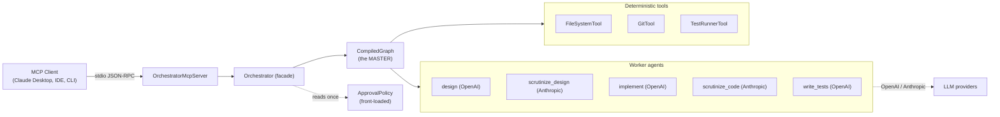
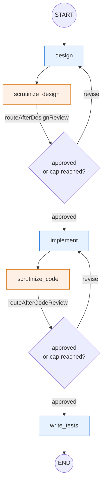
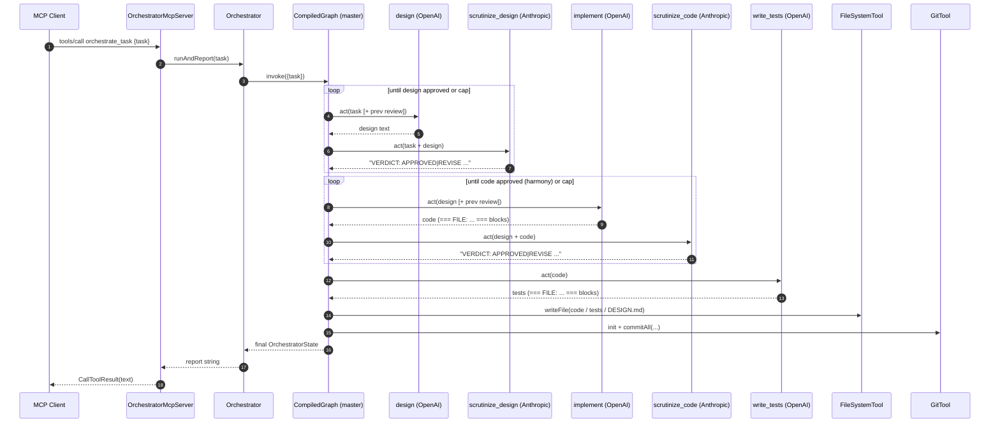
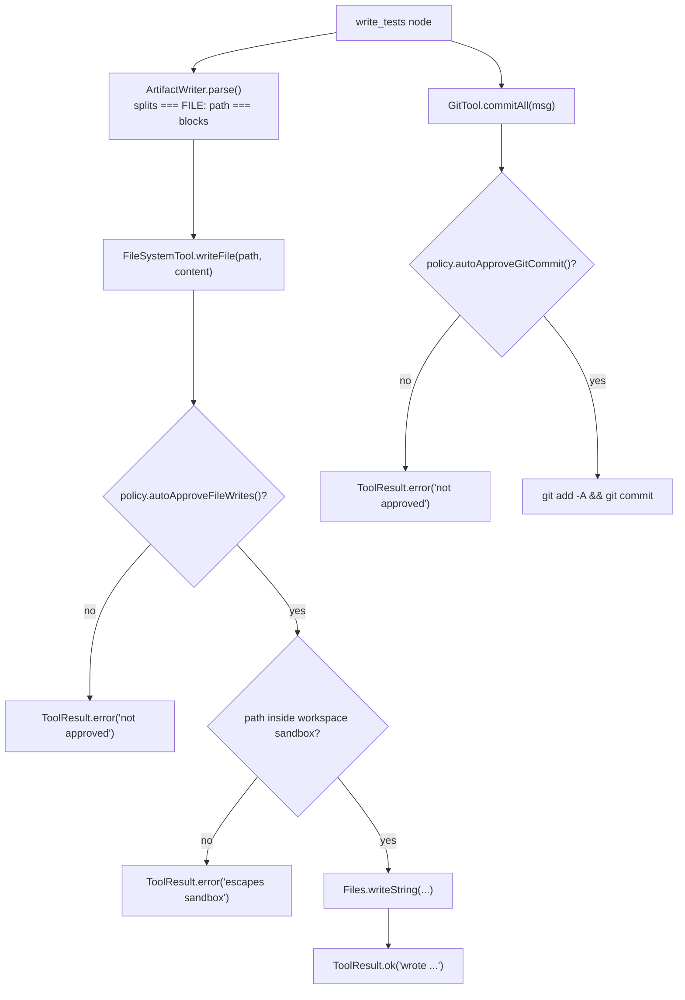
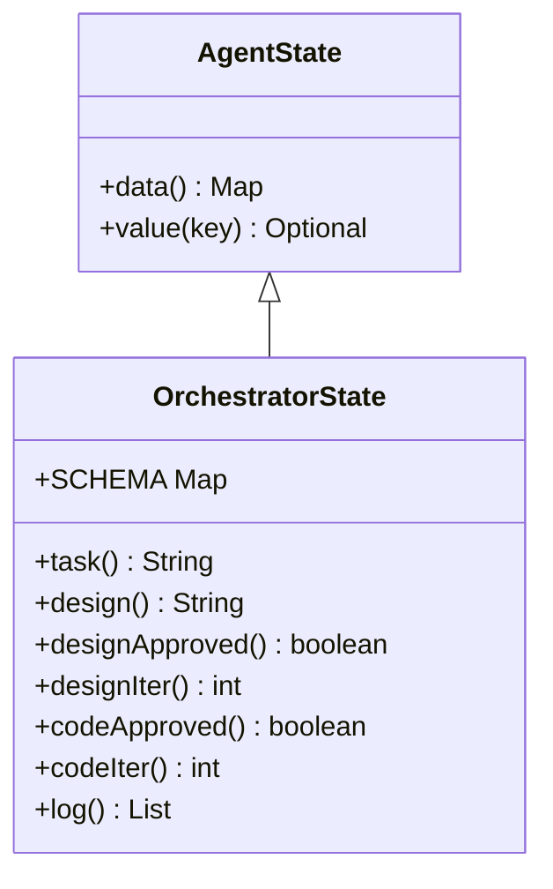
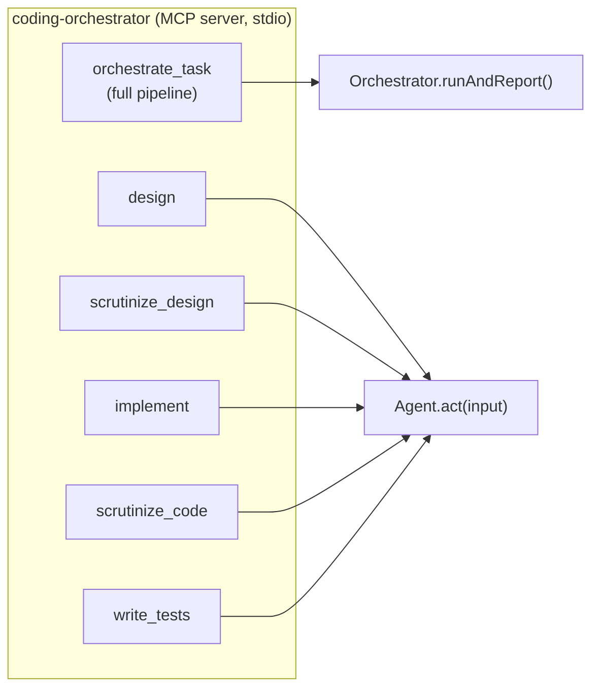
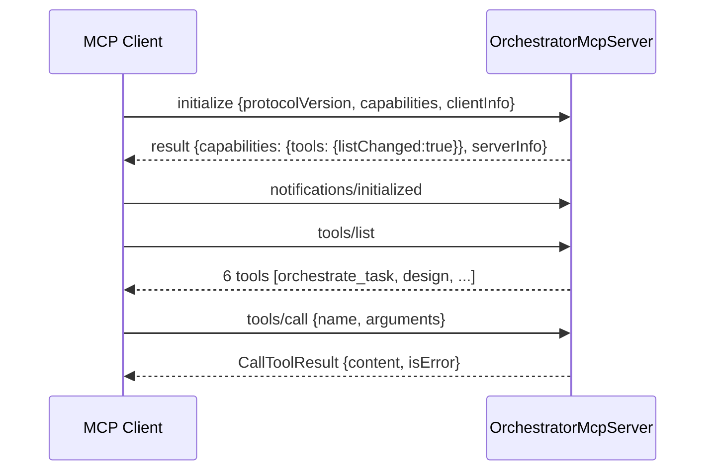
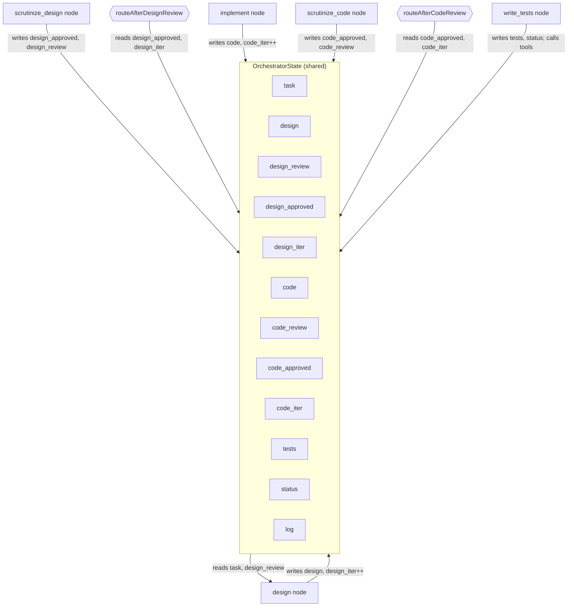

# Coding Orchestrator — Flow, Tools & LangGraph4j Guide

This document explains **how the orchestrator works end to end**: the master–worker control flow,
how the deterministic tools are invoked, and exactly how the graph is defined with LangGraph4j
(including the syntax used). Diagrams are written in [Mermaid](https://mermaid.js.org/) and render
natively on GitHub/most Markdown viewers.

---

## 1. The big picture

The orchestrator is a **deterministic state machine** (the *master*) that delegates each step of a
coding task to a specialized **LLM worker agent**. Agents produce artifacts (design, code, tests);
**deterministic Java tools** perform all side effects (file writes, git). The whole thing is exposed
over **MCP (Model Context Protocol)** so any MCP client can drive it.



**Key idea:** the *master* never asks an LLM "what should I do next?". Routing depends only on
explicit control signals in the shared state (`design_approved`, `code_approved`, iteration
counters). That makes the topology **reproducible**.

---

## 2. Component responsibilities

| Layer | Type | Responsibility |
|---|---|---|
| `OrchestratorApp` | entrypoint | `mcp` (default) or `run "<task>"` modes |
| `OrchestratorMcpServer` | MCP surface | Exposes `orchestrate_task` + each agent as an MCP tool |
| `Orchestrator` | facade | Owns tools + compiled graph; `run(task)` / `runAndReport(task)` |
| `OrchestratorGraph` | **master** | Builds the `StateGraph`, defines nodes + edges (routing) |
| `OrchestratorState` | state | Shared `AgentState` passed between nodes |
| `AgentTeam` / `LlmAgent` | workers | The five specialized agents |
| `ModelFactory` | wiring | OpenAI (impl) + Anthropic (scrutiny) models |
| `FileSystemTool` / `GitTool` / `TestRunnerTool` | tools | Deterministic side effects |
| `ApprovalPolicy` | policy | Front-loaded approvals + loop caps |

---

## 3. The pipeline (master control flow)



- **Blue** nodes = OpenAI implementation agents.
- **Orange** nodes = Anthropic scrutiny agents (different provider ⇒ reduced self-review bias).
- The two diamonds are **conditional edges**. Each returns `"approved"` or `"revise"`, which the
  graph maps to a destination node.
- Loops are **bounded**: `routeAfterDesignReview` / `routeAfterCodeReview` force `"approved"` once
  the iteration counter reaches the policy cap, so the machine always terminates.

### End-to-end sequence



---

## 4. How tools are called

Tools are **plain Java scripts** implementing a tiny `Tool` interface — no LLM logic. They are the
reliable "hands" of the agents and are the only place side effects happen.

```java
public interface Tool {
    String name();
    String description();
    ToolResult execute(Map<String, Object> args);   // structured, side-effecting entry point
}
```

Tools are invoked **inside the `write_tests` node** of the master graph (not by the LLM directly),
which keeps side effects deterministic and auditable:

```java
private Map<String, Object> writeTestsNode(OrchestratorState s) {
    String tests = team.tester().act("SOLUTION CODE:\n" + s.code());

    // 1) Parse "=== FILE: path ===" blocks and write each via the FileSystemTool
    List<String> written = ArtifactWriter.write(fs, s.code(), "solution/CODE.txt");
    written.addAll(ArtifactWriter.write(fs, tests, "solution/TESTS.txt"));
    fs.writeFile("solution/DESIGN.md", s.design());

    // 2) Persist with a local commit (push is policy-gated and disabled by default)
    git.init();
    var commit = git.commitAll("orchestrator: design, implementation and unit tests");

    return Map.of(
        OrchestratorState.TESTS, tests,
        OrchestratorState.STATUS, "completed",
        OrchestratorState.LOG, "write_tests: wrote " + written.size()
            + " artifact(s); git " + (commit.success() ? "committed" : "skipped/failed"));
}
```

### Tool-call flow (with approval gating)

Every side-effecting tool consults the **front-loaded** `ApprovalPolicy` before acting. Approvals
are resolved **once** at startup, so nothing prompts the user mid-run.



### Tool safety properties

| Tool | Guardrails |
|---|---|
| `FileSystemTool` | Confined to a workspace root; path-traversal (`..`) rejected; writes gated by `autoApproveFileWrites`. |
| `GitTool` | Local `init`/`add`/`commit` only; `push` gated by `autoApproveGitPush` (default **false**); sets a local identity so commits work in a fresh sandbox. |
| `TestRunnerTool` | Runs `mvn test` only if a `pom.xml` exists; otherwise returns a non-failing "skipped". |

`ToolResult` is a small immutable success/output wrapper (`ToolResult.ok(...)` /
`ToolResult.error(...)`), so callers branch on `result.success()` deterministically.

---

## 5. How the agents work

Each worker is an `LlmAgent` carrying a fixed **role/system prompt** (its specialization). `act()`
prepends the role to the caller-supplied context and makes a single model call — guarded by the
approval policy.

```java
@Override
public String act(String input) {
    if (!policy.autoApproveModelCalls()) {
        throw new IllegalStateException("model calls not approved by ApprovalPolicy");
    }
    String prompt = rolePrompt + "\n\n=== TASK CONTEXT ===\n" + input;
    return model.chat(prompt);   // langchain4j ChatModel.chat(String) -> String
}
```

Reviewers are instructed to begin their reply with `VERDICT: APPROVED` or `VERDICT: REVISE`.
`ReviewVerdict.parse()` extracts that token **deterministically**, so the master can route without
any further LLM interpretation:

```java
ReviewVerdict verdict = ReviewVerdict.parse(reviewText);   // APPROVED | REVISE
boolean approved = verdict == ReviewVerdict.APPROVED;
```

**Bias elimination** is wired in `ModelFactory`: implementation agents get the OpenAI model, scrutiny
agents get the Anthropic model.

```java
ChatModel impl   = openAi(cfg);      // design / implement / write_tests
ChatModel review = anthropic(cfg);   // scrutinize_design / scrutinize_code (different provider)
```

---

## 6. LangGraph4j — how the graph is defined

LangGraph4j lets you build **stateful, cyclic** agent graphs. Three concepts matter here:
**State**, **Nodes**, **Edges**. This section documents the exact syntax used in this project
(LangGraph4j `1.8.22`).

### 6.1 State — `AgentState` + a schema

State is a typed wrapper over a `Map<String,Object>`. A **schema** declares how each key is updated
by a `Channel` (reducer). Here only the `log` key accumulates (appender); every other key is
last-writer-wins (the default when a key is absent from the schema).

```java
public final class OrchestratorState extends AgentState {
    public static final String TASK = "task";
    public static final String DESIGN = "design";
    public static final String DESIGN_APPROVED = "design_approved";
    public static final String DESIGN_ITER = "design_iter";
    public static final String LOG = "log";
    // ... code / code_review / code_approved / code_iter / tests / status ...

    // Schema: 'log' appends to a list; unlisted keys overwrite.
    public static final Map<String, Channel<?>> SCHEMA = Map.of(
            LOG, Channels.appender(ArrayList::new));

    public OrchestratorState(Map<String, Object> initData) { super(initData); }

    // Typed accessors read from the underlying map with defaults:
    public boolean designApproved() { return this.<Boolean>value(DESIGN_APPROVED).orElse(false); }
    public int designIter()         { return this.<Integer>value(DESIGN_ITER).orElse(0); }
}
```

- `value(key)` returns `Optional<T>`; `value(key, default)` returns `T`.
- `Channels.appender(ArrayList::new)` is the reducer that turns repeated writes to `log` into a
  growing list (used for the execution trace).



### 6.2 Nodes — `NodeAction`

A **node** is a function `State -> Map<String,Object>`. The returned map is a **partial state
update**, merged into the state according to the schema. Nodes are wrapped as async via the
`node_async(...)` helper.

```java
private Map<String, Object> scrutinizeDesignNode(OrchestratorState s) {
    String context = "TASK:\n" + s.task() + "\n\nDESIGN UNDER REVIEW:\n" + s.design();
    String review  = team.designReviewer().act(context);
    boolean approved = ReviewVerdict.parse(review) == ReviewVerdict.APPROVED;

    return Map.of(
        OrchestratorState.DESIGN_REVIEW,    approved ? "" : review,
        OrchestratorState.DESIGN_APPROVED,  approved,
        OrchestratorState.STATUS,           approved ? "design_approved" : "design_revise",
        OrchestratorState.LOG,              "scrutinize_design: " + (approved ? "APPROVED" : "REVISE"));
}
```

### 6.3 Edges — normal and conditional

- **Normal edge:** `addEdge(from, to)` — unconditional transition.
- **Conditional edge:** `addConditionalEdges(from, edgeAction, mapping)` — the `edgeAction`
  (`State -> String`) returns a key, and `mapping` translates that key to the destination node.

The routing functions here are pure and deterministic:

```java
private String routeAfterDesignReview(OrchestratorState s) {
    boolean capReached = s.designIter() >= policy.maxDesignIterations();
    return (s.designApproved() || capReached) ? "approved" : "revise";
}
```

### 6.4 Assembling & compiling the graph

```java
import static org.bsc.langgraph4j.StateGraph.START;
import static org.bsc.langgraph4j.StateGraph.END;
import static org.bsc.langgraph4j.action.AsyncNodeAction.node_async;
import static org.bsc.langgraph4j.action.AsyncEdgeAction.edge_async;

CompiledGraph<OrchestratorState> compile() throws GraphStateException {
    StateGraph<OrchestratorState> graph =
        new StateGraph<>(OrchestratorState.SCHEMA, OrchestratorState::new)   // schema + state factory
            .addNode("design",            node_async(this::designNode))
            .addNode("scrutinize_design", node_async(this::scrutinizeDesignNode))
            .addNode("implement",         node_async(this::implementNode))
            .addNode("scrutinize_code",   node_async(this::scrutinizeCodeNode))
            .addNode("write_tests",       node_async(this::writeTestsNode))

            .addEdge(START, "design")
            .addEdge("design", "scrutinize_design")
            .addConditionalEdges("scrutinize_design",
                    edge_async(this::routeAfterDesignReview),
                    Map.of("approved", "implement", "revise", "design"))
            .addEdge("implement", "scrutinize_code")
            .addConditionalEdges("scrutinize_code",
                    edge_async(this::routeAfterCodeReview),
                    Map.of("approved", "write_tests", "revise", "implement"))
            .addEdge("write_tests", END);

    return graph.compile();
}
```

**Syntax cheat-sheet**

| Construct | Signature (as used) | Meaning |
|---|---|---|
| Constructor | `new StateGraph<>(SCHEMA, State::new)` | Schema map + `AgentStateFactory` (builds state from a map) |
| Node | `addNode(name, node_async(fn))` | Register a worker; `fn` is `State -> Map` |
| Normal edge | `addEdge(from, to)` | Always go `from → to` |
| Entry | `addEdge(START, "design")` | Graph entry point |
| Exit | `addEdge("write_tests", END)` | Graph terminates |
| Conditional | `addConditionalEdges(from, edge_async(fn), map)` | `fn -> key`, `map[key] -> next node` |
| Compile | `graph.compile()` | Validate + produce runnable `CompiledGraph` |
| `START` / `END` | `StateGraph.START` / `.END` | Reserved sentinel node names |
| `node_async` | `AsyncNodeAction.node_async(NodeAction)` | Wrap a sync node as async |
| `edge_async` | `AsyncEdgeAction.edge_async(EdgeAction)` | Wrap a sync edge as async |

### 6.5 Running the graph

`invoke(...)` seeds the initial state and runs to `END`, returning the final `Optional<State>`:

```java
public OrchestratorState run(String task) {
    return graph.invoke(Map.of(OrchestratorState.TASK, task))
                .orElseThrow(() -> new IllegalStateException("no final state"));
}
```

LangGraph4j also guards against runaway cycles with a global max-iteration limit; in this project the
**domain-level caps** in `ApprovalPolicy` (`maxDesignIterations`, `maxCodeIterations`) are the primary
termination mechanism, enforced inside the routing functions.

---

## 7. MCP exposure

The orchestrator is exposed over **stdio** with the MCP Java SDK. Each capability is registered as a
`SyncToolSpecification` (an MCP `Tool` + a handler `BiFunction`).

```java
StdioServerTransportProvider transport = new StdioServerTransportProvider(new ObjectMapper());
McpServer.sync(transport)
    .serverInfo("coding-orchestrator", "1.0.0")
    .capabilities(McpSchema.ServerCapabilities.builder().tools(true).build())
    .tools(buildTools())      // orchestrate_task + one tool per agent
    .build();
```

Each tool handler wraps the call and converts exceptions into an MCP error result:

```java
BiFunction<McpSyncServerExchange, Map<String,Object>, McpSchema.CallToolResult> call =
    (exchange, args) -> {
        try {
            return new McpSchema.CallToolResult(handler.apply(args), false);
        } catch (RuntimeException e) {
            return new McpSchema.CallToolResult("error: " + e.getMessage(), true);
        }
    };
```

Exposed tools:



The MCP handshake used by any client:



---

## 8. Front-loaded approvals (minimize human touch)

All human decisions are captured **once**, up front, in `ApprovalPolicy` (from env or the
`autonomousDefault()`), so a run executes end-to-end without prompts:

| Field | Default | Effect |
|---|---|---|
| `autoApproveFileWrites` | `true` | Allow `FileSystemTool` writes |
| `autoApproveGitCommit` | `true` | Allow local commits |
| `autoApproveGitPush` | `false` | Remote push stays disabled |
| `autoApproveModelCalls` | `true` | Allow LLM calls |
| `maxDesignIterations` | `3` | Design review loop cap |
| `maxCodeIterations` | `4` | Code review loop cap |

Because the policy is read once and consulted by tools/agents synchronously, the pipeline is both
**autonomous** and **safe by construction** (e.g. push cannot happen unless explicitly enabled).

---

## 9. Data & control-flow summary



---

## 10. Where to look in the source

| Concern | File |
|---|---|
| Master graph definition (this doc's §6) | `graph/OrchestratorGraph.java` |
| Shared state + schema | `graph/OrchestratorState.java` |
| Facade / `run()` | `graph/Orchestrator.java` |
| File-block parsing | `graph/ArtifactWriter.java` |
| Agents + prompts + verdict parsing | `agents/*` |
| Model wiring (OpenAI/Anthropic) | `model/ModelFactory.java` |
| Deterministic tools | `tools/*` |
| Approvals | `approval/ApprovalPolicy.java` |
| MCP server | `mcp/OrchestratorMcpServer.java` |
| Entry point | `OrchestratorApp.java` |
