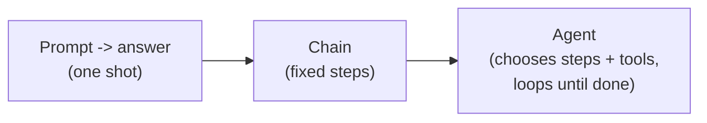
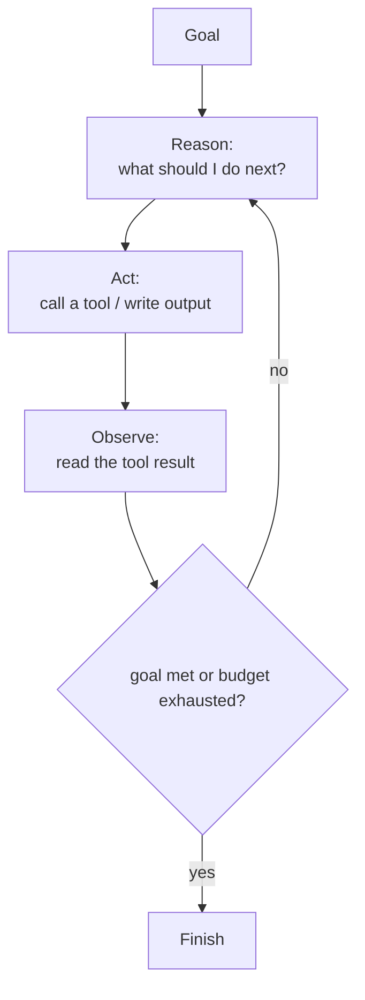

# 01 — Agentic AI

**Agentic AI** describes systems where a language model does more than answer a single prompt: it
**pursues a goal over multiple steps**, deciding what to do next, using **tools** to act on the
world, and reacting to the results — with some degree of **autonomy**.

---

## From chatbot to agent

- **One-shot LLM:** input → output. No memory, no actions.
- **Chain / workflow:** a fixed sequence of LLM calls (e.g. summarize → translate). Deterministic
  control flow, the model only fills in the blanks.
- **Agent:** the model participates in **control flow** — it decides which tool to call, inspects the
  result, and keeps going until a goal is met or a budget runs out.

---

## The agent loop

Most agents implement a **perceive → reason → act → observe** loop:

A popular concrete pattern is **ReAct** (*Reason + Act*): the model alternates between a "thought"
(free-text reasoning) and an "action" (a tool call), reading each "observation" before the next
thought.

---

## What makes something "agentic"

| Property | Meaning |
|---|---|
| **Goal-directed** | works toward an objective, not a single reply |
| **Tool use** | can call functions/APIs to fetch data or cause effects |
| **Memory** | keeps state across steps (short-term context, sometimes long-term stores) |
| **Autonomy** | decides its own next step, within guardrails |
| **Feedback loops** | uses results (test failures, errors) to self-correct |

---

## Levels of autonomy

1. **Assisted** — human approves each step (copilot-style).
2. **Supervised** — the agent runs a loop but pauses for approval at key gates.
3. **Autonomous** — the agent runs end-to-end within a budget and guardrails.

The Coding Orchestrator deliberately sits at **supervised-but-front-loaded**: approvals are decided
**up front** (an `ApprovalPolicy`) so the loop can run without stopping for a human each iteration,
while still bounding risk with loop caps and deterministic tools.

---

## Determinism vs. LLM judgment

A robust agent separates two concerns:
- **Control flow** (what step runs next) — best kept **deterministic** so runs are reproducible and
  debuggable.
- **Content** (the design, the code, the critique) — produced by the **LLM**.

The orchestrator embodies this: a deterministic master graph routes between steps based on explicit
state flags (`design_approved`, `code_approved`, iteration counters), while LLM workers generate the
actual artifacts. See `07-langgraph.md` and `10-agent-architectures.md`.

---

## Common failure modes (and mitigations)

| Failure | Mitigation |
|---|---|
| **Looping forever** | hard iteration caps + budgets |
| **Hallucinated tool calls** | strict tool schemas + validation |
| **Bias / blind spots** | use a *different* model to critique (as the orchestrator does) |
| **Unsafe actions** | deterministic, permission-scoped tools; sandboxing |
| **Context overflow** | summarize/trim history; retrieval instead of stuffing |
