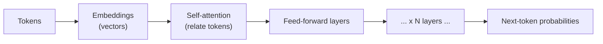

# 02 — Large Language Models (LLMs)

A **Large Language Model** is a neural network trained to predict the next **token** in a sequence.
That single objective, at scale, produces models that can write code, answer questions, translate,
reason, and drive agents.

---

## Tokens, not words

Text is split into **tokens** (sub-word chunks) by a tokenizer. `"tokenizer"` might become
`["token", "izer"]`. Models read and write tokens, not characters or words.

- Pricing and limits are counted in tokens (~4 chars ≈ 1 token in English).
- The **context window** is the maximum number of tokens (prompt + output) a model can consider at
  once — e.g. 8K, 128K, or 1M+ depending on the model.

---

## The transformer, briefly

Modern LLMs are **transformers**. The key mechanism is **self-attention**: for each token, the model
weighs how much every other token in the context matters when producing the next one.

- **Embeddings** turn tokens into vectors.
- Stacked **attention + feed-forward** blocks refine those vectors.
- The final layer outputs a **probability distribution** over the vocabulary for the next token.

---

## How generation works (decoding)

The model produces one token at a time, appends it, and repeats (**autoregression**). Which token
gets picked is controlled by sampling parameters:

| Parameter | Effect |
|---|---|
| **temperature** | randomness. 0 = greedy/deterministic-ish; higher = more diverse/creative |
| **top-p (nucleus)** | sample from the smallest set of tokens whose probability sums to *p* |
| **top-k** | sample from the *k* most likely tokens |
| **max tokens** | cap on output length |
| **stop sequences** | strings that end generation |

For agents you usually want **low temperature** (predictable tool calls); for brainstorming, higher.

---

## Capabilities and limits

**Strengths:** fluent language, code, summarization, translation, pattern completion, in-context
learning (learning from examples in the prompt without retraining).

**Limits to design around:**
- **Hallucination** — plausible but wrong output; mitigate with retrieval (RAG) and verification.
- **Knowledge cutoff** — no knowledge of events after training; mitigate with tools/search.
- **Context limits** — long inputs get truncated; mitigate with summarization/retrieval.
- **No inherent grounding** — the model doesn't "know" it's right; add checks and tools.
- **Cost/latency** — bigger models cost more per token and are slower.

---

## Base vs. instruct vs. chat models

- **Base** model — raw next-token predictor; completes text.
- **Instruct/chat** model — further trained to follow instructions and hold a dialogue with roles
  (`system`, `user`, `assistant`). Agents almost always use instruct/chat models.

---

## Why this matters for the orchestrator

- **Different models for different roles** — using one model to implement and a *different* one to
  critique reduces correlated blind spots (a form of ensembling).
- **Determinism** — low temperature + explicit control flow keeps runs reproducible.
- **Token budgets** — long designs/code must be summarized or chunked to fit context; this is why
  tools and retrieval matter (see `06-rag.md`).

See `03-training-and-fine-tuning.md` for how these models are made, and `04-quantization.md` for how
they're made small enough to run cheaply.
