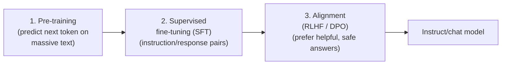
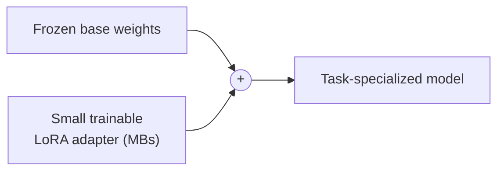

# 03 — Training & Fine-tuning

An LLM you talk to is the product of **several training stages**. Understanding them explains why
models behave the way they do — and when you should fine-tune vs. prompt vs. retrieve.

---

## The training pipeline

### 1. Pre-training
Self-supervised next-token prediction over a huge, diverse corpus (web, books, code). This is where
the model learns language, facts, and reasoning patterns. It is enormously expensive (many GPU-years)
and produces a **base model**.

### 2. Supervised fine-tuning (SFT)
The base model is trained on curated **(instruction, good response)** pairs so it learns to *follow
instructions* and adopt the `system/user/assistant` chat format.

### 3. Alignment (preference optimization)
The model is nudged toward responses humans prefer:
- **RLHF** (Reinforcement Learning from Human Feedback): train a **reward model** from human
  preference rankings, then optimize the LLM against it (e.g. with PPO).
- **DPO** (Direct Preference Optimization): a simpler, RL-free alternative that optimizes directly on
  preference pairs. Increasingly popular for being stable and cheap.

---

## Fine-tuning vs. prompting vs. RAG

A crucial engineering decision — **most of the time you should NOT fine-tune**:

| Need | Best tool |
|---|---|
| Change **style/format/persona** | prompting (system prompt, few-shot) |
| Add **fresh or private facts** | **RAG** (retrieval), not fine-tuning |
| Teach a **new skill/behavior** the model can't do at all | fine-tuning |
| Hit a **latency/cost** target with a smaller model | fine-tune a small model on your task (distillation-like) |

Fine-tuning bakes behavior into weights; it does **not** reliably inject facts (and stale facts are
hard to update). For knowledge, prefer retrieval.

---

## Parameter-efficient fine-tuning (PEFT / LoRA)

Full fine-tuning updates **all** weights — expensive and storage-heavy. **PEFT** methods update only
a tiny fraction:

- **LoRA** (Low-Rank Adaptation): freeze the base weights and train small low-rank "adapter"
  matrices injected into layers. You get a few-MB adapter instead of a full model copy.
- **QLoRA**: LoRA on top of a **quantized** base model — fine-tune large models on a single GPU.

Benefits: cheap to train, tiny to store, easy to swap adapters per task.

---

## Data quality beats quantity

For SFT and fine-tuning, a **small, clean, diverse** dataset usually beats a large noisy one.
Garbage or biased examples are learned faithfully. Deduplicate, filter, and balance.

---

## Practical guidance

1. Start with **prompting**. Most problems are solvable with a good system prompt + few-shot
   examples.
2. Add **RAG** when you need current or proprietary knowledge.
3. Only **fine-tune** when behavior (not knowledge) is the gap, or to shrink cost/latency with a
   specialized small model — and prefer **LoRA/QLoRA**.
4. Always keep an **eval set** to measure whether training actually helped (see
   `11-evaluation-and-guardrails.md`).
