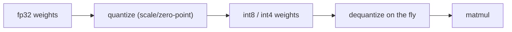

# 04 — Quantization

**Quantization** shrinks a model by storing its weights (and sometimes activations) in **fewer bits**
— e.g. converting 32-bit floats to 8-bit or 4-bit integers. This dramatically reduces memory and
speeds up inference, at some cost to accuracy.

---

## Why it matters

A 7-billion-parameter model:

| Precision | Bytes/param | Approx. weight size |
|---|---|---|
| fp32 (32-bit) | 4 | ~28 GB |
| fp16/bf16 (16-bit) | 2 | ~14 GB |
| int8 (8-bit) | 1 | ~7 GB |
| int4 (4-bit) | 0.5 | ~3.5 GB |

4-bit quantization can turn a model that needed a data-center GPU into one that runs on a laptop or a
single consumer GPU — the difference between "can't run it" and "runs locally."

---

## The core idea

Map a continuous range of float values onto a small set of integers using a **scale** (and often a
**zero-point**):

```
q = round(x / scale)           # quantize
x ≈ q * scale                  # dequantize (approximate)
```

Fewer bits = coarser buckets = more rounding error. The art is minimizing the quality loss.



---

## Flavors

| Type | When it happens | Notes |
|---|---|---|
| **Post-Training Quantization (PTQ)** | after training | fast, no retraining; most common for deployment |
| **Quantization-Aware Training (QAT)** | during training | simulates quantization while training; best quality, more work |
| **Weight-only** | weights quantized, activations kept higher | common for LLMs (e.g. int4 weights, fp16 activations) |

**Calibration** (PTQ) runs a little representative data through the model to pick good scales.

---

## Common LLM quantization formats

- **GGUF** — the format used by `llama.cpp`; supports many bit-widths (Q4_K_M, Q5_K_M, Q8_0…). Great
  for CPU/laptop and mixed CPU/GPU inference.
- **GPTQ** — accurate post-training weight quantization (often 4-bit) for GPU inference.
- **AWQ** (Activation-aware Weight Quantization) — protects the most important weights based on
  activation statistics; strong 4-bit quality.
- **bitsandbytes** — on-the-fly int8/int4 in the Hugging Face stack (enables **QLoRA**).

---

## The tradeoff


- **int8** is usually near-lossless for many tasks.
- **int4** is the popular sweet spot for local LLMs — big savings, modest quality loss.
- **≤3-bit** can degrade reasoning noticeably; test before trusting it.

Larger models tolerate aggressive quantization better than small ones (more redundancy).

---

## When to reach for it

- You need to run a model **locally / on limited hardware**.
- You want **cheaper, faster** inference at scale.
- You're doing **QLoRA** fine-tuning of a large model on one GPU.

Always **evaluate** the quantized model on your actual task (see `11-evaluation-and-guardrails.md`) —
the right bit-width depends on how sensitive your task is to precision. For an agent that must emit
exact tool-call JSON, verify the quantized model still does so reliably.
