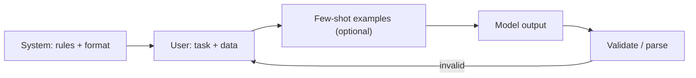

# 05 — Prompting & Context Engineering

The **prompt** is the model's entire world for a request. **Context engineering** is the discipline
of deciding *what information goes into the context window, in what form, and in what order* to get
reliable output. For agents, it matters more than any single "clever" prompt.

---

## Message roles

Chat models take a list of messages with roles:

| Role | Purpose |
|---|---|
| **system** | durable instructions, persona, rules, output format |
| **user** | the task / question / tool results |
| **assistant** | the model's replies (and its tool calls) |
| **tool** | results returned from a tool the model called |

The **system prompt** is your strongest lever — it sets behavior for the whole conversation.

---

## Prompting techniques

- **Zero-shot** — just ask. Works for easy tasks.
- **Few-shot** — include a handful of input→output **examples**; the model imitates the pattern. Great
  for enforcing formats.
- **Chain-of-thought (CoT)** — ask the model to reason step by step before answering; improves
  multi-step reasoning (many modern models do this internally).
- **Structured output** — demand JSON/a schema so the result is machine-parseable. Pair with
  validation.
- **Role/instruction framing** — "You are a senior reviewer applying SOLID principles…" primes the
  relevant behavior (exactly how the orchestrator's scrutiny agents are framed).

---

## Context engineering (the real skill)

The context window is finite and every token costs money/latency. Curate it:

1. **Include only what's relevant** — retrieve the right snippets (RAG) instead of dumping whole
   files.
2. **Order matters** — put critical instructions early (system) and the most relevant evidence close
   to the question.
3. **Summarize history** — for long agent runs, compress old turns rather than carrying them
   verbatim.
4. **Make structure explicit** — headings, delimiters, and schemas reduce ambiguity.
5. **State the output contract** — exactly what shape you want back.

---

## Prompting agents specifically

- **Low temperature** for predictable tool calls and routing.
- **Crisp tool descriptions** — the model chooses tools from their names/descriptions/schemas, so
  write them like API docs (see `09-tools-skills-resources.md`).
- **Explicit stop conditions** — tell the agent when it is "done."
- **Guardrails in the system prompt** — what it must never do; back it with deterministic checks.

---

## Anti-patterns

| Anti-pattern | Better |
|---|---|
| Stuffing entire documents "just in case" | retrieve the relevant chunks |
| Vague instructions ("be helpful") | concrete rules + output schema |
| One giant prompt doing five jobs | decompose into steps/agents |
| Relying on prompt alone for correctness | add validation + tools |
| Burying the key instruction in the middle | lead with it in the system message |

---

## Prompt vs. fine-tune vs. retrieve (recap)

- **Prompt** to change *style/format/behavior*.
- **Retrieve (RAG)** to add *knowledge* (see `06-rag.md`).
- **Fine-tune** only to teach a *new skill* or shrink cost (see `03-training-and-fine-tuning.md`).

Reach for the cheapest, most reversible option first — almost always prompting + context
engineering.
