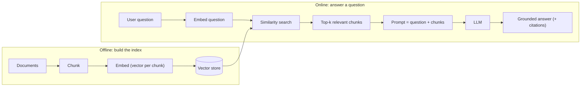

# 06 — Retrieval-Augmented Generation (RAG)

**RAG** gives an LLM access to knowledge it wasn't trained on by **retrieving relevant documents at
query time** and putting them into the prompt. It is the standard fix for hallucination, stale
knowledge, and private data — **without retraining the model**.

---

## The problem it solves

LLMs have a **knowledge cutoff** and no access to your private/internal data. Fine-tuning to inject
facts is expensive and hard to keep current. RAG instead **looks things up** and lets the model
reason over what it found.

---

## How it works

1. **Ingest & chunk** — split documents into passages (e.g. a few hundred tokens, often overlapping).
2. **Embed** — convert each chunk into a vector with an **embedding model** (semantically similar text
   → nearby vectors).
3. **Store** — put vectors in a **vector database** (FAISS, pgvector, Pinecone, Azure AI Search…).
4. **Retrieve** — embed the query, find the **top-k** nearest chunks.
5. **Augment & generate** — insert those chunks into the prompt and let the LLM answer, ideally with
   **citations**.

---

## Embeddings & similarity

An **embedding** is a fixed-length vector capturing meaning. Retrieval ranks chunks by vector
similarity (usually **cosine similarity**). This finds text that is *semantically* related even when
it shares no keywords — the key advantage over plain keyword search.

---

## What makes RAG good or bad

Retrieval quality dominates. Common levers:

| Lever | Effect |
|---|---|
| **Chunk size/overlap** | too big = noisy context; too small = lost meaning |
| **Hybrid search** | combine vector + keyword (BM25) for precision + recall |
| **Re-ranking** | a second model reorders candidates for relevance |
| **Metadata filters** | restrict by source, date, section, permissions |
| **Query rewriting** | expand/clarify the question before retrieval |
| **k (how many chunks)** | more context vs. more noise/cost |

Garbage retrieval → confident wrong answers. Measure retrieval separately from generation.

---

## RAG vs. fine-tuning vs. long context

- **RAG** — best for **knowledge** that changes or is private; update by re-indexing, not retraining.
- **Fine-tuning** — best for **behavior/skills**, not facts.
- **Long-context** (just paste everything) — simple but costly and slower, and quality can drop as
  the window fills; retrieval scales better to large corpora.

They combine well: fine-tune for format/skill, RAG for facts, prompt to orchestrate.

---

## Relationship to agents & MCP

Retrieval is often exposed to an agent as a **tool** ("search the knowledge base") or via **MCP
resources** (see `08-mcp.md`), so the agent decides *when* to look something up. **Agentic RAG** goes
further: the agent iterates — retrieve, reason, retrieve again — until it has enough to answer.

---

## Failure modes

- **Missed retrieval** — relevant chunk not found → answer is incomplete. Fix chunking/hybrid/k.
- **Context stuffing** — too many chunks drown the signal. Re-rank and trim.
- **No grounding check** — model ignores the context. Ask for citations and verify them.
- **Stale index** — re-index on a schedule or on change.
