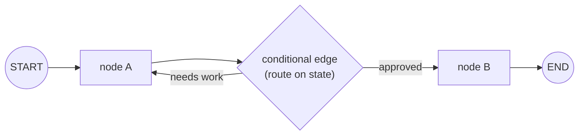

# 07 — LangGraph (and LangGraph4j)

**LangGraph** is a framework for building agents as **graphs**: you define **nodes** (units of work)
and **edges** (how control flows between them) over a shared **state**. Instead of an agent being an
opaque while-loop, its control flow becomes an explicit, inspectable, resumable **state machine**.

**LangGraph4j** is the JVM port used by the Coding Orchestrator.

> The orchestrator's exact graph, node functions, and edge routing (with code) are documented in
> **`../ORCHESTRATOR_FLOW.md`**. This page explains the concepts and syntax generally.

---

## Why a graph?

Plain agent loops are hard to control, test, and resume. A graph gives you:

- **Explicit control flow** — you can *see* and reason about every transition.
- **Determinism** — routing can depend only on state, not on an LLM's whim.
- **Cycles** — loops (implement ↔ scrutinize until harmony) are first-class edges.
- **Persistence/resumption** — state can be checkpointed and resumed.
- **Human-in-the-loop** — pause at a node for approval, then continue.

---

## Core concepts



| Concept | Meaning |
|---|---|
| **State** | a shared object passed to every node; nodes read it and return updates |
| **Node** | a function `state -> partial state update` (call an LLM, run a tool, decide) |
| **Edge** | a transition. **Normal** edge = always go A→B. **Conditional** edge = a function inspects state and returns the next node's name |
| **START / END** | special sentinels marking entry and termination |
| **Compile** | turn the `StateGraph` definition into an executable `CompiledGraph` |

The **state reducer** decides how a node's returned update merges into the shared state (replace,
append to a list, etc.).

---

## Python LangGraph syntax (for reference)

```python
from langgraph.graph import StateGraph, START, END

builder = StateGraph(MyState)
builder.add_node("design", design_fn)
builder.add_node("review", review_fn)

builder.add_edge(START, "design")
builder.add_conditional_edges(
    "review",
    lambda s: "design" if not s["approved"] else END,  # route on state
)
builder.add_edge("design", "review")

graph = builder.compile()
result = graph.invoke({"task": "..."})
```

---

## LangGraph4j syntax (what the orchestrator uses)

The JVM API mirrors the concepts:

```java
var graph = new StateGraph<>(OrchestratorState.SCHEMA, OrchestratorState::new)
    .addNode("design",            node_async(design::apply))
    .addNode("scrutinize_design", node_async(scrutinizeDesign::apply))
    .addNode("implement",         node_async(implement::apply))
    .addNode("scrutinize_code",   node_async(scrutinizeCode::apply))
    .addNode("write_tests",       node_async(writeTests::apply))
    .addEdge(START, "design")
    .addEdge("design", "scrutinize_design")
    .addConditionalEdges("scrutinize_design",
        edge_async(OrchestratorGraph::routeAfterDesignReview),  // returns next node name
        Map.of("implement", "implement", "design", "design"))
    // ... implement <-> scrutinize_code loop ...
    .addEdge("write_tests", END);

CompiledGraph<OrchestratorState> master = graph.compile();
```

- `node_async(...)` / `edge_async(...)` wrap your functions as async node/edge handlers.
- `addConditionalEdges(source, router, mapping)` — the `router` reads state and returns a **key**;
  the `mapping` turns that key into the **target node**. This is where the deterministic routing
  lives (e.g. `design_approved` → `implement`, else back to `design`).
- `compile()` yields the **master** `CompiledGraph` that `.invoke(state)` runs end to end.

---

## The orchestrator's key property

The router functions look **only at explicit control signals** in the state
(`design_approved`, `code_approved`, iteration counters) — never "ask the LLM what to do next."
That's what makes the topology **reproducible**: same signals → same path. The LLMs fill in
*content*; the graph owns *control*.

See `10-agent-architectures.md` for how this graph implements the master–worker pattern, and
`../ORCHESTRATOR_FLOW.md` for the full node/edge listing.
