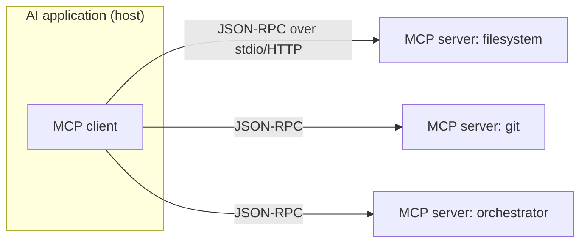
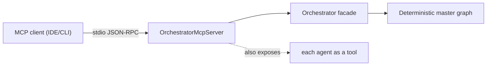

# 08 — Model Context Protocol (MCP)

**MCP (Model Context Protocol)** is an open standard that lets AI applications connect to external
tools and data through a **uniform interface**. Think of it as **"USB-C for AI"**: instead of every
app inventing its own plugin format, an MCP **client** (the AI app) talks to any MCP **server** (a
capability provider) the same way.

The Coding Orchestrator is exposed **as an MCP server**, and each of its agents is an MCP **tool** —
so any MCP client (an IDE, a desktop assistant, a CLI) can drive it.

---

## The model



- **Host** — the AI app the user interacts with (e.g. Claude Desktop, an IDE).
- **Client** — the connector inside the host that speaks MCP.
- **Server** — a program exposing capabilities (tools/resources/prompts). Servers are small and
  composable; a host can connect to many at once.
- **Transport** — usually **stdio** (local subprocess) or **HTTP/SSE** (remote). Messages are
  **JSON-RPC 2.0**.

---

## What a server exposes

MCP defines three main primitives:

| Primitive | What it is | Who controls it | Example |
|---|---|---|---|
| **Tools** | callable functions with a JSON schema; can have side effects | the **model** decides to call them | `write_file`, `git_commit`, `orchestrate_task` |
| **Resources** | readable data identified by URI (like files/records) | the **app/user** selects them | a document, a DB row, a log |
| **Prompts** | reusable prompt templates the user can invoke | the **user** picks them | "review this PR" template |

(Some servers also support **sampling** — asking the host's model to complete text on the server's
behalf — and **roots** for scoping the filesystem.)

---

## A tool definition (shape)

A tool advertises a name, description, and an input **JSON schema**; the model uses these to decide
when and how to call it:

```jsonc
{
  "name": "orchestrate_task",
  "description": "Run the full design->review->implement->test pipeline for a coding task.",
  "inputSchema": {
    "type": "object",
    "properties": { "task": { "type": "string" } },
    "required": ["task"]
  }
}
```

The client lists tools (`tools/list`), the model picks one, the client invokes it (`tools/call`), and
the server returns a result — all as JSON-RPC.

---

## Why MCP matters

- **Interoperability** — write a capability once as an MCP server; any MCP-capable host can use it.
- **Separation of concerns** — the model reasons; servers provide safe, typed access to the world.
- **Composability** — mix servers (filesystem + git + search + your orchestrator) in one host.
- **Security boundary** — servers can validate inputs, scope permissions, and audit calls.

---

## How the orchestrator uses MCP



- **`orchestrate_task`** — one tool that runs the entire pipeline.
- **Each agent** (design, scrutinize, implement, test) is *also* exposed as an individual MCP tool,
  so a client can drive a single stage.
- Internally, the orchestrator's own side effects (filesystem, git, tests) are **deterministic Java
  tools** — the same "tool" idea applied inside the system.

See `09-tools-skills-resources.md` for the broader tool/skill/resource vocabulary and
`../ORCHESTRATOR_FLOW.md` for the concrete server wiring.
