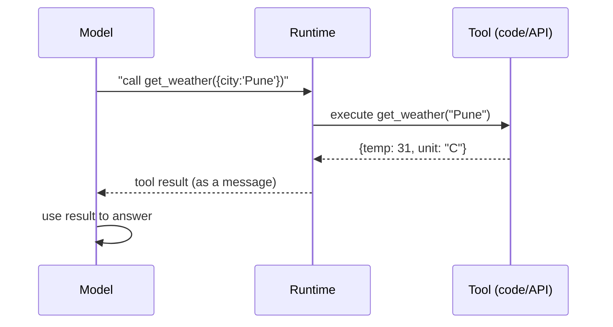
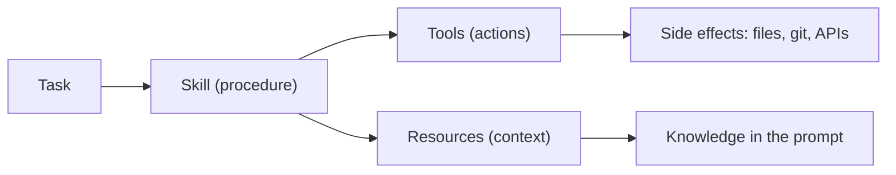

# 09 — Tools, Skills & Resources

Agents are only useful if they can **act on the world** and **bring in knowledge**. The vocabulary
for that — **tools, skills, and resources** — is worth pinning down because the terms overlap in
casual use.

---

## Tools

A **tool** is a function the model can call, described by a **name**, a **description**, and an
**input schema**. Tool calling (a.k.a. *function calling*) is the mechanism by which a text model
triggers real actions.

Key points:
- The model **doesn't run code** — it **emits a structured request** (name + JSON args); the runtime
  executes and returns the result.
- The model chooses tools based on their **descriptions and schemas**, so write them like good API
  docs. Ambiguous descriptions → wrong tool choices.
- Tools should **validate inputs** and fail safely — the model can hallucinate arguments.

**In the orchestrator**, tools are deterministic Java classes — `FileSystemTool`, `GitTool`,
`TestRunnerTool` — that perform **all** side effects. The LLM agents propose; the tools dispose.

---

## Skills

A **skill** is a **packaged capability** — often a bundle of instructions (and sometimes helper
scripts/tools) that teaches an agent *how to do a particular kind of task well*. Where a tool is a
single function, a skill is closer to a **playbook**: "how to review a PR," "how to write unit
tests," "how to author a design doc."

- Skills are typically **model-invoked** when the task matches, and may pull in their own tools.
- They promote **reuse**: define the procedure once, apply it across tasks.

The orchestrator's five agents (design, scrutinize-design, implement, scrutinize-code, write-tests)
are effectively **skills** — each is a specialized procedure with its own system prompt and role.

---

## Resources

A **resource** is **readable data** made available to the model/app — a file, a database record, a
web page, a log — usually identified by a **URI**. Unlike tools, resources typically **don't cause
side effects**; they provide **context**.

- In MCP, **resources** are app/user-selected context (see `08-mcp.md`), distinct from
  model-invoked **tools**.
- RAG chunks (see `06-rag.md`) are a common source of resource-like context.

---

## How they fit together

| Concept | Verb | Side effects? | Chosen by | Analogy |
|---|---|---|---|---|
| **Tool** | *do* | yes (often) | the model | a function/API call |
| **Skill** | *know how to* | via its tools | the model (on match) | a playbook/procedure |
| **Resource** | *read* | no | app/user | a file/record |

---

## Design guidance

1. **Make tools small and single-purpose** — easier for the model to choose correctly.
2. **Write descriptions for the model, not humans** — state exactly when to use it and the argument
   meanings.
3. **Validate everything** — treat model-provided args as untrusted input.
4. **Keep side effects in deterministic tools**, not in the LLM's reasoning — reproducibility and
   safety (the orchestrator's central principle).
5. **Prefer resources/RAG over dumping data** into the prompt — retrieve what's relevant.
6. **Scope permissions** — a tool that can delete files should be constrained and audited.
