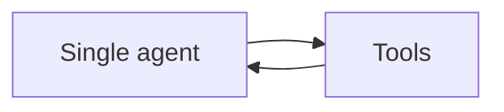
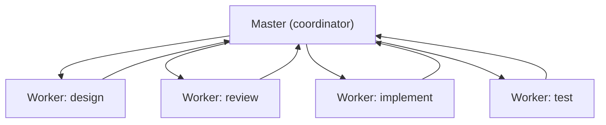
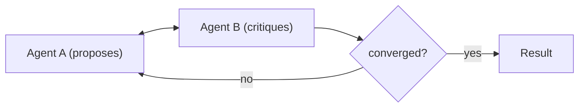
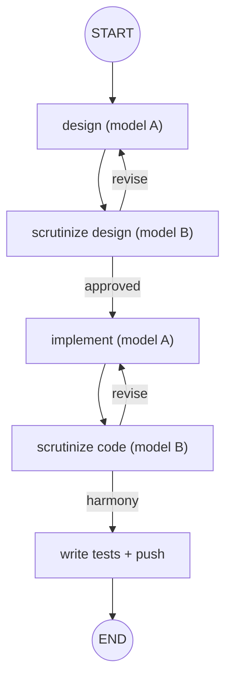

# 10 — Agent Architectures

There are several ways to structure agentic systems. This page surveys the common patterns and
explains why the Coding Orchestrator uses a **deterministic master–worker** design.

---

## 1. Single agent (tool-using loop)

One LLM in a **reason → act → observe** loop with a set of tools.

- **Pros:** simple, flexible, easy to start.
- **Cons:** hard to control on long tasks; one model's biases go unchecked; reasoning and side
  effects are entangled.
- **Good for:** focused tasks with a few tools.

---

## 2. Master–worker (orchestrator–workers)

A **coordinator** decomposes the task and delegates each step to a **specialized worker**. The
master owns control flow; workers own their sub-task.

- **Pros:** separation of concerns; each worker is specialized and independently testable; the master
  can enforce order, retries, and budgets.
- **Cons:** more moving parts; the master's routing must be well-designed.
- **Good for:** multi-stage pipelines (design → review → build → test) — exactly our case.

**The orchestrator's twist:** the master is **deterministic** (a LangGraph4j `CompiledGraph`), not an
LLM. It routes on explicit state signals, so runs are reproducible.

---

## 3. Multi-agent collaboration / debate

Several peer agents interact — critiquing, debating, or voting — to improve quality or reduce bias.

- **Pros:** cross-checking catches errors a single model misses; a *different* critic model reduces
  correlated blind spots.
- **Cons:** more tokens/latency; needs a clear convergence rule to avoid endless argument.
- **The orchestrator uses this** for the **implement ↔ scrutinize-code** loop: the implementer and a
  **different-model** reviewer iterate until they reach *harmony*, bounded by an iteration cap.

---

## 4. Hierarchical / recursive

Agents that spawn sub-agents, forming a tree for very large tasks (a manager of managers). Powerful
but complex; overkill for most problems.

---

## Choosing a pattern

| If you need… | Use |
|---|---|
| a quick tool-using assistant | single agent |
| a reliable multi-stage pipeline | **master–worker** |
| bias reduction / quality via critique | multi-agent debate (different critic model) |
| decomposition of huge, open-ended tasks | hierarchical |

Start simple; add structure only when a simpler pattern fails.

---

## Why the orchestrator combines master–worker **+** debate **+** determinism

1. **Master–worker** gives a clean, testable pipeline.
2. **Debate with a different critic model** (SOLID/design-pattern scrutiny) reduces single-model
   bias.
3. **Deterministic routing** (state flags + iteration caps) makes the whole thing reproducible and
   safe.
4. **Front-loaded approvals** (an `ApprovalPolicy` read once) minimize human interruptions while
   still bounding risk.

This is the practical sweet spot: LLMs supply creativity and judgment; the deterministic master
supplies control, reproducibility, and guardrails. See `07-langgraph.md` and `../ORCHESTRATOR_FLOW.md`.
