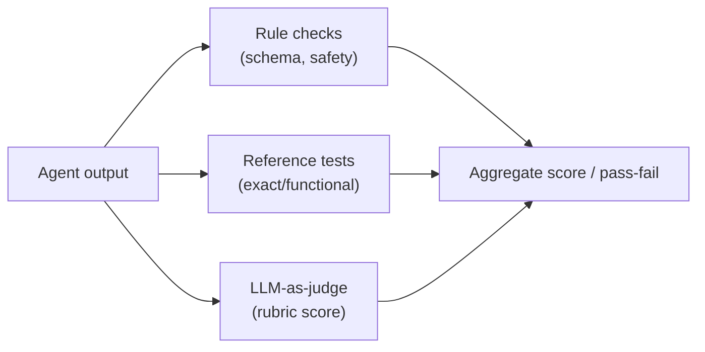
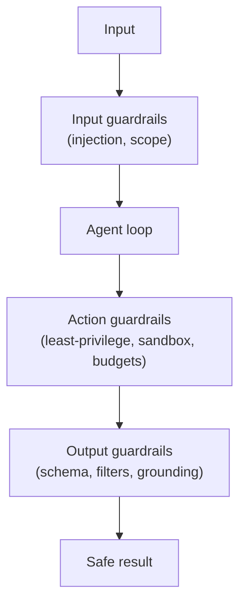

# 11 — Evaluation & Guardrails

Agents are non-deterministic and act on the world, so you cannot ship them on vibes. You need
**evaluation** (are they good?) and **guardrails** (are they safe?).

---

## Evaluation

### Why it's hard
LLM output is open-ended: there's often no single correct string, quality is subjective, and the same
prompt can give different answers. So evaluation blends automated metrics with human/LLM judgment.

### Approaches

| Method | What it does | Good for |
|---|---|---|
| **Golden/reference tests** | compare output to expected answers | tasks with a checkable result (code that must pass tests) |
| **Assertion/rule checks** | verify structure (valid JSON, required fields, no banned content) | format & safety |
| **LLM-as-judge** | a model scores outputs against a rubric | fuzzy quality (helpfulness, correctness) at scale |
| **Human evaluation** | people rate/rank outputs | ground truth, calibration |
| **A/B & regression sets** | track a fixed eval set over changes | catching regressions |

For **coding agents**, evaluation is unusually clean: *run the code against tests*. That's exactly
what Learning Hub's judge and the orchestrator's `write_tests` + `TestRunnerTool` do — objective,
functional grading.

### What to measure
- **Task success rate** (did it achieve the goal?)
- **Faithfulness/grounding** (for RAG: did it use the retrieved facts, with citations?)
- **Cost & latency** (tokens, wall-clock)
- **Robustness** (does it still work on paraphrased/edge inputs?)
- **Safety violations** (rate of blocked/unsafe attempts)

---

## Guardrails

Guardrails constrain **inputs, outputs, and actions** so an agent stays safe and on-task.

### Input guardrails
- Reject/sanitize malicious input; detect **prompt injection** ("ignore your instructions…").
- Enforce scope (topic, allowed data).

### Output guardrails
- **Schema validation** — reject malformed tool calls / responses; re-ask.
- **Content filters** — block PII leaks, secrets, unsafe content.
- **Grounding checks** — verify claims against sources (citations must resolve).

### Action guardrails (most important for agents)
- **Least-privilege tools** — scope what each tool can touch.
- **Deterministic side effects** — keep file/git/network actions in audited, validated tools (the
  orchestrator's core principle) rather than in free-form model output.
- **Sandboxing** — run untrusted/generated code in an isolated process (Learning Hub's judge blocks
  network/subprocess via an audit hook; the container runs non-root).
- **Budgets & loop caps** — cap iterations, tokens, and time so an agent can't run away.
- **Approval gates** — require sign-off for risky actions. **Front-loading** these (decide the policy
  once, up front) minimizes human interruptions while keeping control — the orchestrator's
  `ApprovalPolicy`.
- **Human-in-the-loop** — pause at critical nodes for review, then resume.

---

## Putting it together

A production agent is: **capable model + good context + validated tools + evaluation harness +
layered guardrails.** Skills and prompts make it *capable*; evaluation proves it *works*; guardrails
keep it *safe*. The Coding Orchestrator is a compact worked example — deterministic control, a
different-model critic, sandboxed/deterministic side effects, iteration caps, and front-loaded
approvals.
