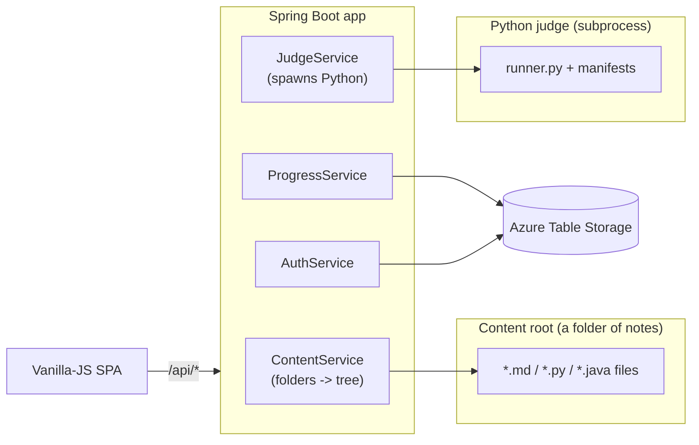

# Learning Hub — Overview

**Learning Hub** is a self-hosted study portal that turns a folder of Markdown/code notes into a
searchable, tabbed website, and adds a **real online judge** so Data-Structures-&-Algorithms (DSA)
solutions can be executed and auto-graded in the browser — like a personal LeetCode/NeetCode.

It is built with **Spring Boot 3** (Java 17) on the backend, a **dependency-free vanilla-JS SPA**
on the frontend, and a **standalone Python judge engine** for grading. It runs locally for zero
cost and is deployed live on **Azure Container Apps** (scale-to-zero).

---

## What it does

| Capability | Summary |
|---|---|
| **Content tabs** | Each subject (Spring Boot, LLD, HLD, DSA, Google, FAANG, Internals, Theory) is a tab, driven entirely by `application.yml` — no code change to add a subject. |
| **File tree + reader** | Walks configured folders into a tree; renders Markdown (with Mermaid + syntax highlight) or shows raw source. |
| **Online judge** | For gradable DSA problems, a **Solve** panel runs your Python against generated test manifests inside a sandbox and grades pass/fail. |
| **Progress tracking** | Per-user completion across DSA / Google / FAANG with progress bars and a reset button, persisted in Azure Table Storage. |
| **Simple auth** | Admin logs in with email+password and manages an allow-list; guests log in with an allow-listed email only. |
| **Dark-first UI** | Responsive dark/light theme, CodeMirror editor, LeetCode-style problem dashboards. |

---

## Why it exists

1. **A single home for interview prep** — LLD machine-coding, HLD system design, DSA, language
   internals, and Spring theory in one place.
2. **Active recall, not passive reading** — the judge forces you to *write and run* code, then
   proves correctness, instead of just reading a solution.
3. **A portfolio piece** — the judge/sandbox, the config-driven content engine, the Azure deploy,
   and the CI pipeline are all genuine engineering, not a CRUD toy.

---

## The 30-second mental model

- The **content root** is just a directory. In dev it is the parent of the app folder; in the
  container it is `/app`.
- The **app** exposes a small REST API (`/api/categories`, `/api/tree`, `/api/file`,
  `/api/judge/*`, `/api/progress`, `/api/auth/*`, `/api/admin/*`).
- The **judge** is a separate Python program the app shells out to — it never runs inside the JVM.

Read the rest of this section for architecture, the content engine, the judge, auth/progress, the
frontend, Azure deployment, testing/CI, and how to run it locally.
