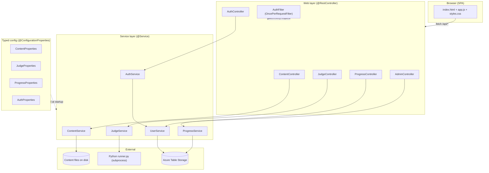
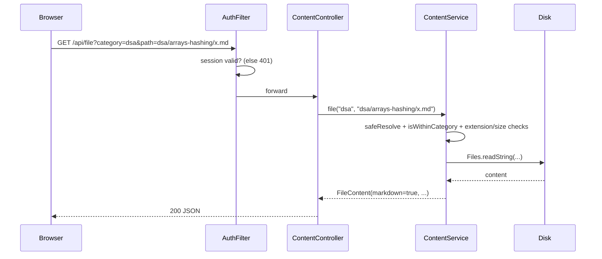

# Architecture

Learning Hub follows a **classic layered Spring Boot architecture** with one twist: the "database"
for content is the **file system**, and grading is delegated to an **out-of-process Python engine**.

---

## Layers

### 1. Web layer (`controller/`, `web/`)
Thin `@RestController` classes that translate HTTP to service calls and back to JSON. A single
servlet filter, **`AuthFilter`** (`OncePerRequestFilter`), gates every request: unauthenticated
page loads get a `302 -> /login.html`, unauthenticated `/api/**` calls get `401`, and `/api/admin/**`
requires the admin role.

### 2. Service layer (`service/`)
The business logic, all `@Service` singletons injected by constructor:
- **`ContentService`** — resolves the content root, exposes categories, walks folders into trees,
  and reads individual files safely (path-traversal protected, extension allow-listed, size-capped).
- **`JudgeService`** — loads problem manifests, builds a problem index, and spawns the Python
  `runner.py` to grade a submission.
- **`ProgressService`** / **`UserService`** — persist completion + the allow-list in Azure Table
  Storage, with an **in-memory fallback** when no connection string is configured (so local dev and
  CI need no cloud).
- **`AuthService`** — validates logins (admin vs allow-listed guest).

### 3. Config layer (`config/`)
Java **records** annotated with `@ConfigurationProperties`, each binding a `hub.*` block from
`application.yml` into an immutable, typed object. This is where the "add a subject with zero code"
magic comes from — categories are just data.

### 4. Model layer (`model/`)
Immutable DTOs (`CategoryDto`, `TreeNode`, `FileContent`) serialized to JSON by Jackson.

---

## Key design decisions

| Decision | Rationale |
|---|---|
| **Content = files, not a DB** | Notes live as Markdown in git; the site is a *view* over them. No schema, no migrations, diff-friendly. |
| **Judge as a subprocess** | Untrusted user code must never share the JVM. A separate Python process can be sandboxed and killed on timeout. |
| **In-memory fallback for state** | Progress/auth degrade gracefully with no Azure — enabling $0 local dev and CI. |
| **Config-driven tabs** | New subjects are a YAML edit; the app has no hard-coded curriculum. |
| **Vanilla JS, no build step** | The frontend is three static files — nothing to compile, bundle, or npm-install. |

---

## Request lifecycle (reading a file)

Every file read is validated to be **inside the content root AND inside one of the requesting
category's configured paths**, defeating `../` traversal.
