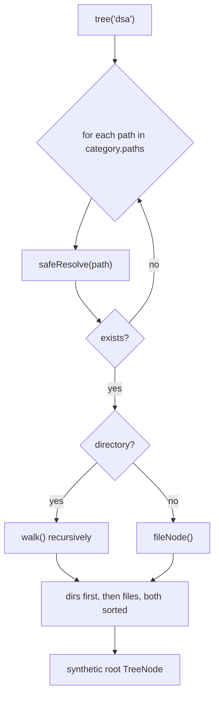

# The Content Engine

The content engine turns a **plain folder of files** into the tabbed, tree-navigable website. It is
implemented by `ContentService` + `ContentProperties` and is the reason a new subject needs **zero
code** — only a YAML edit.

---

## 1. The content root

The root is resolved once at startup:

- If `hub.root` is **blank** (the default), the root is the **parent of the working directory**.
  Locally the app runs from `learning-hub/`, so the root is `Projects/`. In the container the
  working dir is `/app/learning-hub`, so the root is `/app`.
- If `hub.root` is set, that absolute path is used.

```java
private static Path resolveRoot(String configuredRoot) {
    if (configuredRoot == null || configuredRoot.isBlank()) {
        Path workingDir = Paths.get(System.getProperty("user.dir")).toAbsolutePath();
        Path parent = workingDir.getParent();
        return (parent != null ? parent : workingDir).normalize();
    }
    return Paths.get(configuredRoot).toAbsolutePath().normalize();
}
```

---

## 2. Categories = tabs (pure configuration)

Each tab is a `Category` record bound from `application.yml`:

```yaml
hub:
  categories:
    - id: dsa
      label: DSA
      description: "FAANG DSA question bank (Python)."
      paths:
        - dsa/arrays-hashing
        - dsa/two-pointers
        # ...
```

```java
@ConfigurationProperties(prefix = "hub")
public record ContentProperties(String root, List<Category> categories) {
    public record Category(String id, String label, String description, List<String> paths) {}
}
```

`ContentService.categories()` maps these to `CategoryDto` for the `/api/categories` endpoint that
paints the tab bar. **To add a subject:** create a folder, add a `- id/label/description/paths`
block, restart. A new tab appears automatically.

---

## 3. Building the tree

`ContentService.tree(categoryId)` walks each configured path into a `TreeNode`:



Walking rules:
- **Excluded dirs** (`target`, `.git`, `node_modules`, `__pycache__`, `.venv`, …) are never
  descended.
- **Allowed extensions only** (`md`, `py`, `java`, `json`, `yml`, …) are listed; binaries/junk are
  skipped.
- **Empty directories are hidden** after filtering.
- Ordering: **directories before files**, then case-insensitive alphabetical. This is why doc files
  use numeric prefixes (`01-`, `02-`) to control display order.

Each `TreeNode` carries a `path` **relative to the content root**, always using `/` separators so it
is stable across Windows/Linux and safe to use in URLs.

---

## 4. Reading a file safely

`ContentService.file(categoryId, relativePath)` enforces a strict security model before returning
content:

1. **`safeResolve`** — resolve `root.resolve(path).normalize()` and reject anything that does not
   `startsWith(root)` (defeats `../` traversal).
2. **`isWithinCategory`** — the target must live under one of *that category's* configured paths, so
   the DSA tab cannot read HLD files by guessing a path.
3. **Extension allow-list** — only known text/code types.
4. **Size cap** — refuse files larger than 4 MB.
5. Markdown extensions (`md`, `markdown`) are flagged `markdown=true` so the frontend renders them;
   everything else is shown as syntax-highlighted source.

```java
Path target = safeResolve(relativePath);
if (target == null)                       throw badRequest("Illegal path");
if (!isWithinCategory(category, target))  throw forbidden("Path not allowed for this category");
if (!Files.isRegularFile(target))         throw notFound("File not found");
if (!isAllowedFile(name))                 throw forbidden("File type not allowed");
if (Files.size(target) > MAX_FILE_BYTES)  throw payloadTooLarge("File too large");
```

---

## 5. The API surface

| Endpoint | Returns |
|---|---|
| `GET /api/categories` | the tab list |
| `GET /api/tree?category=<id>` | the file tree for a tab |
| `GET /api/file?category=<id>&path=<rel>` | one file's content (+ `markdown` flag) |

That is the entire content engine — small, safe, and driven by data rather than code.
