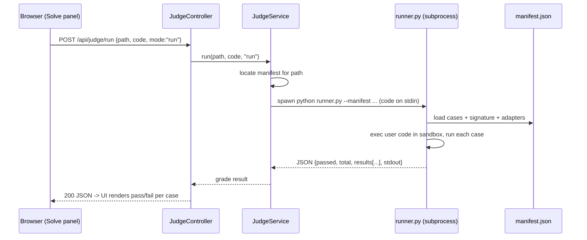

# The Judge Engine

The judge is what makes Learning Hub more than a document viewer: it **executes your code and grades
it**. It is a standalone Python program (`learning-hub/judge/runner.py`) that the Spring app invokes
as a **subprocess**, driven by pre-generated **test manifests**.

> Design rule: untrusted user code must **never** run inside the JVM. It runs in a separate,
> sandboxed, timeout-killable Python process.

---

## 1. Components

| File | Role |
|---|---|
| `judge/runner.py` | The executor: loads a manifest, runs the user's function against test cases, grades pass/fail, and enforces the sandbox. Also does a `complexity` estimate mode. |
| `judge/genlib.py` | Manifest-generation library (parses a problem's reference solution, infers argument kinds, builds cases). |
| `judge/build_manifests.py` | Batch-builds manifests from the DSA `.md` bank; only writes a manifest if it self-checks. |
| `judge/manifests/**.json` | One manifest per gradable problem: signature, sample + hidden cases, adapters. |
| `JudgeProperties` / `JudgeService` / `JudgeController` | Spring side: config, orchestration, REST. |

---

## 2. End-to-end flow



The controller is thin; `JudgeService` owns manifest lookup and process spawning, and `runner.py`
owns execution + grading.

---

## 3. REST API

| Endpoint | Purpose |
|---|---|
| `GET /api/judge/index?section=dsa\|google\|faang` | catalogue of gradable problems `{path,title,difficulty,topic,section}` for the LeetCode-style dashboard. |
| `GET /api/judge/problem?path=...` | editor metadata: starter stub, signature, sample tests, reference solutions (or `available:false` when a problem has no manifest). |
| `POST /api/judge/run` | body `{path, code, mode}` — `mode=run` grades; `mode=complexity` estimates time/space. |

`JudgeService.index()` walks the manifests directory and maps each manifest's relative path back to
its content path (`"dsa/" + relPathWithoutExt + ".md"`), tags the section by prefix
(`google/` → google, `faang/` → faang, else dsa), and caches the result.

---

## 4. Manifests

A manifest is the "answer key" for a problem — generated offline, never trusting the user:

```jsonc
{
  "slug": "two-sum",
  "entry": "twoSum",              // function name to call
  "argKinds": ["list", "int"],    // how to build arguments
  "cases": [
    { "args": [[2,7,11,15], 9], "expected": [0,1] },
    { "args": [[3,2,4], 6],     "expected": [1,2] }
    // ... hidden cases too
  ],
  "adapters": { "tree": true }    // e.g. list<->binary-tree conversion when needed
}
```

`genlib.py` infers `entry`, `argKinds`, and adapters from a problem's reference solution; adapters
convert between JSON-friendly shapes (lists) and runtime objects (linked lists, binary trees) so
tree/list problems can be expressed as plain JSON.

**12 of the 310 base problems are intentionally *not* gradable** (graph clone, random-pointer copy,
tree (de)serialization, float division, sudoku, LCA node-semantics) — they keep their Markdown
explanation but show no Solve panel.

---

## 5. The sandbox (defense in depth)

`runner.py`'s `_install_sandbox()` installs a process-wide **PEP-578 audit hook** (`sys.addaudithook`)
that **blocks dangerous operations** the moment user code tries them:

- `socket.*` (no network)
- `subprocess.*`, `os.system`, `os.exec*`, `os.spawn*`, `os.fork` (no shelling out)
- `ctypes.*` (no native escapes)

```python
def _install_sandbox():
    def hook(event, args):
        if event.startswith(("socket.", "subprocess.")) or event in _BLOCKED:
            raise PermissionError(f"blocked by judge sandbox: {event}")
    sys.addaudithook(hook)   # cannot be removed once installed
```

Combined with:
- a **wall-clock timeout** (the Java side kills a runaway process),
- running as a **non-root user** in the container,
- **no file writes** to the content tree (submissions go to a temp dir),

…this gives a practical sandbox for a single-user learning tool. The pytest suite
(`judge/test_runner.py`) verifies both that legitimate solutions pass **and** that a network/
subprocess attempt is blocked (each in a fresh subprocess so the audit hook can't leak into the test
process).
