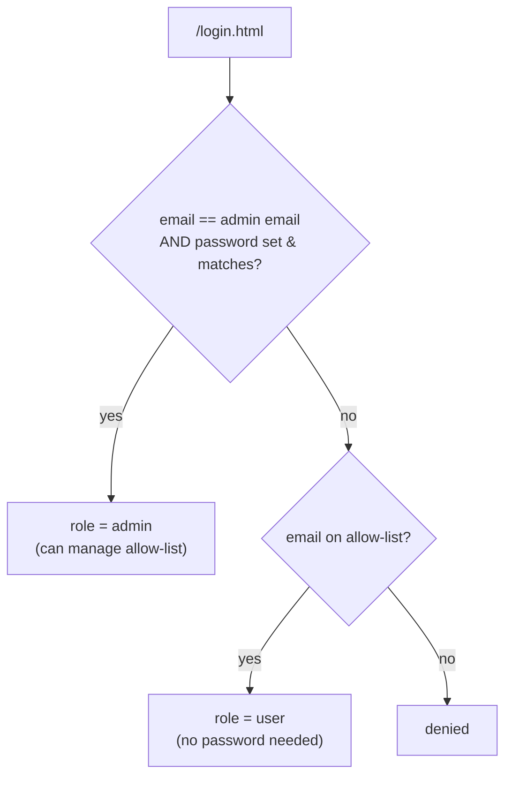
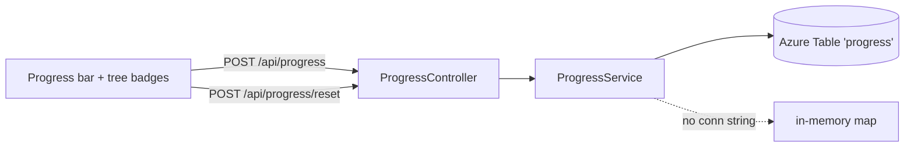

# Auth & Progress

Two features share the same Azure Table Storage account (with an in-memory fallback): **simple
allow-list authentication** and **per-user progress tracking**.

---

## Authentication

A deliberately minimal model for a single-user/small-group app — **not** meant for a hostile public
audience (a tradeoff accepted explicitly).

- **Admin** logs in with an email **+ password**. Both are supplied via environment variables
  (`HUB_AUTH_ADMIN_EMAIL` / `HUB_AUTH_ADMIN_PASSWORD`), backed by Azure Container App secrets in
  production. **Neither is hardcoded** — if either is blank, admin login is disabled.
- **Guests** log in with just an **allow-listed email** (no password). The admin adds emails from an
  in-app admin dashboard.

### Components
| Class | Role |
|---|---|
| `AuthProperties` | binds `hub.auth.*`; exposes `adminEmailConfigured()` / `adminPasswordConfigured()`. |
| `AuthService` | `authenticate(email, password)` → `admin` / `user` / `null`. |
| `UserService` | the allow-list, persisted in the `users` table (in-memory fallback). |
| `AuthFilter` | `OncePerRequestFilter` gating every path. |
| `AuthController` | `/api/auth/login\|logout\|me`. |
| `AdminController` | `/api/admin/users` GET/POST/DELETE (admin only). |

### The filter
`AuthFilter` runs on every request:
- **Public:** `/login.html`, `/api/auth/*`, `/favicon.ico`, `/error`.
- **Unauthenticated page** → `302 /login.html`; **unauthenticated `/api/**`** → `401`.
- **`/api/admin/**`** requires the `admin` role, else `403`.

Sessions are standard servlet `HttpSession`; on Azure, ingress **sticky sessions**
(`affinity=sticky`) keep a session pinned to a replica during scale-out.

### Security note
The password is plain (acceptable for this personal app). It is **never** in source or git history —
only in an Azure secret and your local shell. See `08-testing-and-ci` for the redaction story.

---

## Progress tracking

Per-user completion across the three judge sections (DSA / Google / FAANG), shown as progress bars
with a **reset** button.

### Data model (Azure Table `progress`)
| Field | Value |
|---|---|
| PartitionKey | the user's email (or `default`) |
| RowKey | url-safe base64 of the problem path |
| Path | the problem path |
| Section | `dsa` / `google` / `faang` |

### Endpoints
| Endpoint | Purpose |
|---|---|
| `GET /api/progress` | the caller's solved set |
| `POST /api/progress` | mark a problem solved (also auto-marked when the judge reports all cases passed) |
| `POST /api/progress/reset` | clear a section |

The user is resolved from the **logged-in session email** first (falling back to an Easy-Auth
principal header or `default`), so progress is per person.

### Cost
Azure Table Storage is billed per-GB + per-transaction — for this workload it is **pennies per
month**. With no connection string configured, both progress and the allow-list fall back to an
in-memory map, so **local dev and CI cost $0** and need no cloud account.
