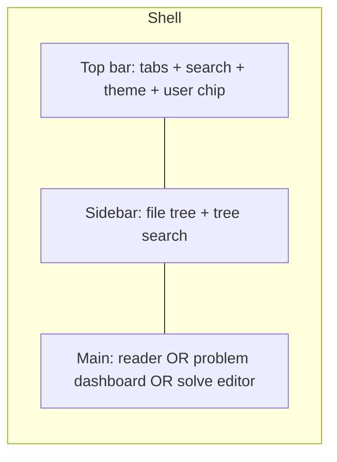
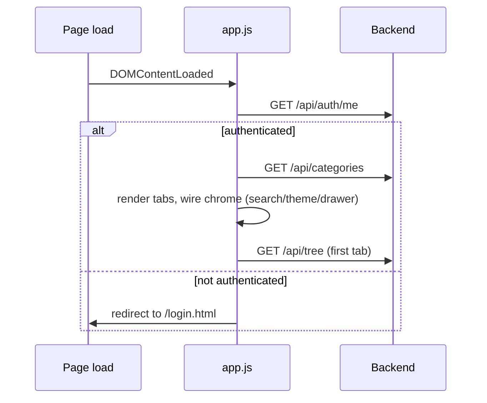

# Frontend & UI

The frontend is a **dependency-free, single-page application** made of exactly three static files
served by Spring Boot from `src/main/resources/static/`:

| File | Role |
|---|---|
| `index.html` | markup shell + CDN libraries (Markdown, highlight.js, Mermaid, CodeMirror) + favicon. |
| `app.js` | all logic: routing, rendering, the judge editor, theming, progress. |
| `styles.css` | dark-first design system (CSS variables), responsive layout, all components. |

There is **no build step** — no npm, no bundler, no framework. Everything is vanilla JS with `fetch`.

---

## Layout



- **Tabs** come from `GET /api/categories`.
- **Sidebar** renders the tree from `GET /api/tree?category=`, with a live filter box.
- **Main pane** shows one of: a rendered Markdown/source file, a **LeetCode-style problem
  dashboard**, or the **Solve editor**.

---

## The problem dashboard

For judge categories (DSA / Google / FAANG), selecting the tab lands on a **dashboard table** built
from `GET /api/judge/index` rather than auto-opening the first file:

- Columns: **Status · Title · Difficulty · Topic**.
- A **search box**, **difficulty chips** (All/Easy/Medium/Hard) and **status chips**
  (Any/Solved/Unsolved).
- Difficulty is shown as coloured **pills** (and small dots in the tree).
- Solved problems get a check, driven by the progress API.

```javascript
// app.js — dashboard state
state.problemIndex   // Map<path, {title, difficulty, topic}>
renderDashboard();   // builds the table + controls
paintDashboardRows(); // applies the active search/difficulty/status filters
```

---

## The Solve editor

Clicking a gradable problem mounts a **CodeMirror 5** editor (loaded from CDN):

- Python mode, line numbers, bracket matching/closing, active-line highlight.
- Shortcuts: **Ctrl+Enter** = run, **Ctrl+/** = toggle comment; 4-space soft tabs.
- A **sticky problem header** (title + difficulty pill + solved badge + back-to-list).
- A **draggable split divider** between the problem statement and the editor (30–70%).
- Themes: `material-darker` (dark) / `neo` (light), re-themed live when the global theme toggles.

Run results render per-case (pass/fail), and an all-pass result auto-marks the problem solved.

---

## Theming & responsiveness

- **Dark mode is the default**; a toggle persists the choice in `localStorage` and swaps the
  highlight.js sheet, the Mermaid theme, and the CodeMirror theme together.
- The design system is built on **CSS custom properties** (`--bg`, `--fg`, `--accent`, …) so the
  whole palette flips by changing variables on `:root`.
- **Responsive:** at ≤ 860px the sidebar becomes an off-canvas drawer (hamburger + scrim) and the
  tab bar scrolls horizontally — usable on a phone.
- Interactive touches: transitions, hover lifts, an animated active-tab underline, fade-in on the
  viewer, focus rings, and a toast for actions.

---

## Bootstrap sequence



`bootstrapAuth()` runs before `init()`, so the SPA only renders content for an authenticated user;
otherwise it hands off to the self-contained dark `login.html`.
