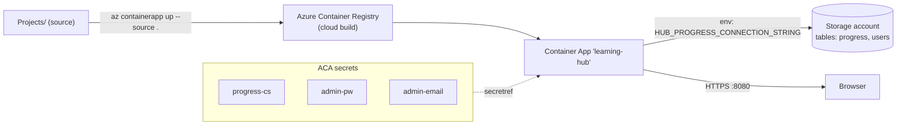

# Azure Deployment

Learning Hub is deployed live on **Azure Container Apps (ACA)** in the **centralindia** region on a
**personal** Azure subscription. ACA was chosen over a VM or App Service for one reason:
**scale-to-zero** — when nobody is using it, it costs almost nothing.

> Live URL:
> `https://learning-hub.wonderfulisland-a04a906a.centralindia.azurecontainerapps.io`

---

## Why Container Apps (not a VM or Web App)

| Option | Verdict |
|---|---|
| **VM** | You pay 24/7 and patch the OS yourself. Overkill for a personal app. |
| **App Service** | Good, but the judge needs both a JRE *and* Python in one image — a custom container is cleaner. |
| **Container Apps** ✅ | Runs our Docker image, **scales to zero** (min replicas 0), HTTPS + ingress included, secrets built in, cheap for bursty personal traffic. |

---

## The image

A **multi-stage `Dockerfile`** at the repo root:

1. **Build stage** (`maven:3.9-eclipse-temurin-17`) — resolves dependencies (cached via `pom.xml`
   first) and packages the Spring Boot fat jar (`-DskipTests` for a fast image).
2. **Runtime stage** (`eclipse-temurin:17-jre` + `python3`) — the judge shells out to Python, so the
   runtime needs **both** a JRE and Python 3.

Runtime layout mirrors local dev so paths resolve identically:

```
/app                 <- content root (parent of the working dir)
/app/dsa, /app/internals, ... , /app/docs-learning-hub, /app/coding-orchestrator/docs
/app/learning-hub    <- WORKDIR (user.dir); judge finds judge/ + manifests
/app/learning-hub/app.jar
```

The container runs as a **non-root user** (`appuser`, uid 10001) for defense in depth — a sandbox
escape cannot act as root.

> When you add a new content folder, add a matching `COPY <folder>/ /app/<folder>/` line to the
> Dockerfile so it ships in the image.

---

## Topology



- No local Docker needed — `az containerapp up --source .` builds the image **in the cloud** via
  ACR and deploys a new revision.
- Config: min-replicas 0, max 3, 0.5 vCPU / 1 GiB, external HTTPS ingress on port 8080, sticky
  sessions.

---

## Secrets (never in source)

Three ACA secrets back three env vars:

| Secret | Env var | Purpose |
|---|---|---|
| `progress-cs` | `HUB_PROGRESS_CONNECTION_STRING` | Azure Table connection string. |
| `admin-pw` | `HUB_AUTH_ADMIN_PASSWORD` | admin login password. |
| `admin-email` | `HUB_AUTH_ADMIN_EMAIL` | admin login email. |

**A deploy must pass all of these** or admin login / progress break on the new revision. To make
that impossible to forget, the repo ships a **`deploy.ps1`** that always passes every `secretref`:

```powershell
az containerapp up `
  --name learning-hub -g learning-hub-rg --environment learning-hub-env `
  --source . --ingress external --target-port 8080 `
  --env-vars `
    HUB_JUDGE_PYTHON_EXE=python3 `
    HUB_PROGRESS_CONNECTION_STRING=secretref:progress-cs `
    HUB_AUTH_ADMIN_PASSWORD=secretref:admin-pw `
    HUB_AUTH_ADMIN_EMAIL=secretref:admin-email
```

**Deploy with `.\deploy.ps1`** rather than a bare `az containerapp up`.

---

## Cost

- **Container App:** scale-to-zero means ~$0 when idle; you pay only for active vCPU/memory-seconds.
- **Storage (tables):** pennies/month for this workload.
- **Registry:** a few cents for the stored image.

For a personal, low-traffic app this typically lands in the **low single-digit dollars per month**,
and $0 while idle.
