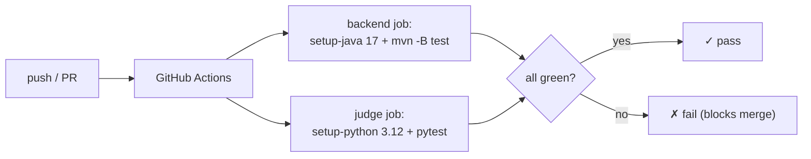

# Testing & CI

Learning Hub ships with an automated test suite and a **GitHub Actions** pipeline that runs on every
push/PR — at **$0** (GitHub's free tier + the in-memory fallbacks mean no Azure is touched in CI).

---

## Test suite

### Backend (JUnit 5 + Spring Boot Test)
| Test | Covers |
|---|---|
| `JudgeServiceTest` | `index()` path→content mapping and section split (dsa/google/faang). |
| `ProgressServiceTest` | in-memory fallback: mark / read / section filter / unmark / reset / per-user isolation. |
| `AuthServiceTest` | admin correct/wrong/blank password, case-insensitivity, guest email-only, revoke, **and** admin disabled when email or password is unconfigured. |
| `ContentControllerTest` | web slice for the content endpoints. |

All state tests use the **in-memory fallback** (blank connection string) so no Azure account is
needed.

### Judge (pytest)
`judge/test_runner.py` verifies the engine itself:
- `mode=run` grades a **correct** solution as passing and a **wrong** one as failing;
- a **compile error** is reported cleanly;
- the sandbox **blocks** `socket`/`subprocess` and **allows** pure computation.

Sandbox cases run in **fresh subprocesses** (`subprocess.run([sys.executable, "-c", ...])`) so the
process-wide audit hook can't contaminate the pytest process.

---

## A WebMvc gotcha (documented so it doesn't bite again)

`AuthFilter` is a `@Component OncePerRequestFilter`, so a `@WebMvcTest` slice will try to register it
and drag in `AuthService`/`AuthProperties`, failing the context load. The fix is to exclude it:

```java
@WebMvcTest(controllers = ContentController.class,
    excludeFilters = @ComponentScan.Filter(
        type = FilterType.ASSIGNABLE_TYPE, classes = AuthFilter.class))
```

---

## CI pipeline (`.github/workflows/ci.yml`)



Two independent jobs:
- **backend** — `actions/setup-java@v4` (Temurin 17) then `mvn -B test` in `learning-hub/`.
- **judge** — `actions/setup-python` (3.12) then `pytest test_runner.py` in `learning-hub/judge/`.

Because both rely on in-memory fallbacks, CI needs **no secrets and no Azure** — it is free and fast
(~2–4 min).

---

## Secret hygiene

Before the repo went public:
1. **Full secret scan** — no API keys, connection strings, or tokens in the tree.
2. The originally hardcoded **admin password and email were redacted** to environment variables
   (`HUB_AUTH_ADMIN_PASSWORD` / `HUB_AUTH_ADMIN_EMAIL`) and moved to ACA secrets.
3. A root **`.gitignore`** keeps `.env`, `target/`, `node_modules/`, and `*secret*` out.
4. Git **history was rewritten** (single amended commit + force-push) so the corp email never
   appears in any commit.

The result: a public repo with a green CI badge and no leaked credentials.
