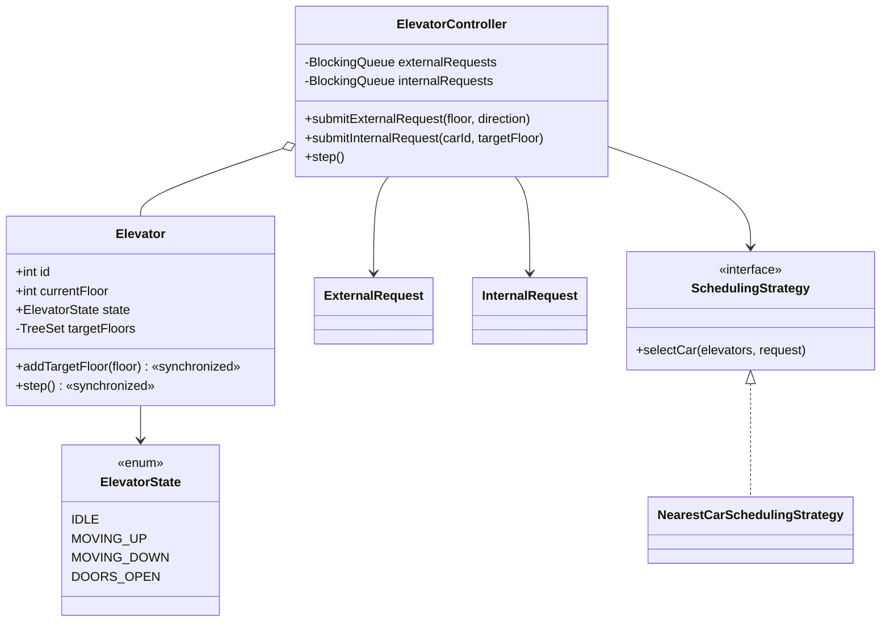
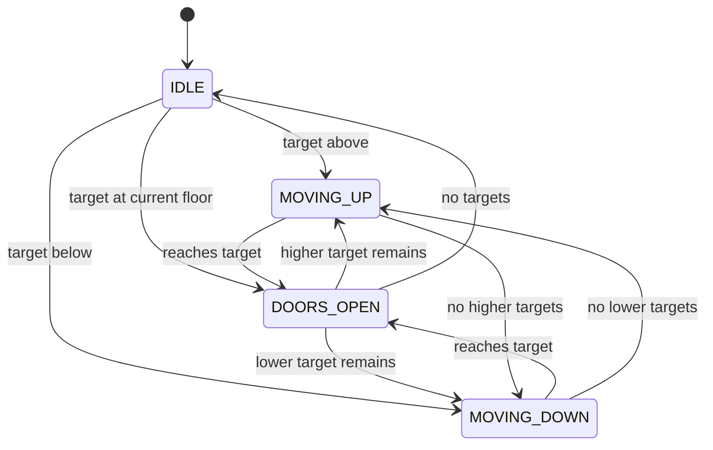

# Elevator System — LLD Machine Coding (Java)

An end-to-end MVP of a multi-car elevator system, built for an SDE2 machine-coding round. It
demonstrates OOP modelling, the **State** and **Strategy** patterns, deterministic simulation, and
thread-safe request intake.

> A parallel Python implementation lives in `../python` with its own README. Both produce identical
> demo output. The class structure is intentionally 1:1 between the two languages.

---

## 1. Why this MVP?

A machine-coding interviewer looks for clean OOP, useful patterns, concurrency awareness, and green
tests — delivered quickly. The MVP is the **smallest elevator system that still exercises all of
those**:

**In scope**
- Building with configurable floors and one or more elevator cars
- External request: `(floor, direction)`
- Internal request: `(car, targetFloor)`
- `ElevatorController.step()` advances every car one deterministic tick
- **State** pattern via `ElevatorState`
- **Strategy** pattern via `SchedulingStrategy`
- Thread-safe request intake with `LinkedBlockingQueue`

**Deliberately out of scope** (extension points): weight limits, express/zoning policies, real-time
threading, door timing, passenger capacity, persistence, REST/UI.

Why step-driven instead of real movement threads? Tests should never depend on sleeps or timing. A
single `step()` is a deterministic clock tick: either move one floor, or open/close doors.

---

## 2. UML

### Class diagram


### State diagram


---

## 3. Design decisions

| Decision | Reasoning |
| --- | --- |
| **Step-driven simulation** | Deterministic tests; no sleeps, timers, or background movement threads. |
| **`ElevatorState` enum** | Compact State pattern suitable for an interview MVP. |
| **Sorted target floors (`TreeSet`)** | Makes SCAN-like “continue in current direction before reversing” simple. |
| **Strategy for scheduling** | Nearest-car policy can be swapped without changing controller code. |
| **Blocking queues for intake** | Multiple threads can submit requests safely; simulation drains them in order. |
| **Single-threaded `step()`** | Keeps movement deterministic while still proving thread-safe request submission. |

### Concurrency model (the key part)
Request intake is concurrent; movement is not. Producers call `submitExternalRequest` or
`submitInternalRequest`, which append to `LinkedBlockingQueue`. `step()` drains those queues and
then advances each car. The concurrency test starts 50 threads and asserts all 50 hall calls are in
the queue, proving none were lost.

---

## 4. Code flow

```
Client → ElevatorController.submitExternalRequest → BlockingQueue
step → drain queues → SchedulingStrategy.selectCar → Elevator.addTargetFloor
step → Elevator.step → move one floor OR open/close doors
```

Package layout:
```
com.example.elevator
├── model/      Elevator, state enum, direction enum, request records
├── strategy/   SchedulingStrategy + NearestCarSchedulingStrategy
├── service/    ElevatorController
├── exception/  InvalidFloorException, ElevatorNotFoundException
└── Main.java   runnable deterministic demo
```

---

## 5. How to run

Prerequisites: JDK 17+ and Maven.

```powershell
cd java

# run the suite (4 tests incl. concurrent intake)
mvn test

# run the demo
mvn -q compile exec:java "-Dexec.mainClass=com.example.elevator.Main"
```

Expected demo output:
```
Initial: Car 1 at floor 0 (IDLE), Car 2 at floor 6 (IDLE)
Queued requests: 2
Tick 1: Car 1 at floor 1 (MOVING_UP)
Tick 2: Car 1 at floor 2 (DOORS_OPEN)
Tick 3: Car 1 at floor 2 (MOVING_UP)
Tick 4: Car 1 at floor 3 (MOVING_UP)
Tick 5: Car 1 at floor 4 (MOVING_UP)
Tick 6: Car 1 at floor 5 (DOORS_OPEN)
Tick 7: Car 1 at floor 5 (IDLE)
```

---

## 6. Tests

`ElevatorControllerTest` covers:
- single car serves an internal request and opens doors
- direction logic: a car moving up does not reverse while higher floors remain
- nearest-car strategy chooses the closer idle car
- **concurrency**: 50 threads submit external requests; all 50 are queued

---

## 7. Extending
- **Door timing**: model door-open duration as more deterministic ticks.
- **Capacity/weight**: reject internal requests when a car is overloaded.
- **Express/zoning**: replace `SchedulingStrategy`.
- **Real-time system**: put a scheduler loop around `step()`; keep core logic deterministic.
