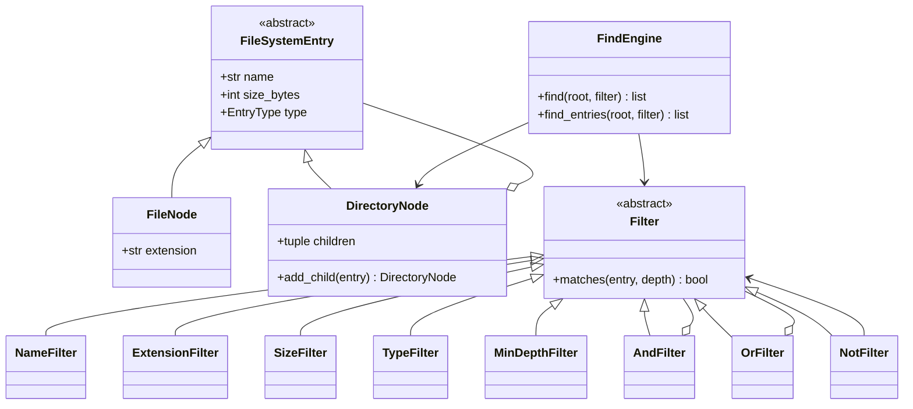
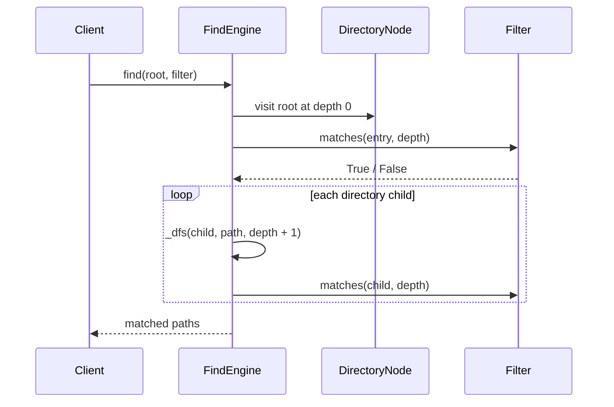

# Find Command — LLD Machine Coding (Python)

An end-to-end MVP of a Linux `find` command, built for an SDE2 machine-coding round. It models an
in-memory filesystem and demonstrates the **Composite** and **Specification / Filter** patterns with
composable boolean filters.

> A parallel Java implementation lives in `../java` with its own README. Both use the same module
> layout and produce equivalent demo output.

---

## 1. Why this MVP?

A machine-coding interviewer looks for clean OOP, design patterns applied for a real reason,
readable code, and working tests — in ~45 minutes. The MVP is the **smallest system that still
exercises all of those**:

**In scope**
- In-memory tree, not the real disk, so tests are deterministic and portable
- `FileSystemEntry` → `FileNode` / `DirectoryNode` Composite
- `Filter` abstraction with name, extension, size, type, and min-depth filters
- `AndFilter`, `OrFilter`, and `NotFilter` to compose criteria like real `find`
- `FindEngine.find(root, filter)` DFS traversal returning matched paths
- Return both files and directories depending on the filter

**Deliberately out of scope** (extension points, not core learning value): real filesystem I/O,
`-exec` actions, permissions/mtime filters, symlink handling, and regex names. The design cleanly
allows a real-FS adapter later.

Thread-safety is not needed here: the search is read-only over an effectively immutable in-memory
tree. The engine is also trivially parallelizable because matching each subtree has no shared state.

---

## 2. UML

### Class diagram


### Traversal / matching sequence


---

## 3. Design decisions

| Decision | Reasoning |
| --- | --- |
| **Composite for the tree** | `FindEngine` treats files and directories uniformly while only directories own children. |
| **Specification / Filter ABC** | One criterion = one class, so each rule is testable and open for extension. |
| **Combinators over hardcoded queries** | Real `find` expressions compose; `And/Or/Not` avoids a giant `if` ladder in the engine. |
| **In-memory model** | Keeps tests deterministic, portable, and fast; a real-FS adapter can build the same tree. |
| **DFS in `FindEngine`** | Simple, predictable output order; easy to swap for BFS or parallel traversal later. |
| **Depth passed to filters** | Supports `MinDepthFilter` without making every entry store traversal context. |
| **No locking** | Read-only search over an immutable tree has no shared mutable state to protect. |

---

## 4. Code flow

```
main → build DirectoryNode/FileNode tree → compose Filter objects
FindEngine.find → _dfs(root)
        → Filter.matches(entry, depth)
        → add path if matched
        → recurse into DirectoryNode children
```

Module layout:
```
find/
├── models.py      FileSystemEntry, FileNode, DirectoryNode, EntryType
├── filters.py     Filter + Name/Extension/Size/Type/MinDepth + And/Or/Not
├── engine.py      FindEngine traversal service
├── exceptions.py  InvalidFileSystemError
└── main.py        runnable demo
tests/
└── test_find.py
```

---

## 5. How to run

Prerequisites: Python 3.10+.

```powershell
cd python

# install the test runner (only dependency)
python -m pip install pytest

# run the test suite (7 tests)
python -m pytest -q

# run the demo
python -m find.main
```

Expected demo output:
```
Text files:
  /workspace/docs/readme.txt
  /workspace/notes.txt
Large log files:
  /workspace/src/logs/app.log
Directories:
  /workspace
  /workspace/docs
  /workspace/src
  /workspace/src/logs
```

---

## 6. Tests

`tests/test_find.py` covers:
- `NameFilter` glob `*.txt`
- `ExtensionFilter` and `SizeFilter.greater_than`
- `TypeFilter(DIRECTORY)` returning directories, including root
- `AndFilter` for name glob + size
- nested `OrFilter` + `NotFilter` composition
- DFS reaching nested paths deeper than one level with `MinDepthFilter`

---

## 7. Extending (what a follow-up would add)
- **Real filesystem adapter**: read disk metadata and build `DirectoryNode` / `FileNode` objects.
- **`-exec` actions**: introduce a Visitor or Action abstraction executed on each match.
- **Regex names**: add `RegexNameFilter` without changing the engine.
- **mtime / permissions**: add more Specification classes.
- **Symlink handling**: add node metadata and cycle detection policy.
- **Parallel traversal**: split DFS by directory because filters are stateless.
