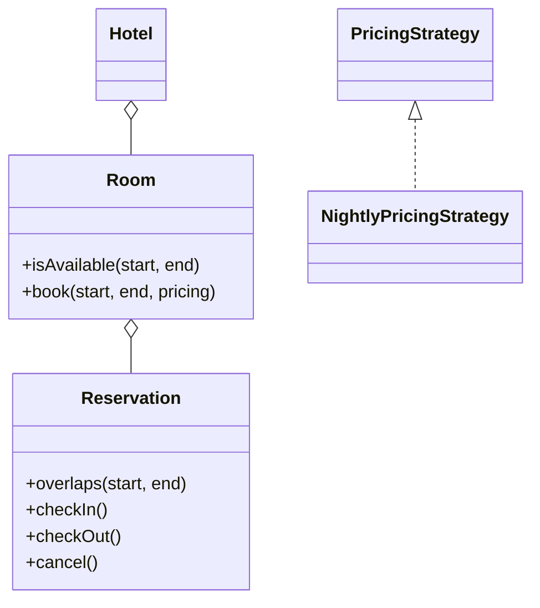
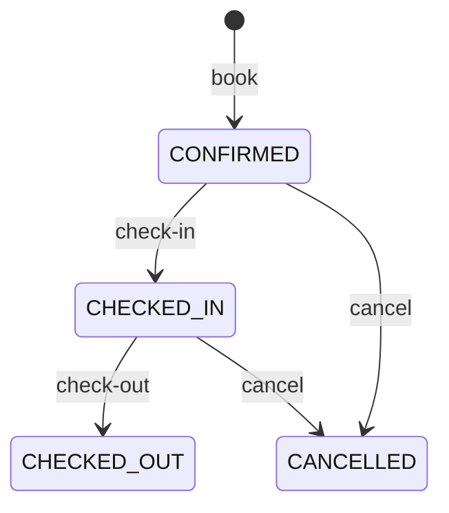
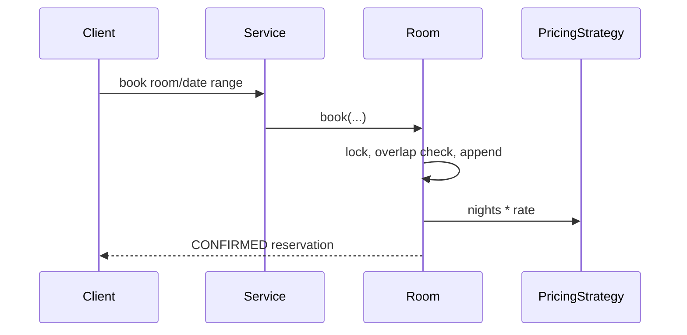

# Hotel Management — LLD Machine Coding

Full MVP of a thread-safe hotel room reservation system, implemented **twice** with an identical design:

| Language | Location | Run tests | Run demo |
| --- | --- | --- | --- |
| Java (Maven, JUnit 5) | [`java/`](./java/README.md) | `cd java && mvn test` | `mvn -q compile exec:java "-Dexec.mainClass=com.example.hotel.Main"` |
| Python (pytest) | [`python/`](./python/README.md) | `cd python && python -m pytest -q` | `python -m hotel.main` |

Both suites cover availability search, date overlap rules, pricing, reservation lifecycle, cancel/freeing dates, and a many-thread race for the same room/date range.

## What it demonstrates
- **OOP**: `Hotel`, `Room`, `Reservation`, and enum-backed room/status models
- **Strategy**: pluggable pricing (`nights * room rate` now; seasonal/weekend later)
- **Workflow/state**: `CONFIRMED -> CHECKED_IN -> CHECKED_OUT`, or `CANCELLED`
- **Concurrency**: atomic per-room reservation-list lock, preventing overlapping double-bookings

See each language README for UML diagrams, design-decision tables, code flow, and MVP rationale.

## 1. Why this MVP?

It keeps the interview scope focused on the core hotel invariant: a room cannot have two live
reservations for overlapping dates. In scope: hotel/rooms/types, availability search, booking,
pricing strategy, reservation lifecycle, cancel/freeing dates, and concurrency. Out of scope:
guests/accounts, payments, housekeeping, multi-hotel inventory, overbooking, refunds, persistence,
and REST/UI.

## 2. UML







## 3. Design decisions

| Decision | Reasoning |
| --- | --- |
| Half-open `[checkIn, checkOut)` dates | Checkout day is free; adjacent bookings are valid. |
| Overlap rule `start1 < end2 AND start2 < end1` | Precise, standard interval test. |
| Per-room lock | Atomic check-and-append prevents double-booking without a global hotel lock. |
| Pricing Strategy | Weekend/seasonal pricing can replace `nights * rate`. |
| Reservation state | Workflow is explicit and testable. |

## 4. Code flow + layout

`search -> Room.isAvailable`; `book -> Room.book -> PricingStrategy -> Reservation`;
`checkIn/checkOut/cancel -> Reservation` state transition.

```
hotel-management/
├── java/   com.example.hotel model/strategy/service/exception + Main + JUnit tests
└── python/ hotel models/strategies/service/exceptions/main + pytest tests
```

## 5. Run steps

```powershell
cd java
mvn test
mvn -q compile exec:java "-Dexec.mainClass=com.example.hotel.Main"

cd ..\python
python -m pytest -q
python -m hotel.main
```

Expected demo output:
```
Available STANDARD rooms for 2026-01-10 to 2026-01-12: [101, 102]
Booked room 101 for 2 nights, total = 200
Available STANDARD rooms after booking: [102]
Reservation status after check-in: CHECKED_IN
Reservation status after check-out: CHECKED_OUT
```

## 6. Test coverage

Both suites cover availability search, adjacent-vs-overlap dates, pricing, unavailable booking,
lifecycle, cancel/freeing dates, and the 50-thread same-room race.

## 7. Extending

Add guests, payments/refunds, housekeeping, multi-hotel inventory, overbooking policies, persistence,
or REST/UI behind the current service/model seams.
