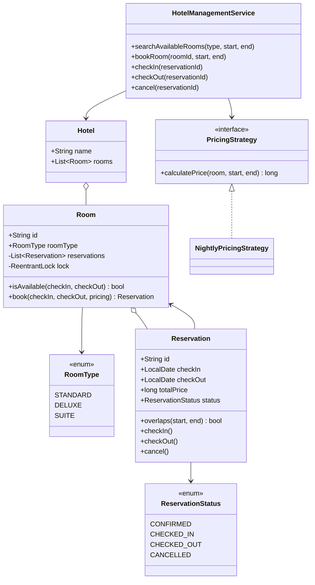
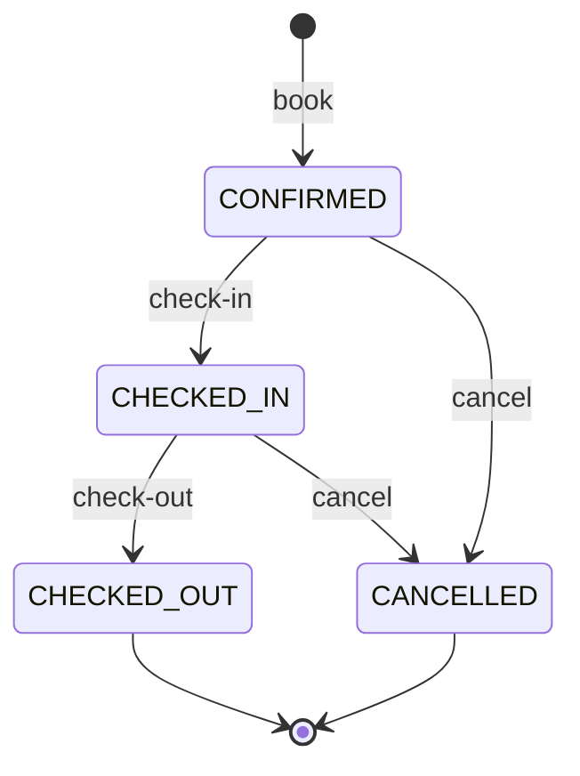
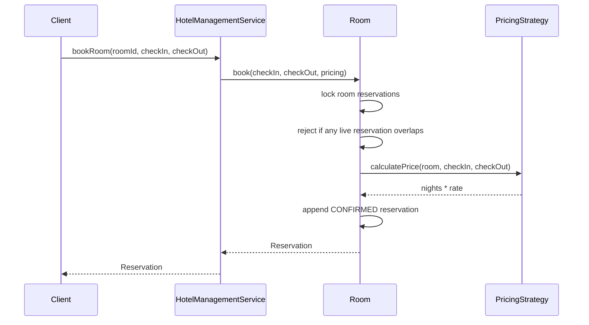

# Hotel Management — LLD Machine Coding (Java)

An end-to-end MVP of a hotel room reservation system, built for an SDE2 machine-coding round. It
models availability search, a booking workflow, a pluggable **Pricing Strategy**, and
**thread-safe** date-range booking so a room is never double-booked for overlapping dates.

> A parallel Python implementation lives in `../python`. The class/module structure is intentionally 1:1.

---

## 1. Why this MVP?

A machine-coding interviewer looks for clean OOP, a useful design pattern, concurrency correctness,
and working tests. This MVP is the **smallest hotel system that still exercises all of those**:

**In scope**
- One `Hotel` with `Room`s of types `STANDARD`, `DELUXE`, `SUITE`, each with a nightly rate
- Search availability for a room type and date range
- Book a specific room for `[checkIn, checkOut)` and compute `nights * rate`
- Reservation lifecycle: `CONFIRMED -> CHECKED_IN -> CHECKED_OUT`, or `CANCELLED`
- Cancel frees the date range
- Per-room locking prevents overlapping double-bookings under concurrent attempts
- Pluggable **PricingStrategy** for future weekend/seasonal pricing

**Deliberately out of scope** (extension points): guests/accounts, payments, housekeeping,
multi-hotel inventory, overbooking policies, refunds, persistence/DB, REST/UI layer.

---

## 2. UML

### Class diagram


### Reservation state diagram


### Booking sequence


---

## 3. Design decisions

| Decision | Reasoning |
| --- | --- |
| **Half-open date ranges `[checkIn, checkOut)`** | Checkout day is free; adjacent bookings are naturally allowed. |
| **Overlap rule: `start1 < end2 AND start2 < end1`** | Standard interval-overlap predicate; tests cover adjacent vs true overlap. |
| **Per-room `ReentrantLock` around reservation list** | The availability check and append are atomic for one room, preventing double-booking while allowing different rooms to book in parallel. |
| **Reservation state enum** | Keeps workflow explicit and easy to validate/extend. |
| **Strategy for pricing** | Current `NightlyPricingStrategy` is simple; weekend/seasonal pricing can be swapped in without changing service/room logic. |
| **In-memory maps/lists** | Correct for an LLD MVP; persistence can be introduced behind repositories later. |

### Concurrency model (the key part)
Every `Room` owns a lock. `Room.book` holds that lock while it checks all live (`CONFIRMED` or
`CHECKED_IN`) reservations for overlap and appends the new reservation. Therefore, when 50 threads
try to book room `101` for the same range, one thread appends first and the other 49 observe the
new overlapping reservation and fail. The race test asserts exactly one success and exactly one
active overlapping reservation.

---

## 4. Code flow

```
Main -> HotelManagementService.searchAvailableRooms
     -> Room.isAvailable -> date-overlap check under room lock
Main -> HotelManagementService.bookRoom
     -> Room.book -> lock -> overlap check -> PricingStrategy.calculatePrice -> Reservation
Main -> checkIn/checkOut/cancel -> Reservation state transition
```

Package layout:
```
com.example.hotel
├── model/      Hotel, Room, Reservation, RoomType, ReservationStatus
├── strategy/   PricingStrategy + NightlyPricingStrategy
├── service/    HotelManagementService
├── exception/  RoomUnavailable/NotFound and reservation state exceptions
└── Main.java   runnable demo
```

---

## 5. How to run

```powershell
cd java

# run the test suite (5 tests incl. the concurrency race test)
mvn test

# run the demo
mvn -q compile exec:java "-Dexec.mainClass=com.example.hotel.Main"
```

Expected demo output:
```
Available STANDARD rooms for 2026-01-10 to 2026-01-12: [101, 102]
Booked room 101 for 2 nights, total = 200
Available STANDARD rooms after booking: [102]
Reservation status after check-in: CHECKED_IN
Reservation status after check-out: CHECKED_OUT
```

---

## 6. Tests

`HotelManagementTest` covers:
- search returns rooms free for a range and excludes overlapping reservations
- overlap logic: adjacent checkout/check-in is allowed; true overlap is excluded
- booking computes `nights * rate`; unavailable room throws
- lifecycle: `CONFIRMED -> CHECKED_IN -> CHECKED_OUT`; cancel frees the range
- **concurrency race**: 50 threads try the same room/range -> exactly one succeeds

---

## 7. Extending
- **Guests/accounts**: attach guest profile to `Reservation`.
- **Payments/refunds**: add payment strategy/service after booking or checkout.
- **Housekeeping**: add room operational status separate from booking status.
- **Multi-hotel**: introduce an inventory repository keyed by hotel id.
- **Overbooking policies**: replace strict room-level blocking with policy objects.
- **Persistence**: put rooms/reservations behind repository interfaces.
