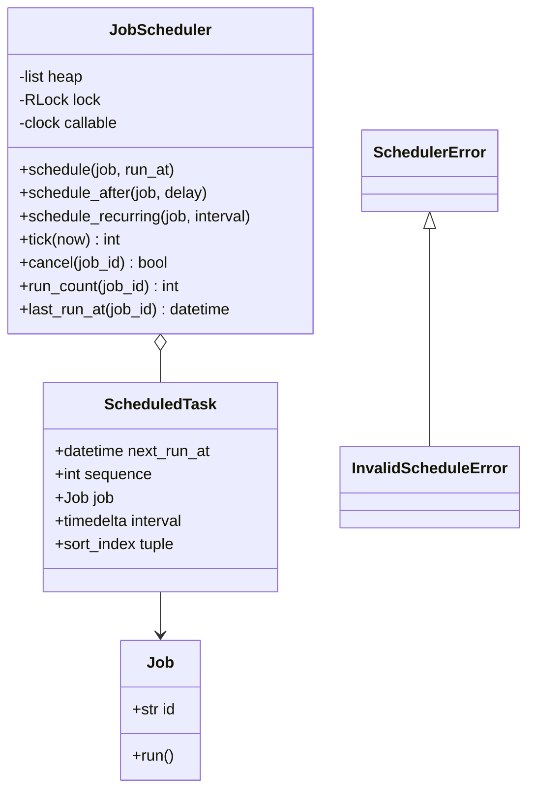
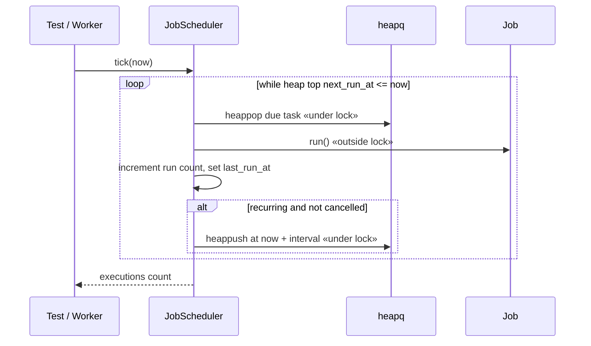

# Job Scheduler — LLD Machine Coding (Python)

An end-to-end MVP of an in-memory job scheduler, built for an SDE2 machine-coding round. It
showcases a **heapq priority queue**, the **Command** pattern, deterministic clock-driven tests, and
thread-safe concurrent job submission.

> A parallel Java implementation lives in `../java` with its own README. Both produce identical
> demo output.

---

## 1. Why this MVP?

A machine-coding interviewer looks for clean OOP, a useful pattern, correct concurrency, and working
tests. This MVP is the **smallest scheduler that still exercises all of those**:

**In scope**
- `schedule(job, run_at)` for one-shot absolute scheduling
- `schedule_after(job, delay)` for one-shot relative scheduling
- `schedule_recurring(job, interval)` for fixed-interval recurring jobs
- Min-heap / priority queue ordered by next-run time, FIFO for ties
- `tick(now)` deterministic engine driven by an injected clock callable
- Run counts and last-run timestamps for assertions
- `cancel(job_id)`
- Thread-safe concurrent submissions

**Why tick/clock-driven?** Real scheduler threads need sleeps, polling intervals, and timing
margins; those make unit tests slow and flaky. The core engine here is deterministic: tests advance
a mutable clock and call `tick(now)`. A production/demo worker can be a thin optional layer that
periodically calls `tick(clock())`, while the tested logic remains pure and stable.

**Deliberately out of scope**: cron expressions, distributed scheduling/leader election,
persistence/recovery, misfire policies, and thread-pool sizing/tuning. See *Extending* below.

---

## 2. UML

### Class diagram


### `tick()` sequence


---

## 3. Design decisions

| Decision | Reasoning |
| --- | --- |
| **`heapq` min-heap** | Earliest job is always at index 0; schedule/poll are O(log n). |
| **`Job` as Command** | Scheduler is decoupled from business work; it just invokes `run()`. |
| **Injected clock + `tick(now)`** | Deterministic tests without sleeps or real worker timing. |
| **Tie-break by insertion sequence** | Equal run times execute in submission order, giving stable behavior. |
| **Lazy cancellation set** | `cancel` is O(1); stale heap entries are skipped when due. |
| **Lock around heap only** | `heapq` is not thread-safe; the lock prevents lost submissions while jobs run outside the lock. |
| **Optional Strategy extension** | A future `NextRunPolicy` could compute next runs (fixed rate, backoff, cron) without changing the heap engine. |

### Concurrency model (the key part)
`heapq` cannot be safely mutated by multiple threads, so `_lock` guards every push, peek, and pop.
`tick()` releases that lock before running user code, so a slow job does not block other threads
from submitting new jobs. The test `test_concurrent_submissions_are_all_enqueued_and_run_once`
starts 50 producer threads at once, then ticks far into the future and asserts all 50 jobs ran
exactly once.

---

## 4. Code flow

```
main/test → JobScheduler.schedule* → heappush ScheduledTask
tick(now) → heappop due tasks in heap order → Job.run → update stats
          → if recurring, heappush a new ScheduledTask at now + interval
cancel(id) → mark id cancelled → tick skips matching heap entries
```

Module layout:
```
scheduler/
├── models.py       Job, ScheduledTask
├── scheduler.py    JobScheduler
├── exceptions.py   SchedulerError, InvalidScheduleError
└── main.py         deterministic runnable demo
tests/
└── test_scheduler.py
```

---

## 5. How to run

Prerequisites: Python 3.10+.

```powershell
cd python

# install the test runner (only dependency)
python -m pip install pytest

# run the test suite (5 tests incl. the concurrency race test)
python -m pytest -q

# run the demo
python -m scheduler.main
```

Expected demo output:
```
Pending jobs at start: 3
Tick +2m ran: 1
Tick +3m ran: 1
Tick +5m ran: 1
Run order: ['cache-cleanup', 'heartbeat', 'email-digest']
Heartbeat runs: 1
```

---

## 6. Tests

`tests/test_scheduler.py` covers:
- one-shot job runs only when `tick(now)` reaches its due time
- ordering across two jobs due at different times in one tick
- recurring job reschedules and runs across 3 deterministic interval ticks
- cancellation prevents execution
- **concurrency**: 50 threads submit jobs concurrently → all 50 are enqueued and each runs once

---

## 7. Extending (what a follow-up would add)
- **Cron expressions**: add a `NextRunPolicy` strategy that computes the next matching datetime.
- **Distributed scheduling**: leader election + sharded ownership of job ids.
- **Persistence**: repository abstraction to reload heap state after process restart.
- **Misfire policies**: choose catch-up, skip, or coalesce when the scheduler was down.
- **Thread-pool tuning**: execute due jobs through an executor with bounded queue/backpressure.
