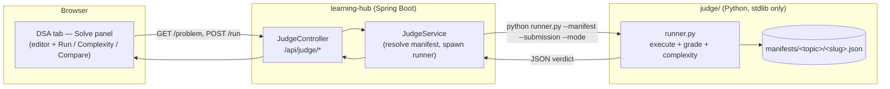

# Local DSA Online Judge

A small, dependency-free judge that runs your **Python** solution to a DSA problem
against auto-generated test cases, estimates its time/space complexity empirically, and
lets you compare your code side-by-side with the reference solutions from the problem's
`.md` file.

It is wired into the `learning-hub` Spring Boot app: open any problem under the **DSA**
tab and a **🧪 Solve** panel appears beneath the write-up.

---

## How it fits together



* **`runner.py`** — the executor. Given a manifest and a submission it either grades the
  submission (`--mode run`) or estimates complexity (`--mode complexity`). Pure stdlib,
  so it runs anywhere Python 3 is installed. Emits a single JSON object on stdout.
* **`genlib.py`** — the manifest *generator* library. Parses a problem `.md`, infers the
  problem shape, extracts the three reference solutions, builds test cases (using the
  optimal solution as an oracle), and self-checks the result.
* **`build_manifests.py`** — the build/verify CLI. Fans out one **subprocess per problem**
  (with a hard timeout) so a pathological reference solution can never hang the build.
* **`manifests/`** — the generated per-problem test specs consumed by `runner.py`.

---

## Problem shapes

The generator auto-detects four shapes from the reference solution + example:

| Shape       | Looks like                                             | How it's graded |
|-------------|--------------------------------------------------------|-----------------|
| `function`  | `class Solution: def entry(self, ...): return answer`  | call `entry(*args)`, compare return value |
| `design`    | a class with `__init__` + several operations           | replay `["Class","op",...]` / `[[args]]`, compare the op outputs |
| `codec`     | `encode(strs) -> s` + `decode(s) -> strs`              | round-trip: `decode(encode(x)) == x` |
| `in-place`  | `entry` mutates an argument and returns `None`         | call it, compare the mutated argument |

For each problem you only write the **function body** — the starter stub (class + method
signatures) is auto-generated from the reference solution and the driver auto-calls it.

---

## How grading stays correct: manifest self-check

A generated manifest is **accepted only if all three reference solutions
(naive / better / optimal) pass it**. The generator:

1. Uses the **optimal** solution as an oracle to compute expected outputs for random inputs.
2. Escalates the comparison mode to the *least permissive* one under which all three
   solutions agree: `exact → sorted → set → multiset2d → set2d` (plus `bool` / `float`).
   This handles problems whose answers are order-independent (e.g. Group Anagrams) or
   otherwise non-canonical without accepting wrong answers.
3. Treats `None` and `[]` as equivalent for list-returning functions (a common, harmless
   convention), but never equates `None` with `0` / `False` / a non-empty value.

If no mode makes all three agree, the manifest falls back to the **canonical example**
from the `.md` only.

### Two-phase, hang-proof build

Each problem is built in its own subprocess:

1. **Phase 1 — base:** an *example-only* manifest (no random generation). Fast and safe;
   written to disk immediately.
2. **Phase 2 — enrich:** oracle-backed random tests + complexity spec. Random generation
   runs under a wall-clock budget; if a reference solution loops forever on synthetic
   input, the subprocess is killed by the per-problem timeout — and the Phase-1 manifest
   still stands. So **every** problem ends up with a working judge.

---

## Complexity estimation (empirical, "estimated")

Static Big-O is undecidable, so the judge **measures** instead. For increasing input
sizes it runs your function, records best-of-N runtime and peak `tracemalloc` memory,
then fits the measurements to `O(1) / O(log n) / O(n) / O(n log n) / O(n²) / O(n³)` by the
lowest coefficient-of-variation of the ratio `measure / g(n)`. The result is labelled
**estimated** with a confidence score — treat it as a strong hint, not a proof. It is only
offered for `function`-shape problems whose inputs the generator can synthesise reliably.

---

## Rebuilding manifests

From the `judge/` directory:

```powershell
# one topic
python build_manifests.py --content-root "<Projects root>" --out ".\manifests" --topic arrays-hashing

# a single problem (handy for debugging)
python build_manifests.py --single "<Projects>\dsa\arrays-hashing\01-two-sum.md" `
    --problem-id arrays-hashing/01-two-sum --topic arrays-hashing --out ".\manifests"
```

The CLI prints a per-problem `[OK]/[FAIL]` report and a summary, and exits non-zero if any
manifest fails its self-check — so it doubles as a verification gate. `--timeout` (default
40s) bounds each problem.

---

## Configuration (in `application.yml`)

```yaml
hub:
  judge:
    enabled: true
    python-exe: python          # or an absolute path
    judge-dir: judge            # holds runner.py
    manifests-dir: judge/manifests
    timeout-seconds: 20         # hard cap per submission run
```

`JudgeService` writes each submission to a temp file and runs `runner.py` as a subprocess,
force-killing it if it exceeds `timeout-seconds`.

---

## Security note

This is a **personal, local, single-user** learning aid. Submissions run as ordinary local
Python with only a wall-clock timeout — there is no sandbox. Do not expose the judge
endpoints to untrusted users or a public network.

---

## Limitations

* Random-input **coverage** varies by problem. For "find a target"-style problems where
  random inputs rarely contain a valid answer, grading falls back to the canonical
  example(s) — correct solutions pass; trivially-wrong ones are still caught by the example.
* A handful of heavy problems (some graph / DP) build as example-only because their
  reference solution is slow on synthetic inputs; complexity is disabled for those.
* Grading is only as good as the reference solutions and examples in each `.md`.
