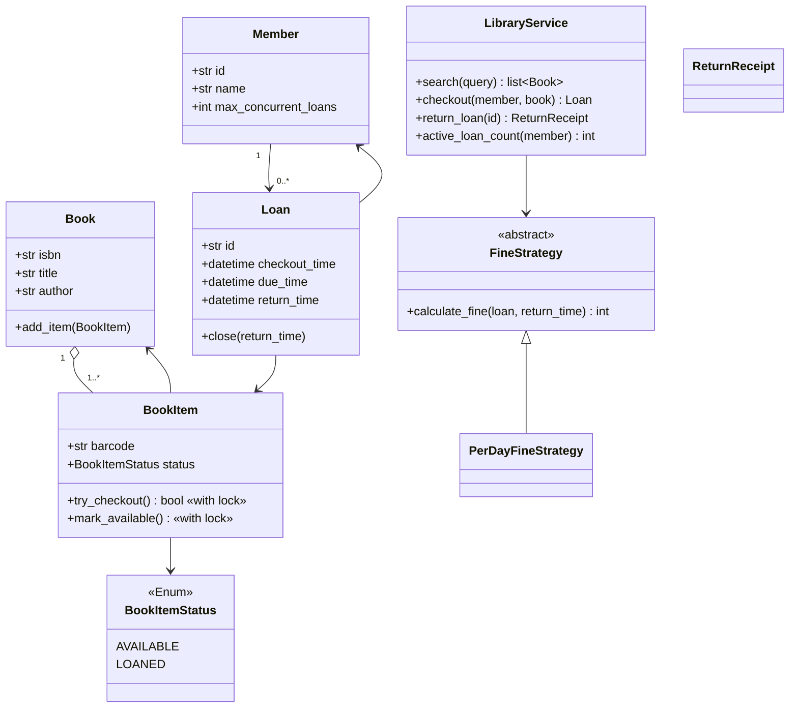
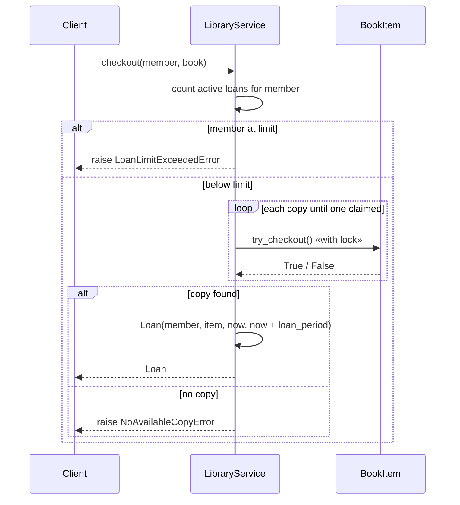

# Library Management — LLD Machine Coding (Python)

An end-to-end MVP of a library management system, built for an SDE2 machine-coding round. It
demonstrates OOP entity modelling, the **Strategy** pattern, and **thread-safe** checkout with no
double-loaning of the same copy.

> A parallel Java implementation lives in `../java` with its own README. Both produce similar
> demo output. The class structure is intentionally 1:1 between the two languages.

---

## 1. Why this MVP?

A machine-coding interviewer looks for clean OOP, a useful design pattern, correct concurrency, and
working tests — delivered quickly. This MVP is the **smallest system that still exercises all of
those**:

**In scope**
- Catalog title (`Book`) and multiple physical copies (`BookItem`) per title
- `search` by title or author substring (case-insensitive)
- `checkout` → claim an available copy → create `Loan` with due date
- Member max concurrent-loans enforcement
- `return_loan` → free copy → compute overdue fine
- Pluggable **FineStrategy** and injected **clock**
- Thread-safe concurrent checkout of the same copy

**Deliberately out of scope** (extension points): reservations/holds queue, multiple branches,
payments, notifications, persistence/DB, REST/UI layer. See *Extending* below.

---

## 2. UML

### Class diagram


### Checkout sequence


---

## 3. Design decisions

| Decision | Reasoning |
| --- | --- |
| **Separate `Book` from `BookItem`** | Users search a title, but lending happens on a physical copy/barcode. This models real libraries and the 1..* relationship. |
| **`Loan` as join entity** | Captures Member ↔ BookItem over time, with due/return timestamps. |
| **Strategy for fines** | Daily fines, grace periods, or premium-member waivers can change without editing `LibraryService`. |
| **Injected `clock` callable** | Due date and overdue fine tests are deterministic — advance a fake clock instead of sleeping. |
| **Concurrency at the copy** | `BookItem.try_checkout` holds a `threading.Lock` so two members cannot borrow the same barcode. |
| **Service lock for member limit** | Counting active loans and inserting a new loan happen together, preventing a member-limit race. |
| **In-memory catalog/loans** | Keeps the MVP focused on LLD; repositories/DB are clean follow-ups. |

### Concurrency model (the key part)
`BookItem.try_checkout` holds a `threading.Lock`, so the check *“is this copy available?”* and the
state change are a single atomic step. The service scans copies and calls `try_checkout`; when 50
threads race for one copy, exactly one wins and no barcode is loaned twice — asserted in
`test_concurrent_checkout_never_double_loans_single_copy`.

---

## 4. Code flow

```
main → LibraryService.search
main → LibraryService.checkout(member, book)
        → enforce member limit → BookItem.try_checkout (atomic)
        → Loan(now, due=now+period) → store in active-loans dict
LibraryService.return_loan → pop active loan → FineStrategy.calculate_fine
        → loan.close → BookItem.mark_available → ReturnReceipt
```

Module layout:
```
library/
├── models.py       Book, BookItem, BookItemStatus, Member, Loan
├── strategies.py   FineStrategy + PerDayFineStrategy
├── service.py      LibraryService, ReturnReceipt
├── exceptions.py   NoAvailableCopyError, LoanLimitExceededError, InvalidLoanError
└── main.py         runnable demo
tests/
└── test_library.py
```

---

## 5. How to run

Prerequisites: Python 3.10+.

```powershell
cd python

# install the test runner (only dependency)
python -m pip install pytest

# run the test suite (5 tests incl. the concurrency race test)
python -m pytest -q

# run the demo
python -m library.main
```

Expected demo output:
```
Catalog size: 2
Search 'code': 1 book(s)
Checked out BC-001 to Asha
Due in days: 14
Returned BC-001, fine = 0
Active loans for member: 0
```

---

## 6. Tests

`tests/test_library.py` covers:
- search by title and author
- checkout marks a copy LOANED, creates a Loan with correct due date, and rejects no-copy checkout
- member max concurrent-loans limit
- return frees the copy and computes a 3-days-late fine using a **mutable injected clock**
- **concurrency**: 50 threads race for 1 copy → exactly 1 succeeds

---

## 7. Extending (what a follow-up would add)
- **Reservations/holds**: wait queue per Book when all copies are loaned.
- **Multiple branches**: Branch owns its copy inventory; search can aggregate branch availability.
- **Payments**: a `PaymentProcessor` invoked for non-zero fines.
- **Notifications**: due-soon/overdue reminders.
- **Persistence**: swap in-memory collections for repository interfaces.
