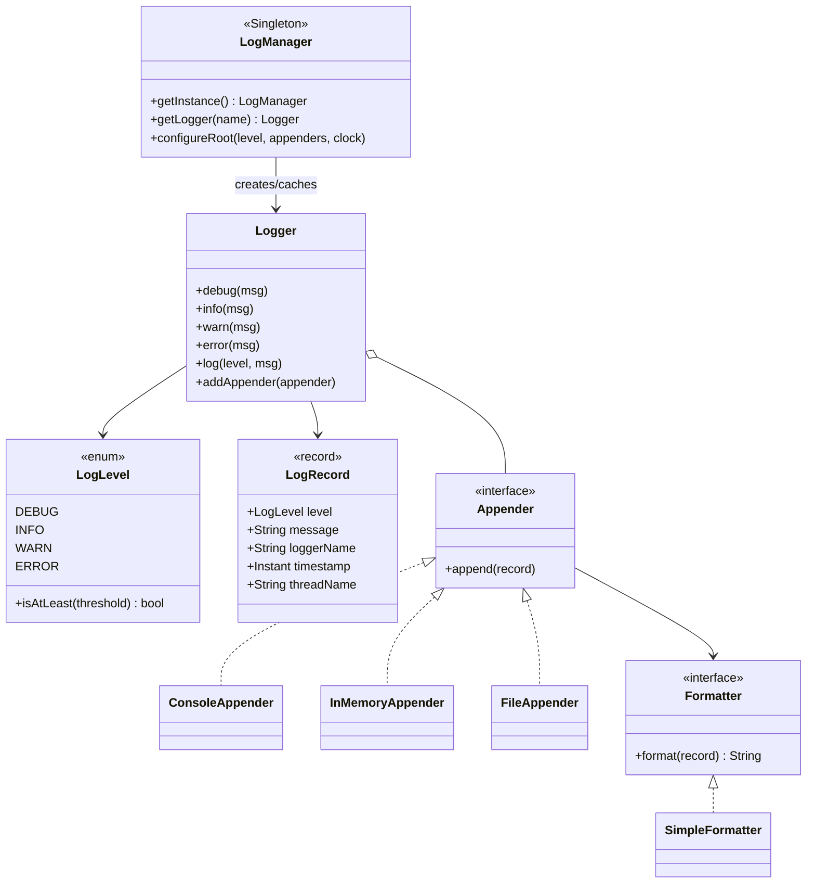
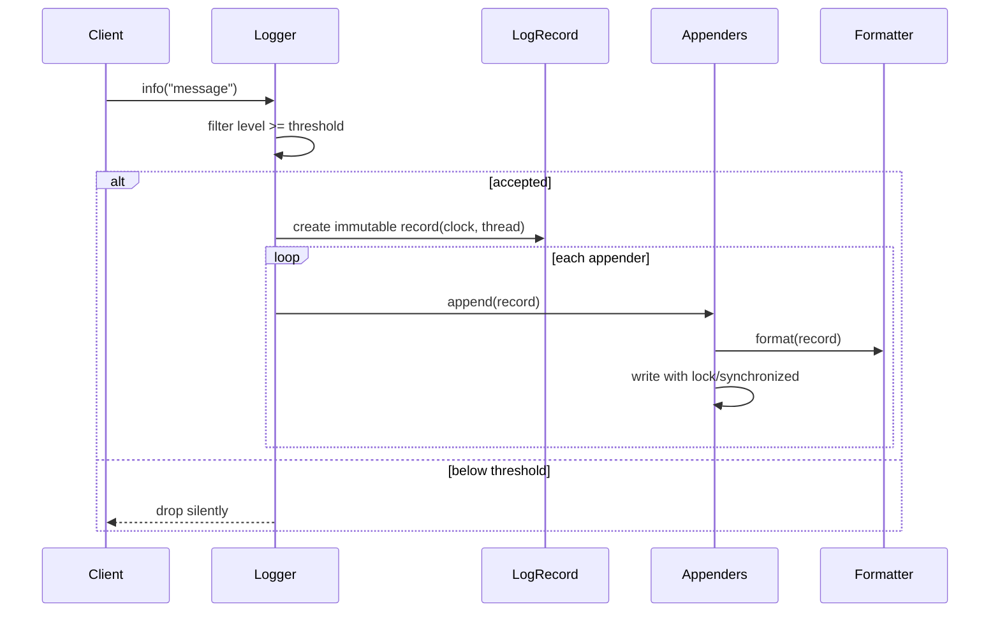

# Logging Framework — LLD Machine Coding (Java)

A compact logging framework built for an SDE2 machine-coding round. It demonstrates **Singleton**,
**Strategy**, **Factory**, Observer-like **fan-out to appenders**, deterministic tests through an
injected `Clock`, and thread-safe logging under contention.

> A parallel Python implementation lives in `../python` with its own README. Both implementations are
> intentionally 1:1 in design.

---

## 1. Why this MVP?

A machine-coding interviewer usually wants clean abstractions, patterns used for a real reason,
concurrency awareness, and executable tests. The MVP is the **smallest logging system that still
shows those skills**.

**In scope**
- Ordered levels: `DEBUG < INFO < WARN < ERROR`
- Named `Logger` with a minimum-level threshold
- Immutable `LogRecord` containing level, message, logger name, timestamp, and thread name
- `ConsoleAppender`, `InMemoryAppender`, and `FileAppender`
- `Formatter` strategy with `SimpleFormatter`
- `LogManager` Singleton that caches loggers by name and holds root defaults
- Thread-safe appender writes and a concurrency test proving no log records are lost

**Deliberately out of scope**: async/buffered logging queues, log rotation, MDC/context, config files,
and network appenders. These are extension points, not needed to prove the core design.

---

## 2. UML

### Class diagram


### Logging sequence


---

## 3. Design decisions

| Decision | Reasoning |
| --- | --- |
| **`LogLevel` enum order** | `ordinal()` captures severity ordering and keeps filtering simple. |
| **Immutable `LogRecord`** | Safe to share one accepted event across multiple appenders and threads. |
| **Singleton `LogManager`** | Logging is process-wide infrastructure; a single registry prevents duplicate named loggers. |
| **Factory method `getLogger`** | Callers ask for a name; manager owns construction and caching. |
| **Formatter Strategy** | Text layout changes without touching appenders or logger filtering. |
| **Fan-out to Appenders** | Observer-like chain: a logger publishes one record to many sinks. |
| **Injected `Clock`** | Tests assert exact timestamps without sleeps or flaky wall-clock timing. |
| **Concurrency in appenders** | Logger fans out without a global lock; each sink serializes its own state/write path. |

### Concurrency model (the key part)
`Logger` stores appenders in `CopyOnWriteArrayList`, so iteration is safe while configuration changes.
`InMemoryAppender.append`, `ConsoleAppender.append`, and `FileAppender.append` are `synchronized`, so
multiple threads writing through the same logger cannot corrupt appender state or interleave file /
console writes. The test `concurrentLoggingDoesNotLoseRecords` releases 20 threads together and
asserts exactly `20 * 100` records are captured.

---

## 4. Code flow

```
Main → LogManager.configureRoot → LogManager.getLogger("checkout")
Logger.info/warn/error → threshold check → new LogRecord(clock.instant, threadName)
        → for each Appender.append → Formatter.format → console/memory/file write
```

Package layout:
```
com.example.logging
├── core/       LogLevel, LogRecord, Logger, LogManager
├── appender/   Appender, ConsoleAppender, InMemoryAppender, FileAppender
├── format/     Formatter, SimpleFormatter
├── exception/  LoggingException
└── Main.java   runnable demo
```

---

## 5. How to run

Prerequisites: JDK 17+ and Maven.

```powershell
cd java

# run the test suite (5 tests incl. concurrent logging)
mvn test

# run the demo
mvn -q compile exec:java "-Dexec.mainClass=com.example.logging.Main"
```

Expected demo output:
```
[2024-01-01T10:00:00Z] INFO checkout [MainThread] - order created
[2024-01-01T10:00:00Z] WARN checkout [MainThread] - payment retry scheduled
[2024-01-01T10:00:00Z] ERROR checkout [MainThread] - payment failed
In-memory records: 3
```

---

## 6. Tests

`LoggingFrameworkTest` covers:
- level filtering: WARN logger drops DEBUG/INFO and keeps WARN/ERROR
- `SimpleFormatter` output includes timestamp, level, logger name, thread, and message
- fan-out: two appenders each receive the same record
- `LogManager.getLogger` returns the same cached instance for the same name
- **concurrency**: 20 threads × 100 messages → exactly 2000 records captured, none lost

---

## 7. Extending (what a follow-up would add)
- **Async appender**: enqueue records to a background worker for low-latency callers.
- **Rotation**: size/time based `RollingFileAppender`.
- **MDC/context**: add request/user key-values to `LogRecord`.
- **Config files**: load levels and appenders from YAML/JSON/properties.
- **Network appenders**: ship logs to Kafka, HTTP, or syslog.
