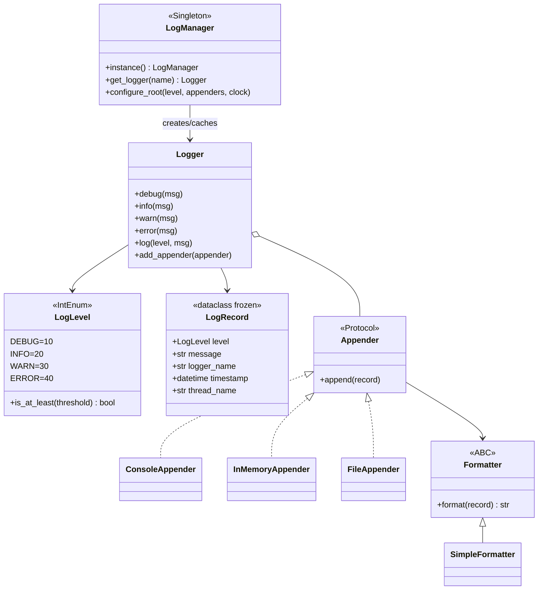
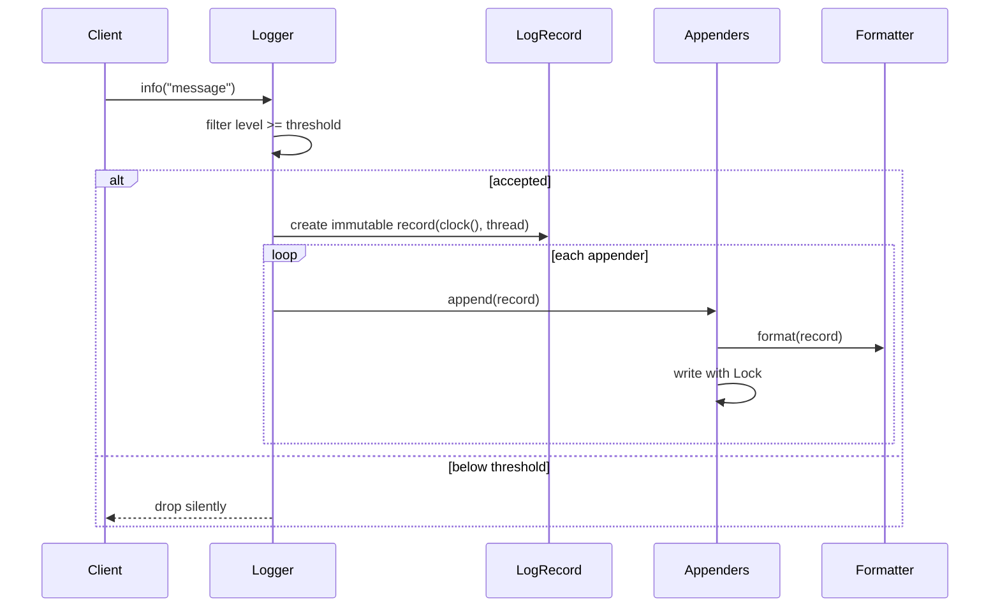

# Logging Framework — LLD Machine Coding (Python)

A compact logging framework built for an SDE2 machine-coding round. It demonstrates **Singleton**,
**Strategy**, **Factory**, Observer-like **fan-out to appenders**, deterministic tests through an
injected clock callable, and thread-safe logging under contention.

> A parallel Java implementation lives in `../java` with its own README. The Python package is named
> `logkit` so it does not shadow the standard library `logging` module.

---

## 1. Why this MVP?

A machine-coding interviewer usually wants clean abstractions, patterns used for a real reason,
concurrency awareness, and executable tests. The MVP is the **smallest logging system that still
shows those skills**.

**In scope**
- Ordered levels: `DEBUG < INFO < WARN < ERROR`
- Named `Logger` with a minimum-level threshold
- Immutable `LogRecord` containing level, message, logger name, timestamp, and thread name
- `ConsoleAppender`, `InMemoryAppender`, and `FileAppender`
- `Formatter` strategy with `SimpleFormatter`
- `LogManager` Singleton that caches loggers by name and holds root defaults
- Thread-safe appender writes and a concurrency test proving no log records are lost

**Deliberately out of scope**: async/buffered logging queues, log rotation, MDC/context, config files,
and network appenders. These are extension points, not needed to prove the core design.

---

## 2. UML

### Class diagram


### Logging sequence


---

## 3. Design decisions

| Decision | Reasoning |
| --- | --- |
| **`LogLevel(IntEnum)`** | Numeric ordering captures severity and keeps filtering simple. |
| **Frozen `LogRecord` dataclass** | Safe to share one accepted event across multiple appenders and threads. |
| **Singleton `LogManager`** | Logging is process-wide infrastructure; a single registry prevents duplicate named loggers. |
| **Factory method `get_logger`** | Callers ask for a name; manager owns construction and caching. |
| **Formatter Strategy** | Text layout changes without touching appenders or logger filtering. |
| **Fan-out to Appenders** | Observer-like chain: a logger publishes one record to many sinks. |
| **Injected clock callable** | Tests assert exact timestamps without sleeps or flaky wall-clock timing. |
| **Concurrency in appenders** | Logger fans out without a global lock; each sink serializes its own state/write path. |

### Concurrency model (the key part)
`Logger` snapshots the appender list under an `RLock` before publishing. `InMemoryAppender`,
`ConsoleAppender`, and `FileAppender` use a `threading.Lock` around their mutable state or write path.
Even with CPython's GIL, a list append plus formatted-line append should be treated as a critical
section because the framework should remain correct across Python runtimes. The test
`test_concurrent_logging_does_not_lose_records` releases 20 threads together and asserts exactly
`20 * 100` records are captured.

---

## 4. Code flow

```
main → LogManager.configure_root → LogManager.get_logger("checkout")
Logger.info/warn/error → threshold check → LogRecord(clock(), threadName)
        → for each Appender.append → Formatter.format → console/memory/file write
```

Module layout:
```
logkit/
├── level.py       LogLevel
├── record.py      immutable LogRecord
├── formatters.py  Formatter + SimpleFormatter
├── appenders.py   ConsoleAppender, InMemoryAppender, FileAppender
├── logger.py      Logger thresholding + fan-out
├── manager.py     Singleton LogManager + named logger factory
└── main.py        runnable demo
tests/
└── test_logkit.py
```

---

## 5. How to run

Prerequisites: Python 3.10+ and pytest.

```powershell
cd python

# run the suite (5 tests incl. concurrent logging)
python -m pytest -q

# run the demo
python -m logkit.main
```

Expected demo output:
```
[2024-01-01T10:00:00Z] INFO checkout [MainThread] - order created
[2024-01-01T10:00:00Z] WARN checkout [MainThread] - payment retry scheduled
[2024-01-01T10:00:00Z] ERROR checkout [MainThread] - payment failed
In-memory records: 3
```

---

## 6. Tests

`tests/test_logkit.py` covers:
- level filtering: WARN logger drops DEBUG/INFO and keeps WARN/ERROR
- `SimpleFormatter` output includes timestamp, level, logger name, thread, and message
- fan-out: two appenders each receive the same record
- `LogManager.get_logger` returns the same cached instance for the same name
- **concurrency**: 20 threads × 100 messages → exactly 2000 records captured, none lost

---

## 7. Extending (what a follow-up would add)
- **Async appender**: enqueue records to a background worker for low-latency callers.
- **Rotation**: size/time based `RollingFileAppender`.
- **MDC/context**: add request/user key-values to `LogRecord`.
- **Config files**: load levels and appenders from YAML/JSON/properties.
- **Network appenders**: ship logs to Kafka, HTTP, or syslog.
