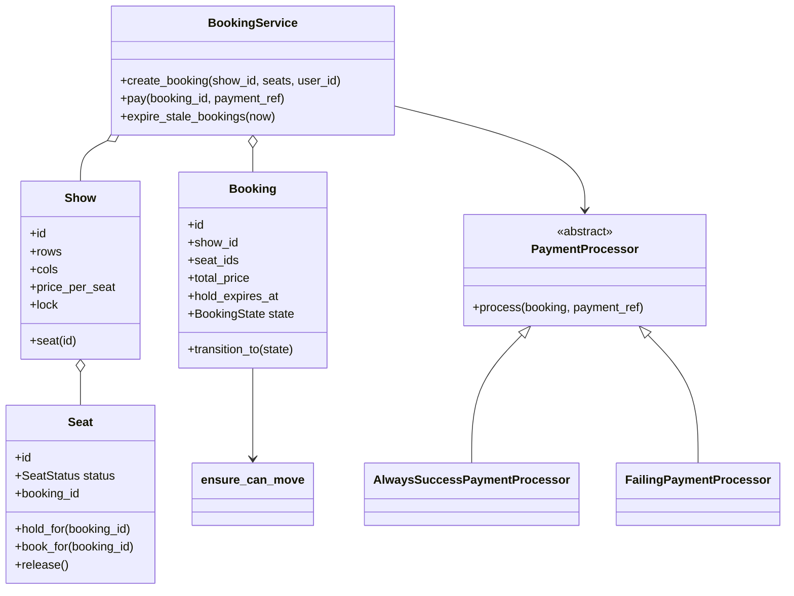
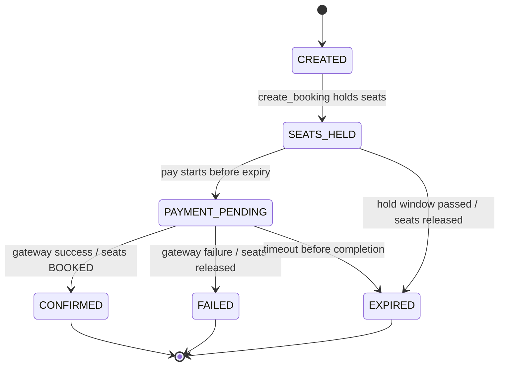
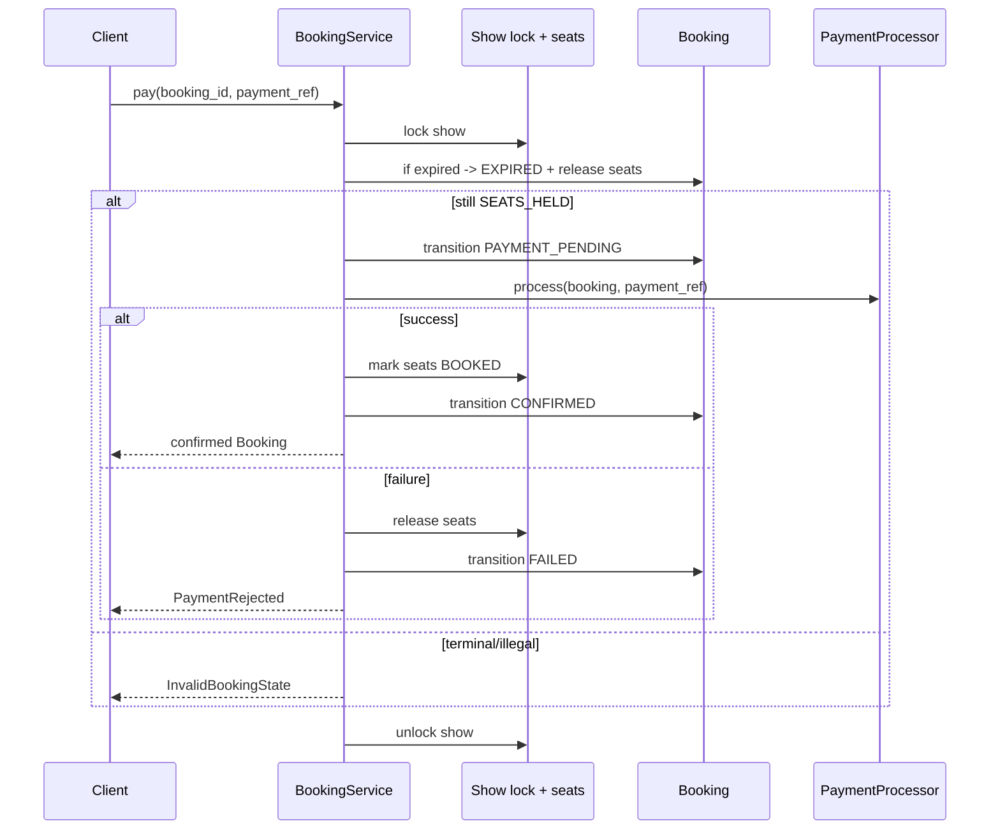

# Movie Ticket Booking — LLD Machine Coding (Python)

An end-to-end MVP of a movie ticket booking system, built for an SDE2 machine-coding round. It is
intentionally **not** a discovery app; the core is **hold seats -> pay -> confirm / fail -> release**,
with expiry and locking.

> A parallel Java implementation lives in `../java`. Both implementations keep the same class
structure, state transitions, tests, and demo flow.

---

## 1. Why this MVP?

**In scope**
- One/few `Show`s with a grid of `Seat`s and flat price per seat
- `create_booking` atomically holds all seats or none
- Explicit `BookingState`: `CREATED -> SEATS_HELD -> PAYMENT_PENDING -> CONFIRMED`, or terminal
  `EXPIRED` / `FAILED`
- `PaymentProcessor` abstraction with success/failure fakes
- Hold expiry using an injected clock callable
- Show-level `RLock` guarding the seat map

**Deliberately out of scope**: real gateway, theater/city discovery, refunds/cancellation, pricing
tiers, auth, persistence, REST/UI. These are extension points, not the core learning value.

---

## 2. UML

### Class diagram


### Booking state diagram


### pay() sequence


---

## 3. Design decisions

| Decision | Reasoning |
| --- | --- |
| **Explicit state machine** | Legal transitions are centralized and testable; terminal states cannot be paid. |
| **Show-level lock** | A multi-seat hold needs one atomic critical section across the seat map: all seats held or none. |
| **Dict booking store** | Simple in-memory store for machine coding; each show serializes its own inventory. |
| **PaymentProcessor strategy** | Payment success/failure is injectable; no real gateway in machine coding. |
| **Injected clock callable** | Expiry tests advance a `MutableClock`, never `sleep`. |
| **Check-on-pay + scheduler expiry** | `pay()` rejects expired holds immediately; `expire_stale_bookings(now)` supports a sweeper. |

### Concurrency model (the key part)
`BookingService` locks `Show` before checking or changing seats. Therefore the check *“are all
requested seats AVAILABLE?”* and the update *“mark them HELD for this booking”* are one atomic
operation. The race test releases 50 threads onto the same seat; exactly one booking wins. The lock
is still required under CPython because check-then-set logic must be atomic, not merely protected by
the GIL by accident.

---

## 4. Code flow

```
main → BookingService.create_booking
        → lock Show → validate all seats AVAILABLE → Booking CREATED -> SEATS_HELD → seats HELD
BookingService.pay → lock Show → expiry check
        → SEATS_HELD -> PAYMENT_PENDING → PaymentProcessor
        → success: seats BOOKED -> CONFIRMED
        → failure/expiry: seats AVAILABLE -> FAILED/EXPIRED
```

Module layout:
```
movieticket/
├── models.py       Show, Seat, Booking, SeatStatus
├── states.py       BookingState + transition guard
├── service.py      BookingService
├── payment.py      PaymentProcessor + success/failure fakes
├── exceptions.py   domain exceptions
└── main.py         runnable demo
tests/
└── test_movieticket.py
```

---

## 5. How to run

```powershell
cd python
python -m pytest -q
python -m movieticket.main
```

Expected demo output (ids vary):
```
Seats at open: 6
Created booking <uuid> -> SEATS_HELD, total = 500
After payment -> CONFIRMED, R1C1 = BOOKED
Failed payment -> FAILED, R1C1 = AVAILABLE
Booked seat cannot be held again -> BOOKED
```

---

## 6. Tests

`tests/test_movieticket.py` covers happy path, payment failure, hold expiry, illegal transition,
all-or-nothing hold, scheduled expiry, and **concurrency**: 50 threads race for the same seat and
exactly one booking wins.

---

## 7. Extending
- Real payment gateway behind `PaymentProcessor`
- Refunds/cancellation (`CONFIRMED -> CANCELLED -> REFUNDED`) with seat-release policy
- Theater/city/movie discovery as a separate bounded context
- Pricing tiers/offers, auth, persistence/repositories, REST APIs
