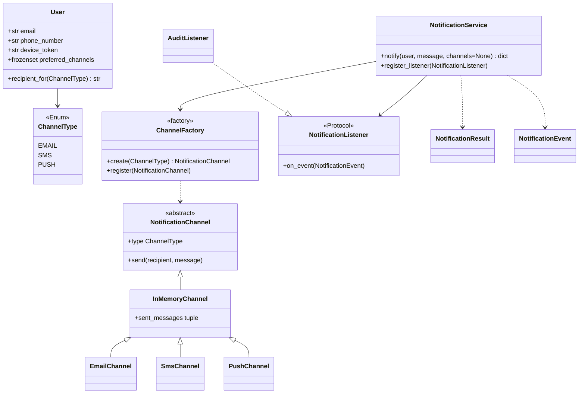
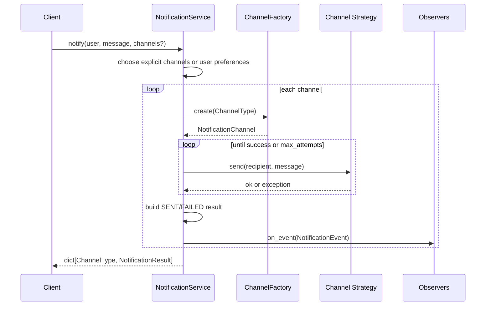

# Notification Service — LLD Machine Coding (Python)

An end-to-end MVP of a notification service, built for an SDE2 machine-coding round. It demonstrates
OOP modelling, **Strategy**, **Factory**, **Observer**, retry handling, and **thread-safe** concurrent
notification dispatch.

> A parallel Java implementation lives in `../java` with its own README. Both produce equivalent
> demo output and intentionally mirror each other.

---

## 1. Why this MVP?

A machine-coding interviewer looks for clean OOP, design patterns applied for a real reason, correct
concurrency, and working tests. This MVP is the **smallest useful system** that still exercises all
of those:

**In scope**
- Channel abstraction with fake in-memory Email/SMS/Push providers
- `ChannelFactory` to resolve `ChannelType` to a channel strategy
- `NotificationService.notify(user, message, channels)` returning per-channel results
- User default preferences via `notify(user, message)`
- Retry up to `max_attempts`; failures are recorded, not thrown to callers
- Observer/listener events for final `SENT` / `FAILED` outcomes
- Thread-safe sends, observer notification, and captured result sinks

**Deliberately out of scope** (extension points, not core learning value): real SMTP/SMS/APNS
providers, rich templating, rate limiting, scheduling, and dedupe.

---

## 2. UML

### Class diagram


### Notify sequence


---

## 3. Design decisions

| Decision | Reasoning |
| --- | --- |
| **Channel ABC as Strategy** | Email/SMS/Push are swappable providers behind one `send` contract. |
| **In-memory channel sink** | Keeps MVP deterministic and testable; no real network calls. |
| **Factory for channels** | Callers use `ChannelType`; construction/injection stays centralized. |
| **Observer for send events** | Audit/metrics/webhooks can be added without changing send logic. |
| **Retry in service** | One policy applies uniformly to all channel strategies. |
| **Return result objects** | Caller sees failures per channel; one bad provider does not throw out the whole request. |
| **Locks around shared lists** | Protects channel sinks/listeners during concurrent dispatch. |

### Concurrency model (the key part)
`NotificationService` stores no per-call mutable state. Channels capture sends behind locks, listener
registration is locked with per-send snapshots, and `AuditListener` uses a lock. The concurrency test
releases 50 threads together; exactly 50 email captures and 50 audit events must exist — no loss, no
duplication.

---

## 4. Code flow

```
main → ChannelFactory → NotificationService.notify
        → choose explicit channels or User.preferred_channels
        → ChannelFactory.create → NotificationChannel.send (retry loop)
        → NotificationResult → NotificationEvent → listeners
```

Module layout:
```
notification/
├── models.py       ChannelType, DeliveryStatus, User, SentMessage, Result, Event
├── channels.py     NotificationChannel, InMemoryChannel, Email/SMS/Push, ChannelFactory
├── service.py      NotificationService, NotificationListener, AuditListener
├── exceptions.py   NotificationDeliveryError
└── main.py         runnable demo
tests/
└── test_notification.py
```

---

## 5. How to run

Prerequisites: Python 3.10+.

```powershell
cd python

# install the test runner (only dependency)
python -m pip install pytest

# run the suite (6 tests incl. retry + concurrency)
python -m pytest -q

# run the demo
python -m notification.main
```

Expected demo output:
```
Results: {'EMAIL': 'SENT', 'PUSH': 'SENT'}
Email sent: 1
Push sent: 1
Audit events: 2
Channels used: ['EMAIL', 'PUSH']
```

---

## 6. Tests

`tests/test_notification.py` covers:
- explicit channel routing and captured recipient/message
- default-preference routing from `User`
- retry succeeds when failures are fewer than `max_attempts`
- retry exhaustion records `FAILED` and does not throw
- observer receives `SENT` and `FAILED` events
- **concurrency**: 50 threads send concurrently → 50 captured deliveries and 50 listener events

---

## 7. Extending (what a follow-up would add)
- **Real providers**: SMTP, SMS gateway, APNS/FCM implementations behind `NotificationChannel`.
- **Templating**: a `TemplateRenderer` before send.
- **Rate limiting**: per-user/channel limiter around the service.
- **Scheduling**: queue with delayed delivery workers.
- **Dedupe**: idempotency key repository to suppress duplicate requests.
