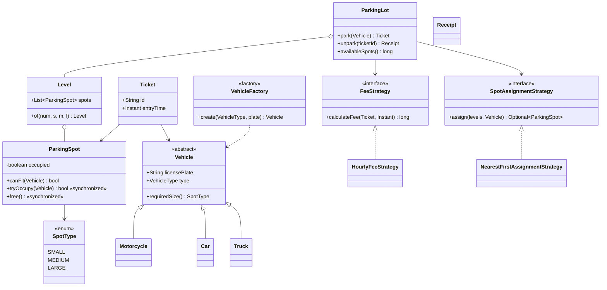
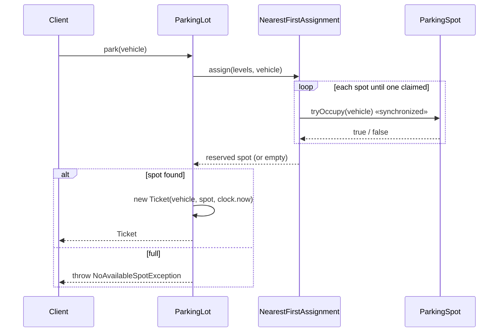

# Parking Lot — LLD Machine Coding (Java)

An end-to-end MVP of a multi-level parking lot, built for an SDE2 machine-coding round. It
demonstrates OOP modelling, the **Strategy** and **Factory** patterns, and **thread-safe**
concurrent parking with no double-allocation.

> A parallel Python implementation lives in `../python` with its own README. Both produce identical
> demo output.

---

## 1. Why this MVP?

A machine-coding interviewer looks for: clean OOP, at least one or two design patterns applied for a
real reason, correct concurrency, and working tests — delivered in ~45 minutes. So the MVP is the
**smallest system that still exercises all of those**:

**In scope**
- Multi-level lot, 3 spot sizes (SMALL/MEDIUM/LARGE) with vehicle-fit rules
- `park` → find nearest compatible free spot → issue `Ticket`
- `unpark` → free spot → compute fee
- Thread-safe concurrent park/unpark (the part interviewers probe hardest)
- Pluggable **FeeStrategy** and **SpotAssignmentStrategy**
- **Factory** for vehicle creation

**Deliberately out of scope** (extension points, not core learning value):
payments/settlement, reservations, multi-entrance routing, license-plate persistence/DB, a REST/UI
layer. Each is noted below under *Extending*.

---

## 2. UML

### Class diagram


### Park sequence


---

## 3. Design decisions

| Decision | Reasoning |
| --- | --- |
| **Abstract `Vehicle` + `requiredSize()`** | Adding a vehicle type = new subclass, no edits elsewhere (Open/Closed). |
| **`SpotType` ordinal comparison** for fit | `spot >= vehicle.required` is one line and models "bigger spot fits smaller vehicle". |
| **Strategy for fee & assignment** | Pricing/placement policy changes without touching the service (Dependency Inversion). |
| **Factory for vehicles** | Callers depend on the enum, not concrete constructors. |
| **Injected `Clock`** | Fee tests are deterministic — advance a fake clock instead of `Thread.sleep`. |
| **Concurrency at the spot, not the lot** | A lot-wide lock would serialize all parking. Per-spot atomic `tryOccupy` lets many threads park in parallel while still preventing double-allocation. |
| **`ConcurrentHashMap` for tickets; atomic `remove` on exit** | Guarantees a ticket is used exactly once (no double-exit / double-free). |

### Concurrency model (the key part)
`ParkingSpot.tryOccupy` is `synchronized`, so the check *“free and fits?”* and the state change are
a single atomic step (a guarded compare-and-set). The assignment strategy simply iterates spots and
calls `tryOccupy`; when 50 threads race for 5 spots, exactly 5 win and no spot id is claimed twice.
This is asserted in `concurrentParkingNeverDoubleAllocates`.

---

## 4. Code flow

```
Main → VehicleFactory.create → ParkingLot.park
        → SpotAssignmentStrategy.assign → ParkingSpot.tryOccupy (atomic)
        → new Ticket → store in ConcurrentHashMap
ParkingLot.unpark → remove ticket (atomic) → FeeStrategy.calculateFee → spot.free → Receipt
```

Package layout:
```
com.example.parkinglot
├── model/      Vehicle hierarchy, SpotType, ParkingSpot, Ticket
├── strategy/   FeeStrategy + HourlyFeeStrategy, SpotAssignmentStrategy + NearestFirst
├── factory/    VehicleFactory
├── service/    Level, ParkingLot, Receipt
├── exception/  NoAvailableSpotException, InvalidTicketException
└── Main.java   runnable demo
```

---

## 5. How to run

Prerequisites: JDK 17+ and Maven.

```powershell
cd java

# run the test suite (7 tests incl. the concurrency race test)
mvn test

# run the demo
mvn -q compile exec:java "-Dexec.mainClass=com.example.parkinglot.Main"
```

Expected demo output:
```
Free spots at open: 10
Parked bike at L0-S0
Parked car  at L0-S2
Parked truck at L0-S4
Free spots now: 7
Car left spot L0-S2, fee = 20
Free spots after exit: 8
```

---

## 6. Tests

`ParkingLotTest` covers:
- fit rules (motorcycle→SMALL, truck→LARGE only)
- full-lot → `NoAvailableSpotException`
- fee calculation with a **mutable injected clock** (90 min → 2 h billed) and the 1-hour minimum
- double-exit → `InvalidTicketException`
- **concurrency**: 50 threads race for 5 spots → exactly 5 succeed, 0 duplicate spot ids

---

## 7. Extending (what a follow-up would add)
- **Payments**: a `PaymentProcessor` invoked after `unpark` returns a `Receipt`.
- **Reservations**: a `RESERVED` spot state + expiry.
- **Multiple entrances**: assignment strategy that takes an entry gate and picks the nearest spot to it.
- **Persistence**: swap in-memory maps for a repository interface.
