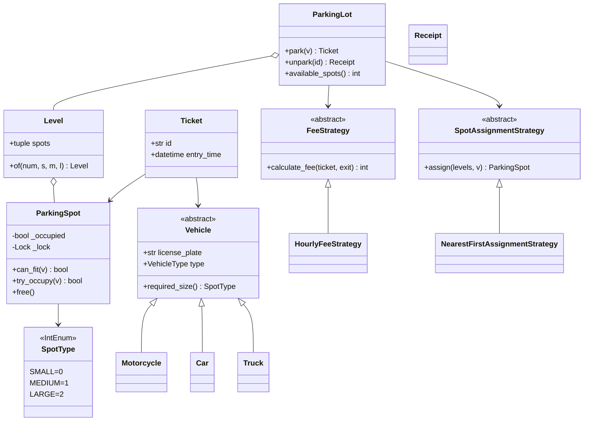
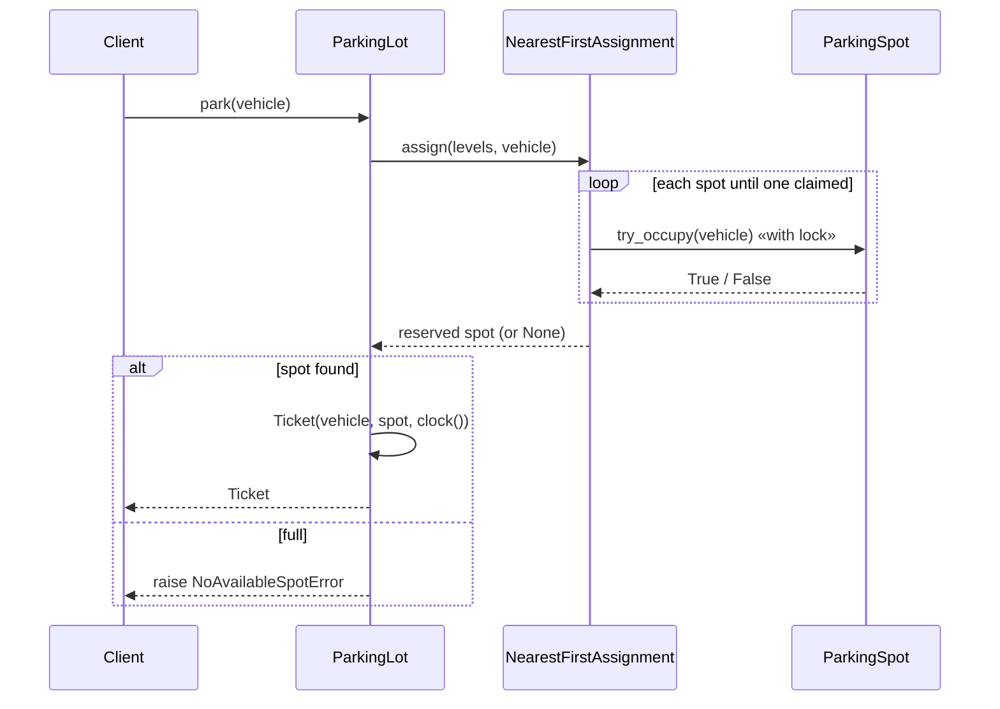

# Parking Lot — LLD Machine Coding (Python)

An end-to-end MVP of a multi-level parking lot, built for an SDE2 machine-coding round. It
demonstrates OOP modelling, the **Strategy** and **Factory** patterns, and **thread-safe**
concurrent parking with no double-allocation.

> A parallel Java implementation lives in `../java` with its own README. Both produce identical
> demo output. The class structure is intentionally 1:1 between the two languages.

---

## 1. Why this MVP?

A machine-coding interviewer looks for clean OOP, one or two design patterns applied for a real
reason, correct concurrency, and working tests — in ~45 minutes. The MVP is the **smallest system
that still exercises all of those**:

**In scope**
- Multi-level lot, 3 spot sizes (SMALL/MEDIUM/LARGE) with vehicle-fit rules
- `park` → find nearest compatible free spot → issue `Ticket`
- `unpark` → free spot → compute fee
- Thread-safe concurrent park/unpark
- Pluggable **FeeStrategy** and **SpotAssignmentStrategy**
- **Factory** for vehicle creation

**Deliberately out of scope** (extension points): payments, reservations, multi-entrance routing,
persistence/DB, REST/UI layer. See *Extending* below.

---

## 2. UML

### Class diagram


### Park sequence


---

## 3. Design decisions

| Decision | Reasoning |
| --- | --- |
| **Abstract `Vehicle` + `required_size`** | New vehicle type = new subclass, no edits elsewhere (Open/Closed). |
| **`SpotType(IntEnum)`** | Lets `spot.spot_type >= vehicle.required_size` express the fit rule in one line. |
| **Strategy for fee & assignment (ABCs)** | Pricing/placement swappable without touching the service (Dependency Inversion). |
| **Factory for vehicles** | Callers depend on the enum, not concrete classes. |
| **Injected `clock` callable** | Fee tests are deterministic — advance a fake clock, never `sleep`. |
| **Concurrency at the spot, not the lot** | Per-spot `threading.Lock` lets many threads park in parallel while preventing double-allocation. |
| **Dict + lock, atomic `pop` on exit** | A ticket is consumed exactly once → no double-exit / double-free. |

### Concurrency model (the key part)
`ParkingSpot.try_occupy` holds a `threading.Lock`, so the check *“free and fits?”* and the state
change are one atomic step. The assignment strategy iterates spots calling `try_occupy`; when 50
threads race for 5 spots, exactly 5 win and no spot id is claimed twice — asserted in
`test_concurrent_parking_never_double_allocates`.

> Note: even under CPython's GIL, a plain `if not occupied: occupied = True` is **not** atomic
> across the two bytecodes, so the explicit lock is required for correctness — the test forces the
> race to prove it.

---

## 4. Code flow

```
main → create_vehicle → ParkingLot.park
        → SpotAssignmentStrategy.assign → ParkingSpot.try_occupy (atomic)
        → Ticket → store in dict (under lock)
ParkingLot.unpark → pop ticket (under lock) → FeeStrategy.calculate_fee → spot.free → Receipt
```

Module layout:
```
parking_lot/
├── models.py       Vehicle hierarchy, SpotType, ParkingSpot, Ticket
├── strategies.py   FeeStrategy + HourlyFeeStrategy, SpotAssignmentStrategy + NearestFirst
├── factory.py      create_vehicle
├── lot.py          Level, ParkingLot, Receipt
├── exceptions.py   NoAvailableSpotError, InvalidTicketError
└── main.py         runnable demo
tests/
└── test_parking_lot.py
```

---

## 5. How to run

Prerequisites: Python 3.10+.

```powershell
cd python

# install the test runner (only dependency)
python -m pip install pytest

# run the suite (7 tests incl. the concurrency race test)
python -m pytest -q

# run the demo
python -m parking_lot.main
```

Expected demo output:
```
Free spots at open: 10
Parked bike at L0-S0
Parked car  at L0-S2
Parked truck at L0-S4
Free spots now: 7
Car left spot L0-S2, fee = 20
Free spots after exit: 8
```

---

## 6. Tests

`tests/test_parking_lot.py` covers:
- fit rules (motorcycle→SMALL, truck→LARGE only)
- full-lot → `NoAvailableSpotError`
- fee calc with a **mutable injected clock** (90 min → 2 h billed) and the 1-hour minimum
- double-exit → `InvalidTicketError`
- **concurrency**: 50 threads race for 5 spots → exactly 5 succeed, 0 duplicate spot ids

---

## 7. Extending (what a follow-up would add)
- **Payments**: a `PaymentProcessor` invoked after `unpark`.
- **Reservations**: a `RESERVED` spot state + expiry.
- **Multiple entrances**: assignment strategy parameterized by entry gate.
- **Persistence**: replace the in-memory dict with a repository abstraction.
