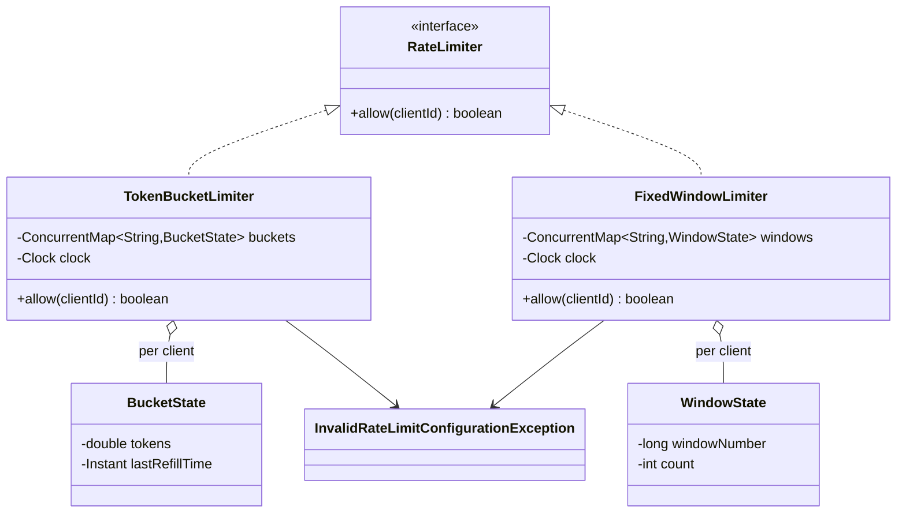
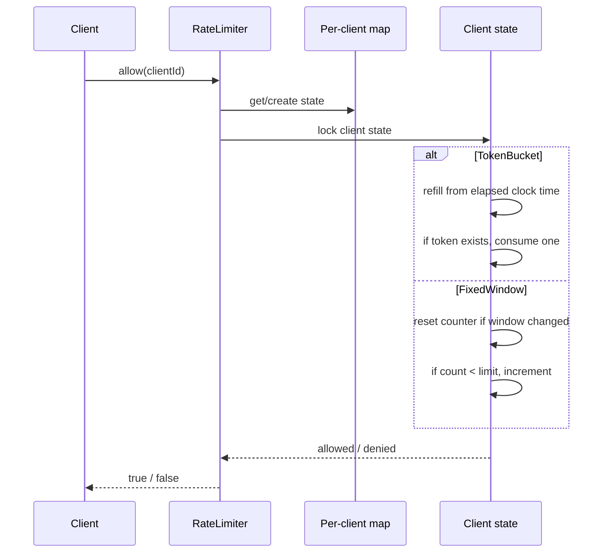

# Rate Limiter — LLD Machine Coding (Java)

An end-to-end MVP of a per-client rate limiter, built for an SDE2 machine-coding round. It
showcases the **Strategy** pattern, deterministic time-based tests via injected `Clock`, and
thread-safe concurrent `allow(clientId)` calls with no over-admission.

> A parallel Python implementation lives in `../python` with its own README. The class structure is
> intentionally 1:1 between the two languages.

---

## 1. Why this MVP?

A machine-coding interviewer looks for a small but complete design: a crisp abstraction, swappable
algorithms, correct time handling, and concurrency tests. This MVP keeps the surface area tiny while
covering the important trade-offs.

**In scope**
- `RateLimiter.allow(clientId)` returns `true` to pass and `false` to throttle
- Per-client state keyed by `clientId`
- **TokenBucketLimiter**: capacity + refill rate in tokens/second
- **FixedWindowLimiter**: max N requests per fixed W-second window
- Injected `Clock` and mutable test clock; no `Thread.sleep` in tests
- Thread-safe per-client mutation under a per-client monitor

**Deliberately out of scope** (extension points): distributed/Redis-backed limiting, sliding-window
counter approximation, endpoint/tier-specific limits, and cost-weighted requests.

### Algorithm trade-offs
- **Token Bucket** allows bursts up to bucket capacity and smooths average traffic over time. It is a
  strong default for APIs that tolerate short bursts.
- **Fixed Window** is cheap and easy to explain, but it can permit boundary bursts: N requests just
  before a window ends and N more just after the next window starts.

---

## 2. UML

### Class diagram


### `allow` decision flow


---

## 3. Design decisions

| Decision | Reasoning |
| --- | --- |
| **`RateLimiter` interface** | Callers depend on one method while algorithms remain swappable (Strategy). |
| **Per-client state maps** | Client A exhausting its limit does not affect client B. |
| **Injected `Clock`** | Refill/window tests are deterministic — advance a fake clock instead of sleeping. |
| **Per-client synchronization** | Same-client mutation is atomic; different clients can proceed independently. |
| **Boolean result** | Throttling is expected control flow, so `false` is clearer than an exception. |
| **Token Bucket + Fixed Window** | Covers the two most common interview algorithms and their trade-offs. |

### Concurrency model (the key part)
The `ConcurrentHashMap` safely locates a client's state. The actual algorithm state is protected by
`synchronized (state)`, so refill/check/consume and reset/check/increment are indivisible. In
`concurrentFixedWindowAllowsExactlyCapacity`, 50 threads race in the same window for a limit of 5;
exactly 5 pass and 45 are denied.

---

## 4. Code flow

```
Main → new TokenBucketLimiter / FixedWindowLimiter
Client → RateLimiter.allow(clientId)
        → get/create per-client state
        → lock state
        → TokenBucket: refill → check token → consume
          FixedWindow: compute window → maybe reset → check count → increment
        → return true/false
```

Package layout:
```
com.example.ratelimiter
├── RateLimiter.java
├── algorithms/  TokenBucketLimiter, FixedWindowLimiter
├── exception/   InvalidRateLimitConfigurationException
└── Main.java    runnable demo
```

---

## 5. How to run

Prerequisites: JDK 17+ and Maven.

```powershell
cd java

# run the test suite (4 tests incl. the exactly-N concurrency race)
mvn test

# run the demo
mvn -q compile exec:java "-Dexec.mainClass=com.example.ratelimiter.Main"
```

Expected demo output:
```
TokenBucket capacity=3 refill=1/sec
client-a request 1 -> ALLOW
client-a request 2 -> ALLOW
client-a request 3 -> ALLOW
client-a request 4 -> DENY
client-a after refill -> ALLOW
FixedWindow max=2 window=60s
client-b request 1 -> ALLOW
client-b request 2 -> ALLOW
client-b request 3 -> DENY
```

---

## 6. Tests

`RateLimiterTest` covers:
- TokenBucket: first C pass, next denied, then refilled tokens pass after advancing `MutableClock`
- FixedWindow: N pass, N+1 denied, counter resets after advancing past the window
- per-client isolation: client A's exhaustion does not affect client B
- **concurrency**: 50 threads race for a limit of 5 in one window → exactly 5 allowed

---

## 7. Extending (what a follow-up would add)
- **Distributed/Redis limiter**: move per-client state and atomic scripts to Redis/Lua.
- **Sliding-window counter**: approximate smoother windows with less memory than a timestamp log.
- **Endpoint tiers**: include endpoint/plan in the key and choose limits from configuration.
- **Cost-weighted requests**: consume more than one token for expensive operations.
