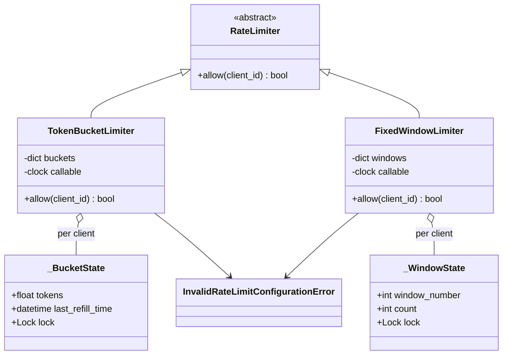
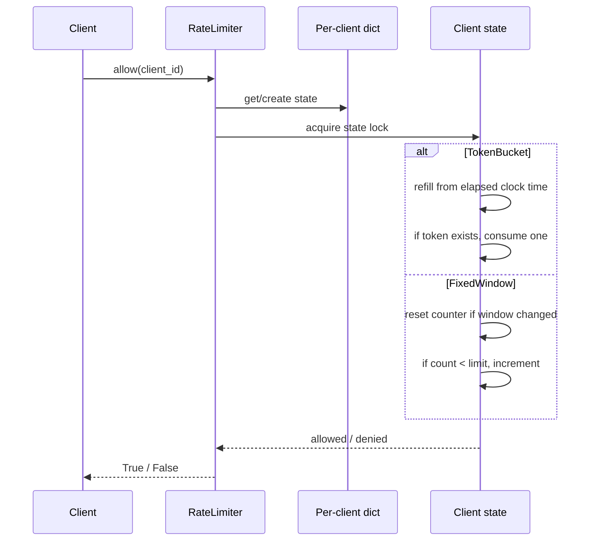

# Rate Limiter — LLD Machine Coding (Python)

An end-to-end MVP of a per-client rate limiter, built for an SDE2 machine-coding round. It
showcases the **Strategy** pattern, deterministic time-based tests via an injected clock callable,
and thread-safe concurrent `allow(client_id)` calls with no over-admission.

> A parallel Java implementation lives in `../java` with its own README. The module structure is
> intentionally 1:1 between the two languages.

---

## 1. Why this MVP?

A machine-coding interviewer looks for a crisp abstraction, swappable algorithms, correct time
handling, and a real concurrency proof. This MVP keeps the API tiny while showing those skills.

**In scope**
- `RateLimiter.allow(client_id)` returns `True` to pass and `False` to throttle
- Per-client state keyed by `client_id`
- **TokenBucketLimiter**: capacity + refill rate in tokens/second
- **FixedWindowLimiter**: max N requests per fixed W-second window
- Injected clock callable and mutable test clock; no `sleep` in tests
- Thread-safe per-client mutation with a lock per client state

**Deliberately out of scope** (extension points): distributed/Redis-backed limiting, sliding-window
counter approximation, endpoint/tier-specific limits, and cost-weighted requests.

### Algorithm trade-offs
- **Token Bucket** allows bursts up to bucket capacity and smooths the long-term average rate.
- **Fixed Window** is simple and memory-cheap, but may allow boundary bursts: N requests near the
  end of one window and N more immediately after the next starts.

---

## 2. UML

### Class diagram


### `allow` decision flow


---

## 3. Design decisions

| Decision | Reasoning |
| --- | --- |
| **`RateLimiter` ABC** | Callers depend on one method while concrete algorithms remain swappable (Strategy). |
| **Per-client state dicts** | Client A exhausting its quota does not affect client B. |
| **Injected clock callable** | Refill/window tests are deterministic — advance a fake clock instead of sleeping. |
| **Per-client locks** | Same-client mutation is atomic; unrelated clients can proceed independently. |
| **Boolean result** | Throttling is expected control flow, so `False` is clearer than an exception. |
| **Token Bucket + Fixed Window** | Covers common interview algorithms and their operational trade-offs. |

### Concurrency model (the key part)
The outer dict lock only creates or finds the per-client state. The state lock then protects the
algorithm's critical section. Even under CPython's GIL, a check-then-increment is not a safe
high-level invariant, so the explicit lock is required. In
`test_concurrent_fixed_window_allows_exactly_capacity`, 50 threads race for a limit of 5; exactly 5
pass.

---

## 4. Code flow

```
main → TokenBucketLimiter / FixedWindowLimiter
client → RateLimiter.allow(client_id)
        → get/create per-client state
        → lock state
        → TokenBucket: refill → check token → consume
          FixedWindow: compute window → maybe reset → check count → increment
        → return True/False
```

Module layout:
```
ratelimiter/
├── limiter.py      RateLimiter abstraction
├── algorithms.py   TokenBucketLimiter, FixedWindowLimiter
├── exceptions.py   InvalidRateLimitConfigurationError
└── main.py         runnable demo
tests/
└── test_ratelimiter.py
```

---

## 5. How to run

Prerequisites: Python 3.10+ and pytest.

```powershell
cd python

# run the suite (4 tests incl. the exactly-N concurrency race)
python -m pytest -q

# run the demo
python -m ratelimiter.main
```

Expected demo output:
```
TokenBucket capacity=3 refill=1/sec
client-a request 1 -> ALLOW
client-a request 2 -> ALLOW
client-a request 3 -> ALLOW
client-a request 4 -> DENY
client-a after refill -> ALLOW
FixedWindow max=2 window=60s
client-b request 1 -> ALLOW
client-b request 2 -> ALLOW
client-b request 3 -> DENY
```

---

## 6. Tests

`tests/test_ratelimiter.py` covers:
- TokenBucket: first C pass, next denied, then refilled tokens pass after advancing `MutableClock`
- FixedWindow: N pass, N+1 denied, counter resets after advancing past the window
- per-client isolation: client A's exhaustion does not affect client B
- **concurrency**: 50 threads race for a limit of 5 in one window → exactly 5 allowed

---

## 7. Extending (what a follow-up would add)
- **Distributed/Redis limiter**: move per-client state and atomic scripts to Redis/Lua.
- **Sliding-window counter**: approximate smoother windows with less memory than a timestamp log.
- **Endpoint tiers**: include endpoint/plan in the key and choose limits from configuration.
- **Cost-weighted requests**: consume more than one token for expensive operations.
