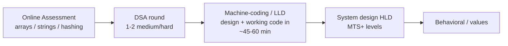

# Salesforce — DSA + LLD Interview Prep

A single, focused section for the **Salesforce** software-engineering loop (SDE / MTS / SMTS). It
has two halves that mirror the two coding rounds Salesforce actually runs:

| Half | What it is | Where |
| --- | --- | --- |
| **DSA** | The **150 most-asked** Salesforce DSA questions, curated and indexed. | [`dsa/00-index.md`](dsa/00-index.md) |
| **LLD** | The most-asked Salesforce **machine-coding / low-level-design** problems, each a full dual-language (Java + Python) project with tests. | [`lld/00-index.md`](lld/00-index.md) |

## The Salesforce loop (typical)

- **DSA rounds** lean on arrays, strings, hashing, intervals, trees, graphs, DP — with a noticeable
  Salesforce bias toward **"design a data structure"** questions (LRU/LFU Cache, Trie, HashMap,
  autocomplete, iterators).
- **Machine-coding / LLD** expects clean OOP, one or two design patterns applied for a real reason,
  correct concurrency, and **working tests** — delivered in ~45–60 minutes.

## How this section is organised
```
salesforce/
├── 00-overview.md          ← you are here
├── dsa/
│   ├── 00-index.md         ← the 150 questions, each linked to its full solution
│   └── gaps/               ← brand-new solutions for questions not already in the repo
└── lld/
    ├── 00-index.md         ← the LLD problem list (existing → linked, new → built here)
    ├── pub-sub-system/     ← new dual-language builds (Java + Python + tests + README)
    ├── meeting-scheduler/
    ├── in-memory-file-system/
    ├── custom-hashmap/
    ├── autocomplete-system/
    └── connection-pool/
```

## Design principle: **don't duplicate, curate**
Salesforce's DSA set overlaps almost entirely with the FAANG/Google banks already in this repo. So
the DSA half is an **index that links into existing solutions**, and only genuine gaps got new
write-ups. Likewise, LLD problems that already exist (Parking Lot, LRU/LFU Cache, Splitwise,
Elevator, Tic-Tac-Toe, Rate Limiter, Job Scheduler, Library Management, Movie Booking, Notification
Service) are **referenced in the LLD tab** rather than copied — only the Salesforce-flavoured gaps
are built fresh here.

## What "good" looks like in the LLD round
- **Clarify first** — interviewers deliberately withhold detail; ask about scale, concurrency, and
  which operations must be fast.
- **Model the objects**, then code. Start from the smallest MVP that still exercises OOP + a pattern
  + concurrency + tests (exactly how each `lld/*` project here is scoped).
- **Name your trade-offs** (efficiency vs. maintainability; lock granularity; extensibility).
- **Leave extension points** — every project here ends with an *Extending* section.
